Une bonne **image jouet en 2D** compte plus qu’un modèle image→3D sophistiqué. Étapes dans l’ordre, [**diapositives**](./make-figurines-using-ai-for-3d-printing.pptx), [**workflow ComfyUI**](./workflows/image_omnigen2_image_edit.json), et schémas avec [**uml-mcp**](https://github.com/antoinebou12/uml-mcp).

<!--more-->

## Pipeline (ordre)

1. **Photo de référence** — profil ou face nette.
2. **Rendu chibi vinyle** — ChatGPT, Midjourney ou ComfyUI (OmniGen2).
3. **Maillage** — Hunyuan3D v2 (ComfyUI local ou outils en ligne).
4. **Impression** — orientation, supports, résine ; îlots avec **[UVtools](https://github.com/sn4k3/UVtools)** si besoin.

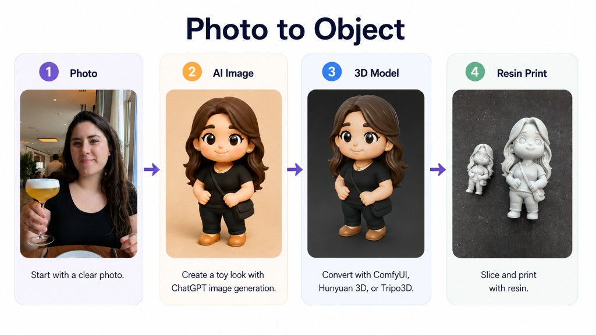

Diagramme de séquence ([`figurine-pipeline-sequence.mmd`](./images/figurine-pipeline-sequence.mmd), rendu via [uml-mcp](https://github.com/antoinebou12/uml-mcp)) :

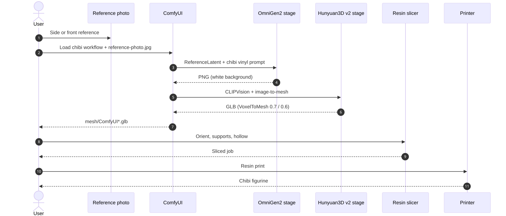

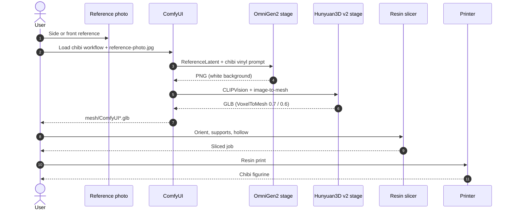

**Diapositives** (~17 Mo) — captures et liens outils de la présentation :



## Étape 1 — Jouet / chibi en 2D

> Convert this image into a toy-style plastic figure. Keep features but simplify and smoothen as if molded in plastic.

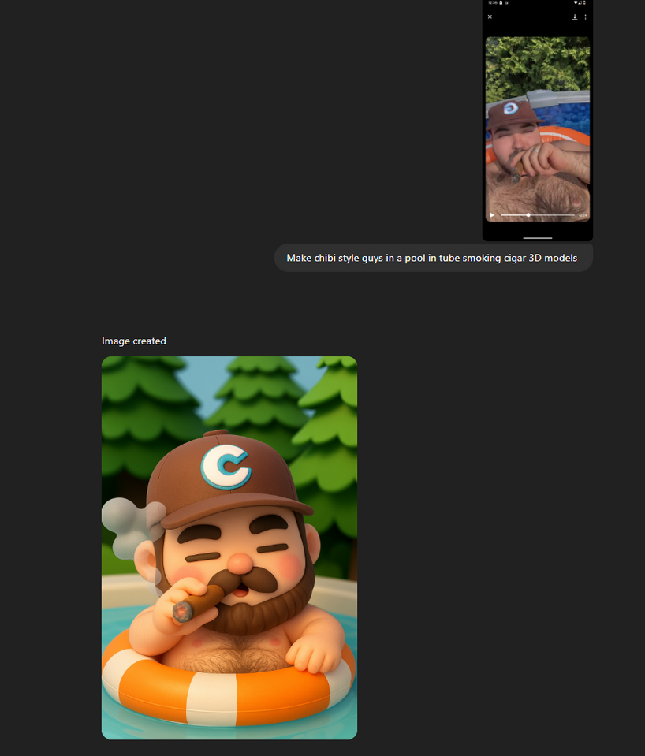 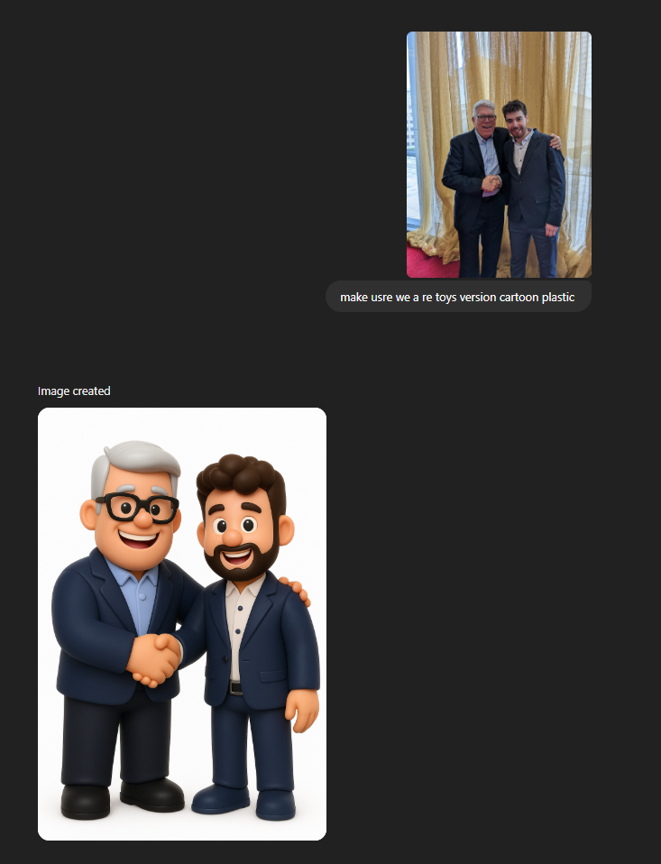

**Prompt chibi :** figurine vinyle chibi, plastique lisse, fond blanc, un personnage, pose stable sur socle.

  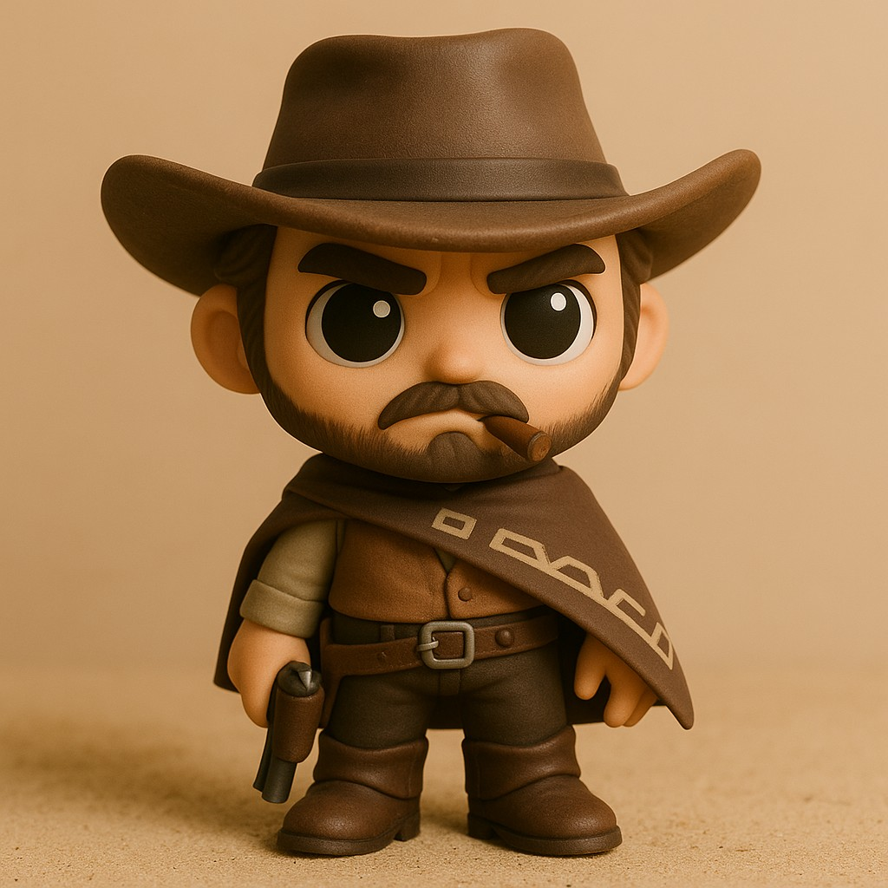  

## Documenter le flux — [uml-mcp](https://github.com/antoinebou12/uml-mcp)

Le diagramme ci-dessus vient de **uml-mcp** (`generate_uml`, type `mermaid`) : [`figurine-pipeline-sequence.mmd`](./images/figurine-pipeline-sequence.mmd) et SVG dans ce bundle.

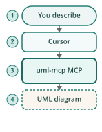

Dans Cursor : activer **uml-mcp**, appeler `generate_uml` avec le `.mmd` ou décrire les étapes ComfyUI → impression. Voir aussi [diagrammes de séquence ChatGPT](../chatgpt-airprm-sequence-diagrams/).

## Étape 2 — ComfyUI (un graphe)

**Télécharger :** [image_omnigen2_image_edit.json](./workflows/image_omnigen2_image_edit.json) — *Load* dans ComfyUI (OmniGen2 + Hunyuan3D v2). Photo dans `input/` : **`reference-photo.jpg`**.

| Étape | Rôle |
|-------|------|
| **A** | OmniGen2 + `ReferenceLatent` → PNG chibi |
| **B** | Hunyuan3D v2 → deux GLB (`mesh/ComfyUI*.glb`) |

Prompts et graines dans le JSON. Nœuds Hunyuan3D-2 ([GitHub](https://github.com/Tencent-Hunyuan/Hunyuan3D-2)). Sur 8–12 Go VRAM, baisser `octree_resolution` ou `num_chunks`.

## Étape 3 — Image vers 3D (hébergé)

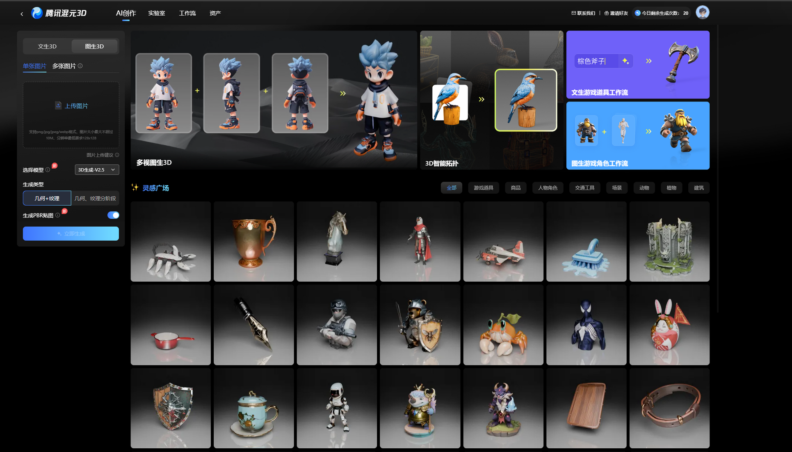

La clarté du PNG jouet compte plus que la marque du générateur.

| Outil | Lien | Notes |
|------|------|--------|
| **Hunyuan3D-2** | [GitHub](https://github.com/Tencent-Hunyuan/Hunyuan3D-2) | Poids ouverts, local ou hébergé |
| **RodinHD** | [Démo](https://rodinhd.github.io/) | Figurines / avatars détaillés |
| **Hi3DGen** | [Space](https://huggingface.co/spaces/Stable-X/Hi3DGen) | Prior 2D + cohérence géométrie ([CHI 2024](https://doi.org/10.1145/3641520.3665304)) |
| **Hyper3D** | [hyper3d.ai](https://hyper3d.ai/) | Commercial rapide |
| **Meshy** | [meshy.ai](https://www.meshy.ai/) | Texte/image → 3D, remaillage |
| **Tripo3D** | [studio.tripo3d.ai](https://studio.tripo3d.ai/) | Studio navigateur |
| **Sparc3D** | [lizhihao6.github.io/Sparc3D](https://lizhihao6.github.io/Sparc3D/) | Reconstruction multi-vues |

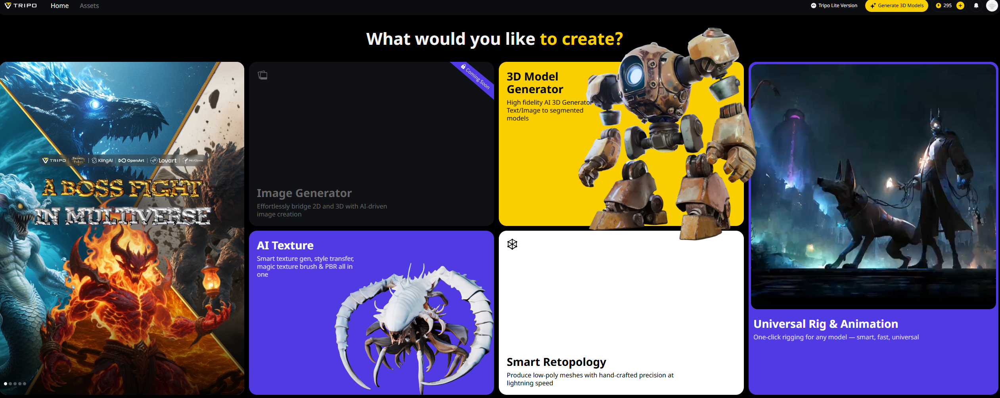

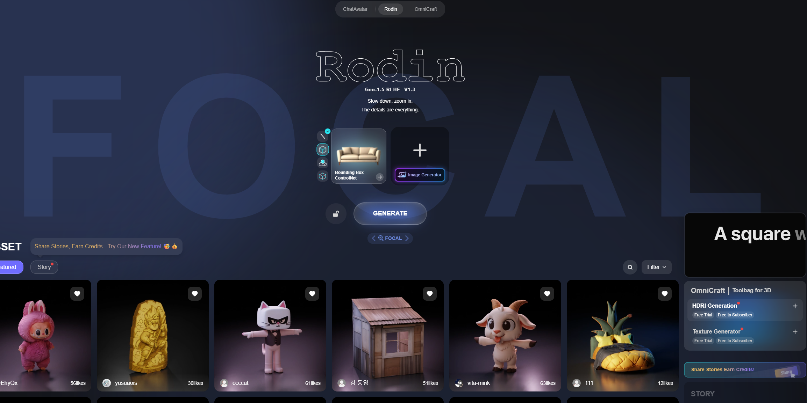

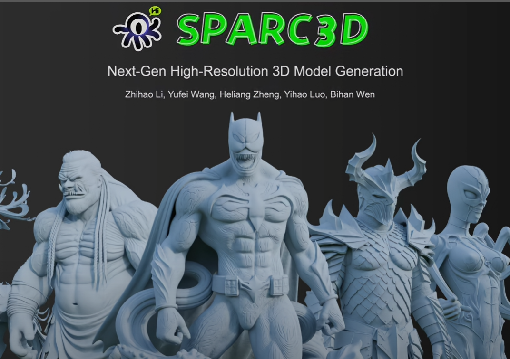

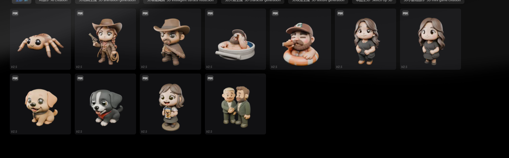

## Quand utiliser quoi

| Situation | Piste |
|----------|--------|
| VRAM 8–12 Go, une photo | ComfyUI local (workflow fourni) |
| Test rapide sans GPU | Hi3DGen / Tripo3D en ligne |
| Figurine chibi déjà propre | Hunyuan3D ou RodinHD |
| Impression résine fine | Réduire faces, vérifier îlots UVtools |

## Pièges

- **Photo de profil floue** — le maillage fond les traits.
- **GLB énormes dans git** — garder hors dépôt ; exporter depuis `mesh/`.
- **Sous-estimer les supports** — cheveux et capes = îlots en slicer.

## Aperçu maillage

Les **GLB** d’exemple (Hunyuan3D, RodinHD, Hyper3D, Hi3DGen) ne sont pas versionnés ici (20–75 Mo chacun). Utilisez l’aperçu des outils ou exportez depuis ComfyUI (`mesh/ComfyUI*.glb`).

## Étape 4 — Réglages maillage

Ajuster faces, symétrie et remaillage avant export GLB/OBJ.

## Étape 5 — Impression résine

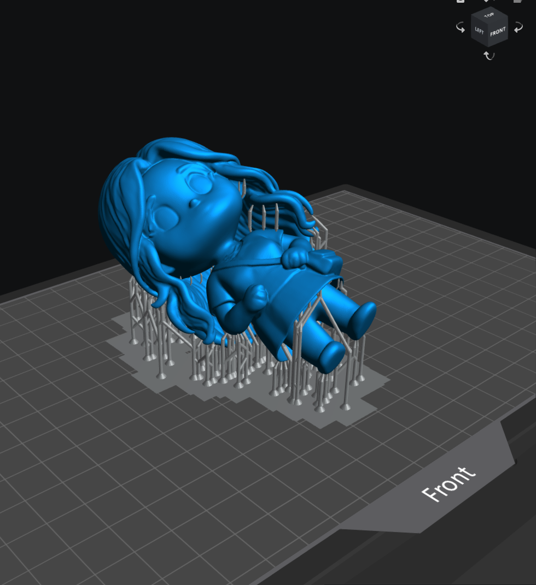

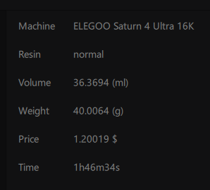

Résine pour petites pièces ; incliner les porte-à-faux vers le plateau.

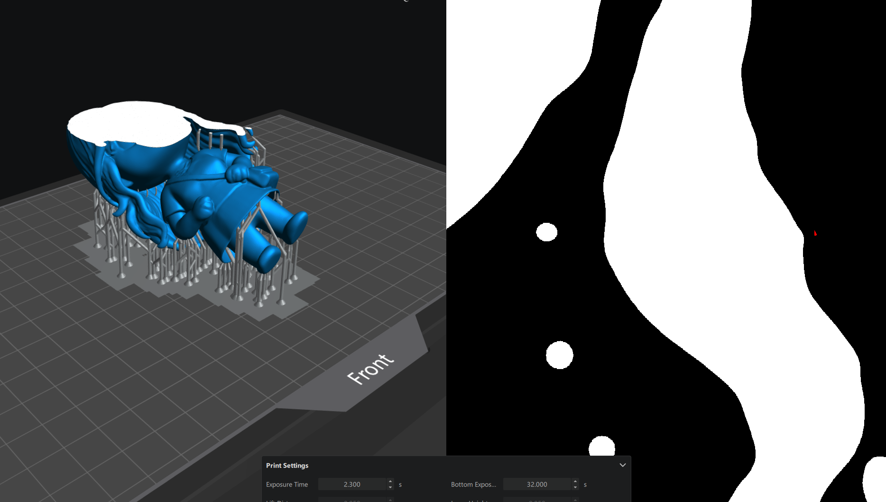

Vérifier les îlots avec le slicer ou **[UVtools](https://github.com/sn4k3/UVtools)**.

## Résultats

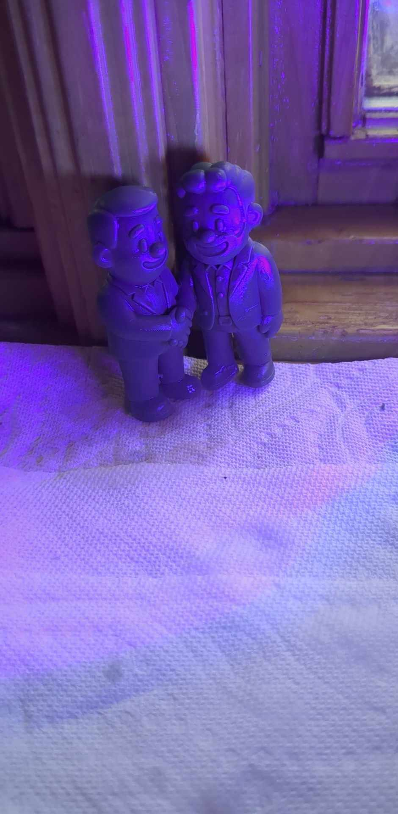

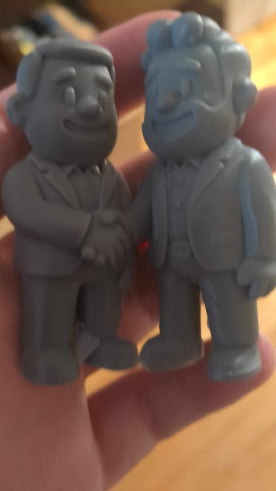

## Références

- Gao et al. (2024). *Hi3DGen.* CHI 2024. https://doi.org/10.1145/3641520.3665304
- Tencent Hunyuan. *Hunyuan3D-2.* https://github.com/Tencent-Hunyuan/Hunyuan3D-2
