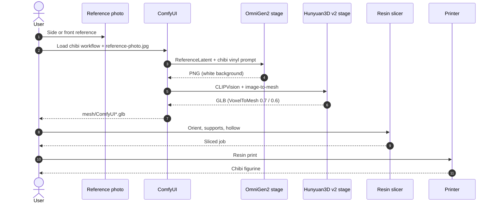
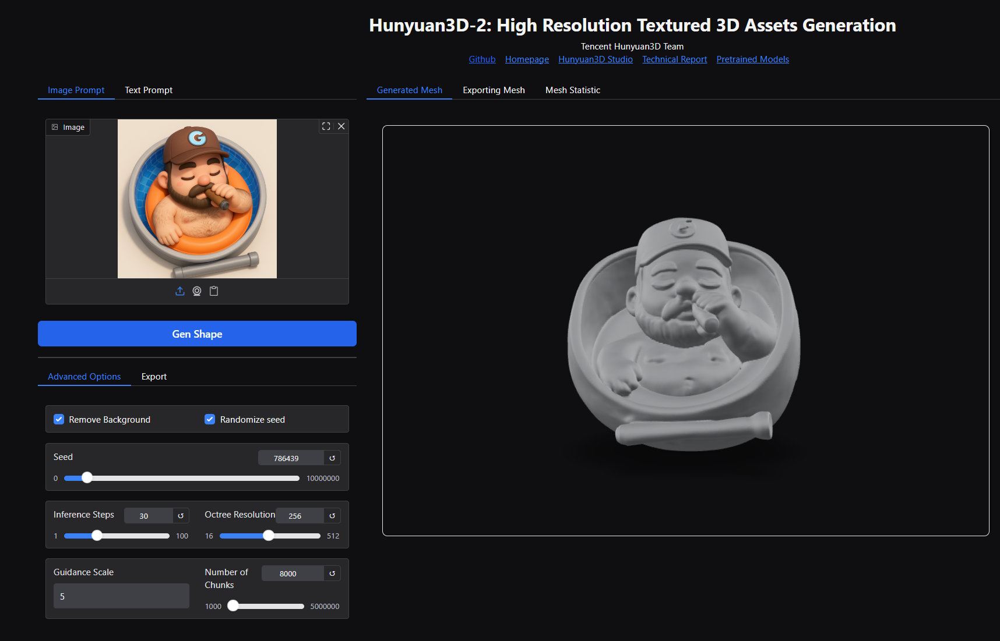
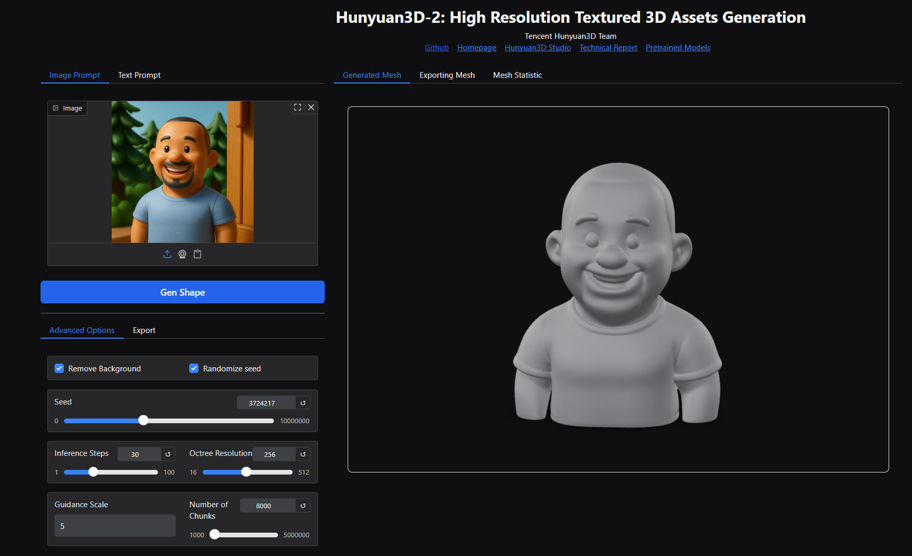

Good **2D toy art** beats a fancy image-to-3D model. This post walks the steps in order, links a [**slide deck**](./make-figurines-using-ai-for-3d-printing.pptx), a [**ComfyUI workflow**](./workflows/image_omnigen2_image_edit.json), and how I sketch the flow with [**uml-mcp**](https://github.com/antoinebou12/uml-mcp).

<!--more-->

## Pipeline (in order)

1. **Reference photo** — clear side or front view.
2. **Chibi vinyl render** — ChatGPT, Midjourney, or ComfyUI (OmniGen2).
3. **Mesh** — Hunyuan3D v2 (local ComfyUI or hosted tools).
4. **Print** — orient, supports, resin slice; fix islands with **[UVtools](https://github.com/sn4k3/UVtools)** if needed.

Pipeline sequence (source: [`figurine-pipeline-sequence.mmd`](./images/figurine-pipeline-sequence.mmd), rendered with [uml-mcp](https://github.com/antoinebou12/uml-mcp)):

**Deck** (~17 MB) — screenshots and tool URLs from the talk:



## Step 1 — 2D toy / chibi

**Deck prompt:**

> Convert this image into a toy-style plastic figure. Keep features but simplify and smoothen as if molded in plastic.

 

**Chibi prompt** (same idea, bigger head):

> Vinyl chibi figurine, smooth plastic, white background, one character, pose that can stand on a base.

Gallery (ChatGPT):

    

## Document the flow — [uml-mcp](https://github.com/antoinebou12/uml-mcp)

The sequence diagram above was generated with **uml-mcp** (`generate_uml`, type `mermaid`) and saved as [`figurine-pipeline-sequence.mmd`](./images/figurine-pipeline-sequence.mmd) + SVG in this page bundle.

In Cursor: enable the **uml-mcp** server (repo README), then call `generate_uml` with the `.mmd` source or ask for a sequence diagram of the ComfyUI → print steps. Same idea as [ChatGPT sequence diagrams](../chatgpt-airprm-sequence-diagrams/).

## Step 2 — ComfyUI (one graph)

**Download:** [image_omnigen2_image_edit.json](./workflows/image_omnigen2_image_edit.json) — *Load* in ComfyUI (OmniGen2 chibi edit + Hunyuan3D v2 mesh). Put your photo in `input/` as **`reference-photo.jpg`** (or edit the `LoadImage` node).

| Stage | What it does |
|-------|----------------|
| **A** | OmniGen2 + `ReferenceLatent` → chibi PNG (`heun`, 45 steps) |
| **B** | Hunyuan3D v2 → two GLBs (`mesh/ComfyUI*.glb`, thresholds 0.7 and 0.6) |

Full positive/negative prompts and seeds are in the JSON. Needs OmniGen2 + Hunyuan3D-2 custom nodes ([Hunyuan3D-2](https://github.com/Tencent-Hunyuan/Hunyuan3D-2)). On 8–12 GB VRAM, lower `octree_resolution` or `num_chunks`.

## Step 3 — Image to 3D (hosted)

Single-image mesh tools — clarity of the toy PNG matters more than the brand.

| Tool | Link | Notes |
|------|------|--------|
| **Hunyuan3D-2** | [GitHub](https://github.com/Tencent-Hunyuan/Hunyuan3D-2) | Open weights / local or hosted runs; strong general image-to-3D. |
| **RodinHD** | [WebGL demo](https://rodinhd.github.io/) | High-detail avatars and figurines from images. |
| **Hi3DGen** | [Hugging Face demo](https://huggingface.co/spaces/Stable-X/Hi3DGen) | 2D diffusion prior + geometry consistency ([CHI 2024 paper](https://doi.org/10.1145/3641520.3665304), [white paper PDF](https://stable-x.github.io/Hi3DGen/hi3dgen_paper.pdf)). |
| **Hyper3D** | [hyper3d.ai](https://hyper3d.ai/) | Fast commercial image-to-3D. |
| **Meshy** | [meshy.ai](https://www.meshy.ai/) | Text/image to 3D with editing and remeshing. |
| **Tripo3D** | [studio.tripo3d.ai](https://studio.tripo3d.ai/) | Browser studio workflow. |
| **Sparc3D** | [lizhihao6.github.io/Sparc3D](https://lizhihao6.github.io/Sparc3D/) | Structured sparse-view reconstruction. |

**Hi3DGen** ([CHI 2024](https://doi.org/10.1145/3641520.3665304), [demo](https://huggingface.co/spaces/Stable-X/Hi3DGen)) — strong when the 2D silhouette is already clean.

## Mesh preview

Sample **GLB** files from Hunyuan3D, RodinHD, Hyper3D, and Hi3DGen are not stored in this repo (each was 20–75 MB). Use the generator previews in the tool UIs, or export from your own ComfyUI run (`mesh/ComfyUI*.glb`).

## Step 4 — Mesh settings

Tune **face count**, **symmetry**, and **remesh** in the generator UI before export.

## Step 5 — Resin print

Resin for small parts. Tilt overhangs toward the plate; light supports on hair and capes.

Check floating islands with the slicer or **[UVtools](https://github.com/sn4k3/UVtools)** before printing.

## Printed results

## When to use this pipeline

| Goal | Start here |
|------|------------|
| Gift figurine from a pet photo | ChatGPT/Midjourney chibi → hosted mesh |
| Repeatable local batch | ComfyUI JSON in this bundle |
| Teaching a class | Deck + uml-mcp sequence diagram |
| Production CAD interchange | Expect cleanup in Blender after GLB |

## Pitfalls

- **Skipping 2D quality** — mesh tools amplify bad silhouettes.
- **Committing 50 MB GLBs** — export locally; link tools instead.
- **Zero island check** — resin failures mid-print waste hours.

## Related posts

- [Skate rack — CAD to object]()
- [Rhino LiDAR apartment scan]()
- [Diagram prompts with ChatGPT and AIPRM]()

## References

- Gao, Y., He, J., Liu, Z., Xie, Y., Zhang, J., Deng, Z., … & Li, Y. (2024). *Hi3DGen: High-quality text-to-3D generation with 2D diffusion prior and geometry consistency.* Proceedings of the 2024 CHI Conference on Human Factors in Computing Systems. https://doi.org/10.1145/3641520.3665304
- Stable-X. (2024). *Hi3DGen: High-quality text-to-3D generation with 2D diffusion prior and geometry consistency* [White paper]. https://stable-x.github.io/Hi3DGen/hi3dgen_paper.pdf
- Tencent Hunyuan. (2024). *Hunyuan3D-2* [Computer software]. GitHub. https://github.com/Tencent-Hunyuan/Hunyuan3D-2
- Stable-X. (n.d.). *Hi3DGen demo* [Interactive tool]. Hugging Face Spaces. https://huggingface.co/spaces/Stable-X/Hi3DGen
- Hyper3D. (n.d.). *Hyper3D* [Website]. https://hyper3d.ai/
- RodinHD. (n.d.). *RodinHD demo* [WebGL demo]. https://rodinhd.github.io/
- Meshy. (n.d.). *Meshy AI* [3D content creation platform]. https://www.meshy.ai/
- YouTube. (2024, March). *Hi3DGen: High-quality text-to-3D generation (demo video)* [Video]. https://www.youtube.com/watch?v=243Dpi8DKVM
