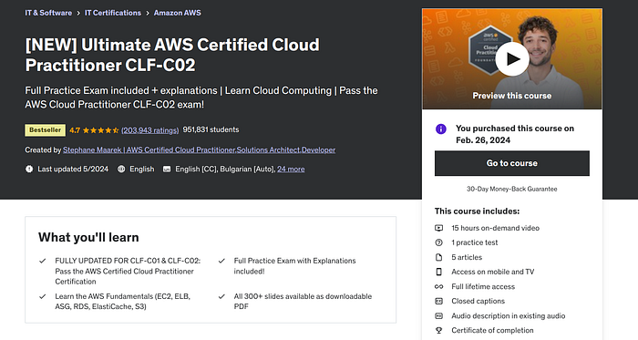
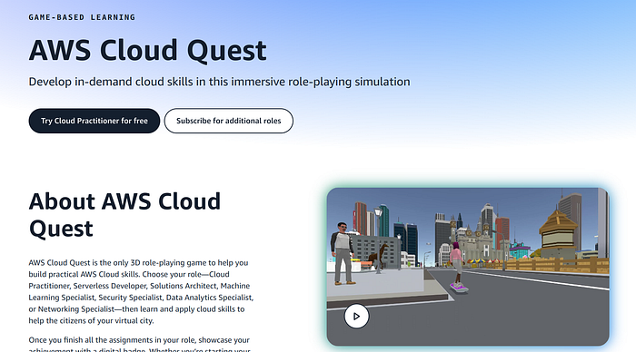
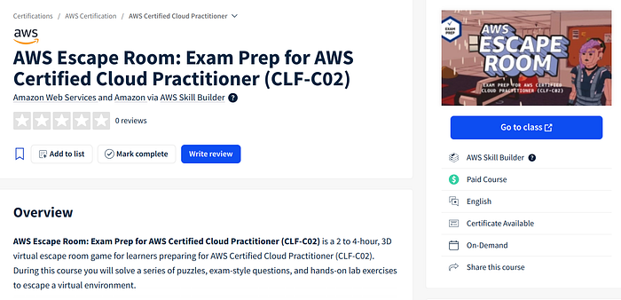
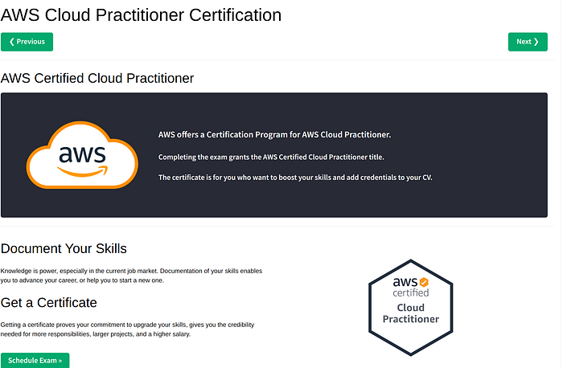
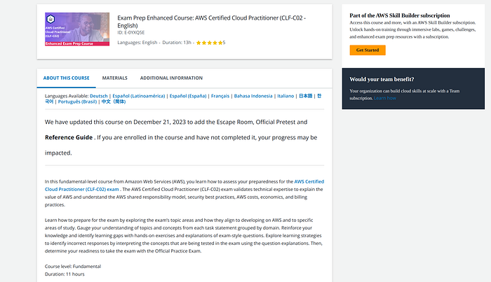
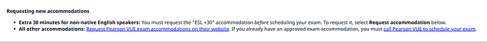
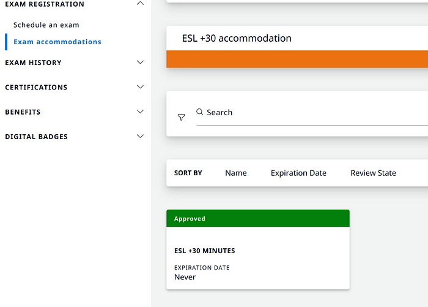
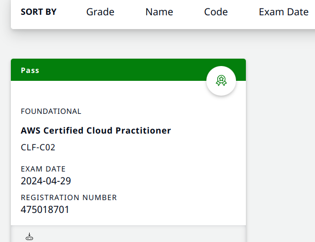
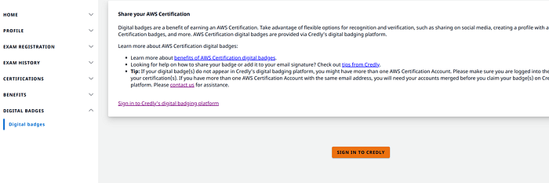
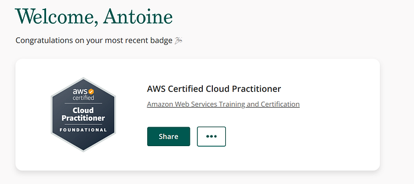

J’ai passé **AWS Certified Cloud Practitioner (CLF-C02)** en environ **deux semaines** (~60 h) — pas parce que l’examen est facile, mais parce que mélanger vidéos, labs et préparation gamifiée m’a gardé en mouvement. Ce billet liste les ressources (Udemy, Skill Builder, Cloud Quest, Escape Room) et les détails **Pearson VUE** : temps supplémentaire si l’anglais n’est pas votre langue maternelle, proctoring en ligne, badge Credly. **[English version]()**.

<!--more-->

### **Mon guide d’étude : sprint sur deux semaines**

**Temps investi :** environ **60 heures** sur deux semaines.

Ressources utilisées :

1. **Ultimate AWS Certified Cloud Practitioner CLF-C02** (Udemy — payant)

2. **AWS Cloud Quest: Cloud Practitioner** (AWS Skill Builder — gratuit)

3. **AWS Escape Room: Exam Prep for AWS Certified Cloud Practitioner** (CLF-C02) (AWS Skill Builder — essai gratuit payant)

4. **Examen blanc gratuit** ([https://www.w3schools.com/aws/aws_cloudessentials_awscert.php](https://www.w3schools.com/aws/aws_cloudessentials_awscert.php))

5. **Exam Prep Enhanced Course: AWS Certified Cloud Practitioner** (CLF-C02 — anglais) (AWS Skill Builder — essai gratuit payant)

### AWS Skill Builder

AWS Skill Builder est un centre d’apprentissage en ligne pour approfondir les services AWS à tous niveaux, du débutant à l’avancé.

**Fonctionnalités :**

- **Parcours structurés :** pour Cloud Practitioner, un chemin couvre les objectifs d’examen.  
- **Labs pratiques :** mise en situation sur de vrais scénarios.  
- **Contenu varié :** vidéos, quiz, lectures, pour différents styles d’apprentissage.

**AWS Cloud Quest : gamifier le cloud**

AWS Cloud Quest: Cloud Practitioner transforme l’apprentissage en aventure (quêtes, énigmes).

- **Apprentissage interactif**  
- **Scénarios réalistes**  
- **Engagement**

**AWS Escape Room**

L’Escape Room AWS simule des situations où il faut résoudre des défis pour « s’échapper » de salles virtuelles.

- **Simulation d’examen** : format et contrainte de temps.  
- **Esprit critique** : utile pour l’examen et le terrain.  
- **Interactif** : garde la motivation pendant la préparation.

**Synthèse de mon parcours**

- **Semaine 1 :** cours Udemy Ultimate AWS Cloud Practitioner, vidéos et labs.  
- **Semaine 2 :** Cloud Quest, Escape Room, examens blancs et cours Exam Prep Enhanced sur Skill Builder.

## Pearson VUE et temps d’examen supplémentaire

J’ai passé l’examen via **Pearson VUE** (présentiel ou en ligne). De la réservation au jour J, l’expérience a été fluide.

Si l’**anglais n’est pas votre langue première**, AWS permet de demander une **prolongation de 50 %** de la durée :

1. **Certifications AWS :** avant de planifier, rubrique **exam accommodations**

2. **Pièce d’identité** valide pour la vérification (présentiel ou en ligne).

3. **Planifier avec l’extension** une fois approuvée — plus de temps pour lire chaque question sereinement.

## Examen surveillé en ligne

1. **Délais d’attente** : se connecter au moins **30 minutes** avant pour les contrôles.  
2. **Pièce** : propre, sans nourriture ni second écran ; la procuration demande une vue **360°** de la pièce.  
3. **Logiciel Pearson VUE** : installer et tester à l’avance.  
4. **Calme** : prévenir l’entourage pour limiter les interruptions.

## Badge numérique

Après réussite, AWS délivre un badge via **Credly** :

1. Attendre **2–3 jours** l’e-mail Credly.  
2. Créer un compte Credly avec la **même adresse** que la certification AWS.  
3. **Accepter** le badge.  
4. **Partager** sur LinkedIn, CV, etc.

### Bilan

La certif est surtout un test de vocabulaire cloud, pas un examen d’architecte senior — mais **Cloud Quest** et **Escape Room** ont mieux fixé les termes que les seules vidéos. Si vous faites un sprint similaire, empilez un cours payant, les essais Skill Builder, et réservez l’examen tant que le contexte est chaud.

### Références

*   [AWS Skill Builder](https://aws.amazon.com/training/skill-builder/)
*   [AWS Cloud Quest](https://aws.amazon.com/training/digital/aws-cloud-quest/)
*   Ultimate AWS Certified Cloud Practitioner CLF-C02 (Udemy)
*   [AWS Escape Room: Exam Prep for AWS Certified Cloud Practitioner](https://aws.amazon.com/training/digital/aws-escape-room/)
*   Examen blanc gratuit (W3Schools)
*   [Exam Prep Enhanced Course: AWS Certified Cloud Practitioner](https://aws.amazon.com/training/digital/aws-certified-cloud-practitioner-exam-prep/)

---

*Publié à l’origine sur [Medium](https://medium.com/@antoine.boucher012/a-journey-to-aws-certified-cloud-practitioner-9b17dffe4533).*
