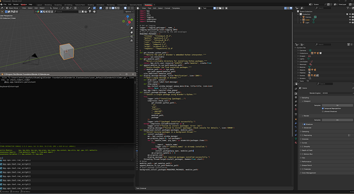

Blender add-ons that need **NumPy**, **meshio**, or **requests** hit the same wall: Blender ships its **own Python**, so `pip install` on your system Python does nothing. I wrote a small installer that targets Blender’s `sys.executable`, drops wheels under `scripts/modules`, and runs in a **background thread** so the UI stays responsive (Blender 4.2+, Windows). **[Version française]()**.

<!--more-->



*Running the installer from the Text Editor (Scripting workspace).*

## Why Install External Packages in Blender’s Python?

Many advanced Blender add-ons require external Python libraries, such as:

*   **NumPy & SciPy** — Scientific computing and mesh processing
*   **Meshio** — Converting mesh file formats
*   **Pillow** — Image processing
*   **Requests** — Handling HTTP requests for APIs
*   **PyTorch/TensorFlow** — Machine learning integration

Since Blender ships with its own Python environment, these packages **must be installed within Blender’s directory** rather than the system-wide Python installation.

## A Robust & Generalized Python Script for Add-ons

This script ensures the **automatic installation** of required packages inside Blender’s Python environment. It detects missing modules, and installs them using Blender’s `sys.executable`, and provides user feedback.

## 💡 Features

✔️ Works **inside** Blender without requiring terminal commands  
✔️ Installs **multiple packages** automatically  
✔️ Uses a **user-writable directory** instead of modifying Blender’s core files  
✔️ Runs **asynchronously** to keep Blender responsive

## 📜 The Installation Script

```python
import bpy
import sys
import site
import logging
import subprocess
import threading

# Set up logging
logger = logging.getLogger(__name__)
logging.basicConfig(level=logging.INFO)
# List of packages required by the add-on/plugin
REQUIRED_PACKAGES = {
    "fileseq": "fileseq==1.15.2",
    "meshio": "meshio==5.3.4",
    "rich": "rich==13.7.0",
    "requests": "requests==2.31.0"
}
def get_blender_python_path():
    """Returns the path of Blender's embedded Python interpreter."""
    return sys.executable
def get_modules_path():
    """Return a writable directory for installing Python packages."""
    return bpy.utils.user_resource("SCRIPTS", path="modules", create=True)
def append_modules_to_sys_path(modules_path):
    """Ensure Blender can find installed packages."""
    if modules_path not in sys.path:
        sys.path.append(modules_path)
    site.addsitedir(modules_path)
def display_message(message, title="Notification", icon='INFO'):
    """Show a popup message in Blender."""
    def draw(self, context):
        self.layout.label(text=message)
    def show_popup():
        bpy.context.window_manager.popup_menu(draw, title=title, icon=icon)
        return None  # Stops timer
    bpy.app.timers.register(show_popup)
def install_package(package, modules_path):
    """Install a single package using Blender's Python."""
    try:
        logger.info(f"Installing {package}...")
        subprocess.check_call([
            get_blender_python_path(),
            "-m",
            "pip",
            "install",
            "--upgrade",
            "--target",
            modules_path,
            package
        ])
        logger.info(f"{package} installed successfully.")
    except subprocess.CalledProcessError as e:
        logger.error(f"Failed to install {package}. Error: {e}")
        display_message(f"Failed to install {package}. Check console for details.", icon='ERROR')
def background_install_packages(packages, modules_path):
    """Install missing packages in a background thread."""
    def install_packages():
        wm = bpy.context.window_manager
        wm.progress_begin(0, len(packages))
        for i, (module_name, pip_spec) in enumerate(packages.items()):
            try:
                __import__(module_name)
                logger.info(f"'{module_name}' is already installed.")
            except ImportError:
                install_package(pip_spec, modules_path)
            wm.progress_update(i + 1)
        wm.progress_end()
        display_message("All required packages installed successfully.")
    threading.Thread(target=install_packages, daemon=True).start()
# Setup
modules_path = get_modules_path()
append_modules_to_sys_path(modules_path)
# Start package installation
background_install_packages(REQUIRED_PACKAGES, modules_path)
```

## 📌 Step-by-Step Breakdown

## 1️⃣ Identifying Blender’s Python Path

```python
def get_blender_python_path():
    return sys.executable
```

*   Finds Blender’s Python interpreter (`python.exe`) to ensure `pip` installs packages correctly.

## 2️⃣ Choosing the Installation Directory

```python
def get_modules_path():
    return bpy.utils.user_resource("SCRIPTS", path="modules", create=True)
```

*   Installs packages in Blender’s **user scripts directory** (`AppData\Roaming\Blender Foundation\Blender\<version>\scripts\modules`).

## 3️⃣ Ensuring Packages Are Found

```python
def append_modules_to_sys_path(modules_path):
    if modules_path not in sys.path:
        sys.path.append(modules_path)
    site.addsitedir(modules_path)
```

*   Adds the modules directory to Python’s search path (`sys.path`), ensuring that Blender can **find the installed packages**.

## 4️⃣ Installing a Single Package

```python
def install_package(package, modules_path):
    subprocess.check_call([
        get_blender_python_path(),
        "-m",
        "pip",
        "install",
        "--upgrade",
        "--target",
        modules_path,
        package
    ])
```

*   Uses Blender’s **Python environment** to install the required package in the correct directory.

## 5️⃣ Handling Multiple Packages

```python
def background_install_packages(packages, modules_path):
    threading.Thread(target=install_packages, daemon=True).start()
```

*   Runs installation **in a background thread** to prevent Blender from freezing.

## 6️⃣ Displaying User Messages

```python
def display_message(message, title="Notification", icon='INFO'):
    bpy.app.timers.register(show_popup)
```

*   Provides **popup notifications** for a user-friendly installation experience.

## 🚀 How to Use This Script

## Option 1: Running Inside Blender

1.  Open **Blender** (Version 4.2+).
2.  Go to the **Scripting** workspace.
3.  Open the **Text Editor**.
4.  Paste the script and click **Run Script**.
5.  Blender will automatically **install the required packages** and display a popup when complete.

## Option 2: Using as Part of an Add-on

*   Include this script inside your add-on to ensure required dependencies are installed automatically.

```python
def register():
  """Register all classes and set up PointerProperties."""
  modules_path = get_modules_path()
  append_modules_to_sys_path(modules_path)
  # Install required packages in the background
  background_install_packages(REQUIRED_PACKAGES, modules_path)
  ...
```

## 🛠️ Troubleshooting

**Packages Not Found After Installation?**

*   Restart Blender after running the script.
*   Manually check `sys.path` to ensure the correct directory is listed:

```python
import sys
print(sys.path)
```

## Takeaway

Ship the installer with your add-on’s `register()` and users stop emailing “which Python do I use?” Restart Blender once after the first run if imports fail — then check `sys.path` includes your `modules` folder.

## 🔗 Further Reading

*   [Blender API Documentation](https://docs.blender.org/api/current/)
*   [Managing Python in Blender](https://wiki.blender.org/wiki/Building_Blender/Python)
*   [Python Package Installation Guide](https://packaging.python.org/)

---

*Originally published on [Medium](https://medium.com/@antoine.boucher012/a-method-to-install-python-packages-for-add-ons-plugins-in-blender-windows-blender-4-2-98bcbe10fa81).*
