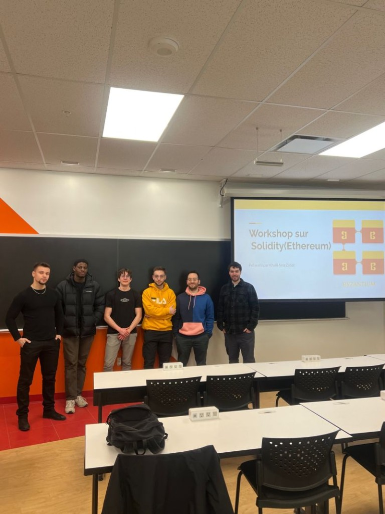
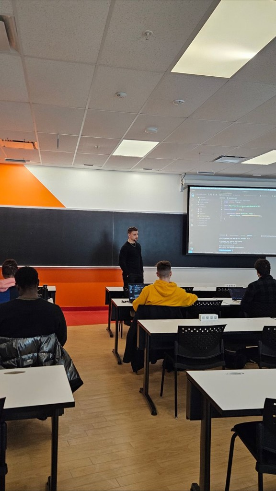
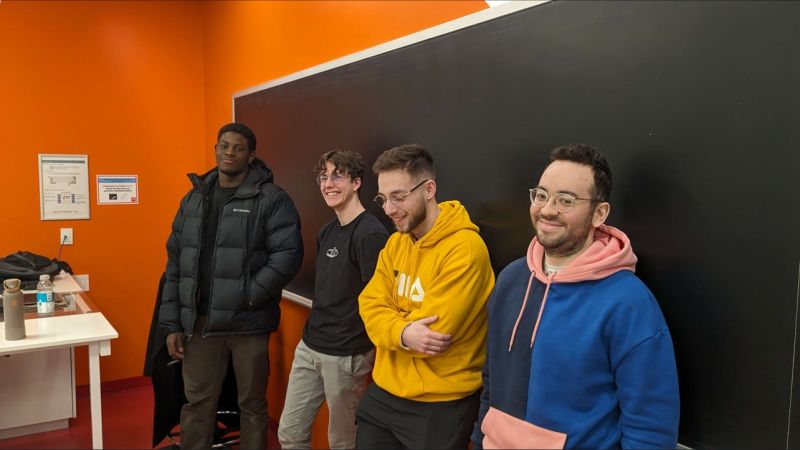
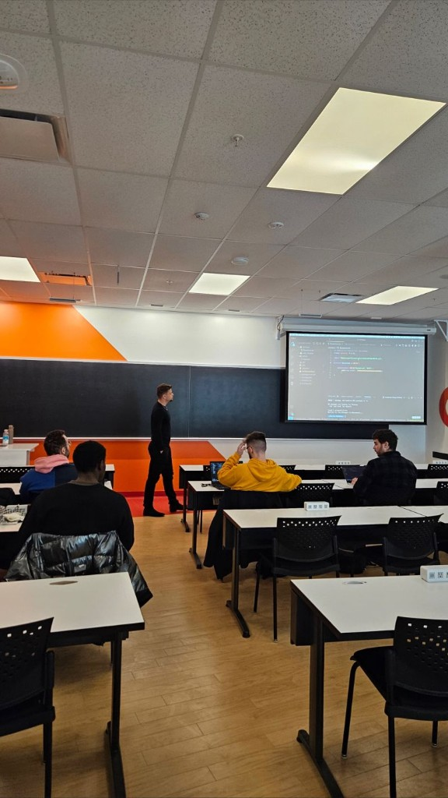

On **11 March 2024**, **Byzantium** ran its **first Ethereum workshop** at ÉTS: a hands-on evening where people who had never touched a chain left with a **testnet token** they could send to a friend. **Khalil Anis Zabat** led the session in French; this page is the English recap. **[Version française]()** has the same story with a bit more room for detail.

<!--more-->

## What we actually did

The arc was deliberate and beginner-friendly:

1. **Remix in the browser** — compile and deploy without installing a full toolchain first, so you could redo the steps at home.
2. **A local dev setup** (editor + node tooling) — the “how professionals repeat this” half, with the same ERC-20 idea carried over.
3. **Sepolia** — test ETH from a faucet, **MetaMask** as the wallet, **Infura** (or similar) as the RPC bridge because nobody has a direct door into the chain.
4. **OpenZeppelin** — don’t reinvent `transfer`; inherit battle-tested **ERC-20** and focus on name, symbol, decimals, and an initial mint.
5. **Peer transfers** — deploy, copy contract addresses, and **send tokens to each other** until the room felt like a tiny economy.

That last step matters. Until you push a transaction and see it on a block explorer, Solidity is just syntax. Afterward it is a public ledger with your name on one line.

## The token we started from

Khalil walked through a minimal mintable ERC-20 — roughly:

```solidity
// SPDX-License-Identifier: MIT
pragma solidity ^0.8.20;

import "@openzeppelin/contracts/token/ERC20/ERC20.sol";

contract MyToken is ERC20 {
    constructor() ERC20("MyToken", "MTK") {
        _mint(msg.sender, 1000000 * 10 ** decimals());
    }
}
```

You pick **name** and **symbol**, set **decimals** (often 18), and **mint** an initial supply to `msg.sender` (the deployer). OpenZeppelin is the community’s shared library for standards — the same idea as **ERC-721** for NFTs, but here we stayed on fungible tokens.



## Concepts that came up in Q&A

These were the live questions, not slide titles — worth keeping for anyone revisiting the workshop vibe.

**Block explorers (Etherscan, Sepolia variants).** Every transaction is a row: who sent what, to whom, gas paid, block number. Indexers and companies building on Ethereum rely on that history; you can literally search an address and walk the graph of past calls.

**Gas and limits.** Contracts are not unconstrained Turing machines in practice — infinite loops can burn gas and stall. Developers set gas limits; users pay for execution. Mainnet fees were discussed as “real money” (on the order of tens of dollars for busy periods in 2024); **Sepolia** kept the lesson affordable.

**ABI = the skeleton.** After deploy, the ABI is how apps (or bots) know which functions exist. Khalil gave a stage example: watch a contract’s `mint` with a timer, filter mempool traffic, prioritize with higher gas — the kind of automation people build on top of public ABIs, not magic.

**On-chain vs off-chain data.** Storage on-chain is expensive. Patterns point to **hashes or URIs** (IPFS, storage chains) for bulky data; the chain holds the reference, not the JPEG. Keep the contract small.

**Decentralization (opinions in the room).** Side debate: maximal decentralization vs pragmatic bridges for enterprises while the stack matures. No verdict — useful tension for a student club workshop.

## Room and energy

Tables, power strips, and laptops open — good for pairing when Remix threw a curveball or MetaMask asked for another confirmation.





Byzantium framed **follow-up workshops** around other token types and deeper Solidity patterns. This one was the on-ramp.

## Links

- [LinkedIn thread / Byzantium recap](https://www.linkedin.com/posts/antoineboucher12_retour-sur-notre-tout-premier-workshop-activity-7173128307155156992-tQy4)
- [Deployed contract (short link)](https://lnkd.in/e-9T5-MX)
- [OpenZeppelin Contracts](https://docs.openzeppelin.com/contracts)
- [Remix IDE](https://remix.ethereum.org/)
- [Sepolia testnet explorer](https://sepolia.etherscan.io/)

Thanks to **Khalil** for teaching through the messy middle (wallets, faucets, failed txs), and to everyone who showed up for Byzantium’s first chain night.

## Related posts

- [Diagram prompts with ChatGPT and AIPRM]() — explaining systems in prose
- [QcES lean discovery pitch]() — another ÉTS-adjacent learning format
