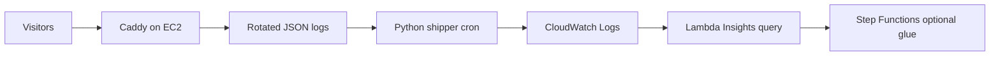

I already ran **Caddy** at home for Home Assistant. This article is the **AWS edge** version: **EC2** (often `t4g.nano`), automatic HTTPS, JSON access logs in **CloudWatch**, a nightly Python shipper, and **Lambda + Step Functions** for cheap observability — not a SaaS dashboard bill. **[Version française]()**.

<!--more-->

## Architecture story



Homelab taught me to like Caddy’s **Caddyfile** ergonomics. AWS taught me to like **paying cents** for a nano instance when traffic is personal-scale.

## Step 1 — EC2 + Caddy

- AMI: Amazon Linux 2 (or similar).
- Instance: `t2.micro` free tier or **`t4g.nano`** when you want ARM cheap always-on (~$0.10/day in the original notes).
- Security group: **22, 80, 443**.


Install:

```bash
sudo yum update -y
sudo yum install -y yum-utils
sudo yum-config-manager --add-repo https://dl.cloudsmith.io/public/caddy/stable/rpm.repo
sudo yum install caddy -y
```

### Caddyfile pattern

Per-site log snippets + reverse proxy to CloudFront or local services:

```caddyfile
{
  email you@example.com
  servers { metrics }
  admin :2019
}
(log_site) {
  log {
    output file /home/ec2-user/caddy/logs/{args[0]}.log {
      roll_size 10mb
      roll_keep 5
      roll_keep_for 168h
    }
    level INFO
  }
}
example.com www.example.com {
  import log_site example.com
  reverse_proxy https://your-origin.example
}
```

Reload: `sudo caddy reload`.

## Step 2 — CloudWatch without drowning in files

Caddy writes **rotated JSON logs** under `/home/ec2-user/caddy/logs/`. A small **boto3** script reads each file stream and `put_log_events` into group `reverse_proxy` (create group/stream on first sight).

Schedule with **cron** at night so daytime SSH stays quiet:

```cron
0 0 * * * /usr/bin/python3 /home/ec2-user/cloudwatch.py
```

Core loop (abbreviated):

```python
cloudwatch = boto3.client("logs", region_name="us-east-1")
log_group_name = "reverse_proxy"
# for each .log file → log stream → put_log_events per line
```

Full script: [Medium original](https://medium.com/@antoine.boucher012/making-caddy-aws-ec2-cloudwatch-step-functions-and-lambda-work-together-creating-a-cheap-and-990fd0d9427d).

## Step 3 — Lambda + Insights queries

Lambda can run **CloudWatch Logs Insights** queries on a schedule (via Step Functions in the full write-up). Example — distinct remote IPs:

```sql
fields @message
| parse @message /"remote_ip": "(?<remote_ip>[^"]+)"/
| stats count_distinct(remote_ip) as unique_ip by remote_ip
| sort unique_ip desc
```

Geo / location parsing variant:

```sql
fields @timestamp, @message
| parse @message /"IP": "(?<ip>[^"]+)", "Location": "(?<location>[^"]+)"/
| stats count() by ip, location
| sort count desc
```


## Cost and ops notes

| Choice | Tradeoff |
|--------|----------|
| nano EC2 | Cheap; CPU spikes on log crunch |
| File logs + cron shipper | Simple; not real-time |
| Lambda queries | Pay per run; watch free tier |
| Caddy metrics endpoint | `:2019` admin — lock down SG |

## When not to use this stack

- High-traffic production multi-tenant edge — use managed CDN/WAF.
- Strict real-time SIEM — batch shipper is too slow.
- Teams allergic to SSH maintenance — consider Fargate + sidecar.

## Takeaway

You can get **structured reverse-proxy visibility** without Datadog money if you accept cron delays and a little Python glue.

## Related posts

- [Home networking evolution]() — where Caddy started for me
- [AWS Cloud Practitioner journey]()

---

*Originally published on [Medium](https://medium.com/@antoine.boucher012/making-caddy-aws-ec2-cloudwatch-step-functions-and-lambda-work-together-creating-a-cheap-and-990fd0d9427d). Step Functions wiring: see Medium for full Lambda/SFN listings.*
