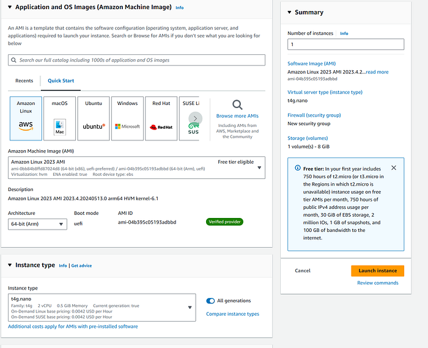
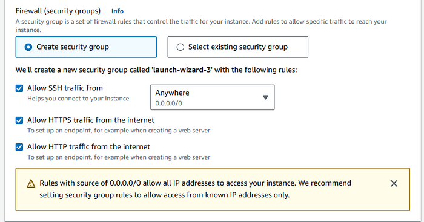
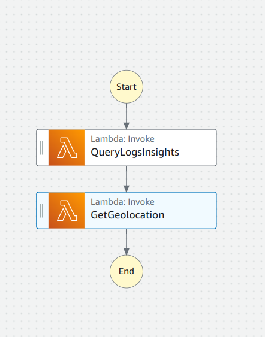
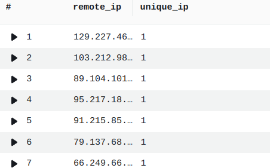
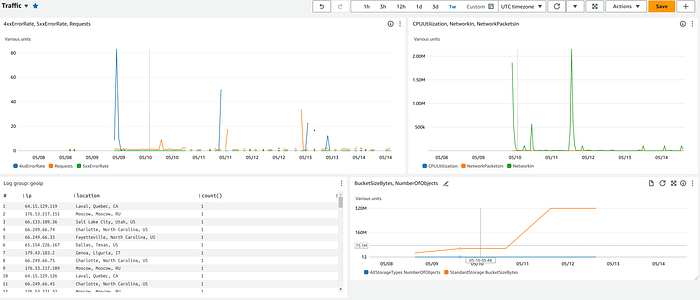

I already ran **Caddy** at home for Home Assistant; this write-up is the **cheap AWS mirror**: **EC2** (often `t4g.nano`), Caddy with automatic HTTPS, access logs into **CloudWatch**, Python shippers, and **Step Functions + Lambda** for a scrappy ops dashboard without a SaaS bill. Step-by-step detail is below as imported from Medium. **[Version française]()**.

<!--more-->

### Step 1: Setting Up Caddy on AWS EC2

Caddy is a powerful, easy-to-use web server that provides automatic HTTPS. It is an excellent choice for managing web traffic and reverse proxying. I use caddy for my home assistants at home

Launch an EC2 Instance:

*   Log in to the AWS Management Console.
*   Navigate to EC2 and launch a new instance.
*   Choose an Amazon Linux 2 AMI (or any preferred Linux distribution).
*   Select an instance type (e.g., t2.micro for the free tier or t4g.nano for 0.10$ a day).



*   Configure security group rules to allow HTTP, HTTPS, and SSH access.



2\. Install Caddy:

SSH into your EC2 instance and run the following commands to install Caddy:

sudo yum update -y  
sudo yum install -y yum-utils  
sudo yum-config-manager — add-repo https://dl.cloudsmith.io/public/caddy/stable/rpm.repo  
sudo yum install caddy -y

3\. Configure Caddy:

## Get Antoine Boucher’s stories in your inbox

Create a Caddy configuration file (`Caddyfile`) with your domain and proxy settings. Below is an example configuration:

```caddyfile
{
 email antoine@antoineboucher.info
 servers {
 metrics
 }
 admin :2019
}
(log_site) {
 log {
 output file /home/ec2-user/caddy/logs/{args[0]}.log {
 roll_size 10mb
 roll_keep 5
 roll_keep_for 168h
 }
 level INFO
 }
}
antoineboucher.info www.antoineboucher.info {
 import log_site antoineboucher.info
 reverse_proxy <cloudfront_url>
 handle_errors {
 redir https://github.com/antoinebou12
 }
}
linkedin.antoineboucher.info www.linkedin.antoineboucher.info {
 import log_site linkedin.antoineboucher.info
 redir https://www.linkedin.com/in/antoineboucher12
}
home.antoineboucher.info www.home.antoineboucher.info {
 import log_site home.antoineboucher.info
 reverse_proxy http://127.0.0.1:8080
}
```

Start Caddy:

> sudo caddy reload

sudo caddy reload

### Step 2: Monitoring with AWS CloudWatch

AWS CloudWatch is a monitoring and management service that provides data and actionable insights for AWS, hybrid, and on-premises applications.

1.  Configure Caddy to Log to CloudWatch: Modify your Caddy configuration to log directly to CloudWatch Logs. You can use the AWS CLI or SDKs to push logs to CloudWatch.

import os  
import boto3  
from datetime import datetime  
  
\# Initialize the CloudWatch client  
cloudwatch = boto3.client('logs', region\_name='us-east-1')  
  
\# Define your log group name  
log\_group\_name = 'reverse\_proxy'  
  
\# Path to your log directory  
log\_directory = "/home/ec2-user/caddy/logs"  
  
def send\_log\_to\_cloudwatch(log\_stream\_name, log\_message):  
    try:  
        \# Get or create the log stream  
        streams = cloudwatch.describe\_log\_streams(logGroupName=log\_group\_name, logStreamNamePrefix=log\_stream\_name)  
        if not streams\['logStreams'\]:  
            cloudwatch.create\_log\_stream(logGroupName=log\_group\_name, logStreamName=log\_stream\_name)  
        \# Send log to CloudWatch  
        cloudwatch.put\_log\_events(  
            logGroupName=log\_group\_name,  
            logStreamName=log\_stream\_name,  
            logEvents=\[  
                {  
                    'timestamp': int(datetime.now().timestamp() \* 1000),  
                    'message': log\_message  
                }  
            \]  
        )  
    except Exception as e:  
        print(f"Failed to send log to CloudWatch: {str(e)}")  
  
\# Read logs from files and send to CloudWatch  
for filename in os.listdir(log\_directory):  
    if filename.endswith(".log"):  
        log\_stream\_name = filename\[:-4\]  \# Remove .log from filename to use as stream name  
        file\_path = os.path.join(log\_directory, filename)  
        with open(file\_path, 'r') as file:  
            for line in file:  
                send\_log\_to\_cloudwatch(log\_stream\_name, line.strip())

You can setup a cronjob at night for the python script inside the ec2 instance

sudo yum install cronie -y  
sudo systemctl start crond  
sudo systemctl enable crond  
chmod +x /home/ec2-user/cloudwatch.py  
crontab -e  
0 0 \* \* \* /usr/bin/python3 /home/ec2-user/cloudwatch.py

1.  Create CloudWatch Log Group:

aws logs create\-log\-group - log\-group-name reverse\_proxy  
aws logs create\-log\-group - log\-group-name geoip

**Set Up a Lambda Function to Push Logs:**

import boto3  
import json  
import time  
from datetime import datetime, timedelta  
  
def lambda\_handler(event, context):  
    client = boto3.client('logs')  
    query = """  
    fields @timestamp, @message  
    | parse @message /"remote\_ip": "(?<remote\_ip>\[^"\]+)"/  
    | stats count() by remote\_ip  
    | sort remote\_ip asc  
    """  
      
    log\_group = 'reverse\_proxy'  
    start\_query\_response = client.start\_query(  
        logGroupName=log\_group,  
        startTime=int((datetime.now() - timedelta(days=1)).timestamp()),  
        endTime=int(datetime.now().timestamp()),  
        queryString=query  
    )  
      
    query\_id = start\_query\_response\['queryId'\]  
    response = None  
    max\_wait\_time = 30  \# maximum wait time of 30 seconds  
    start\_time = time.time()  
      
    while response is None or response\['status'\] == 'Running':  
        if time.time() - start\_time > max\_wait\_time:  
            raise TimeoutError("Query did not complete within the maximum wait time.")  
        response = client.get\_query\_results(queryId=query\_id)  
        time.sleep(0.5)  \# Reduced sleep interval to check more frequently  
      
    ip\_addresses = \[\]  
    for result in response\['results'\]:  
        for field in result:  
            if field\['field'\] == 'remote\_ip':  
                ip\_addresses.append(field\['value'\])  
      
    return {  
        'statusCode': 200,  
        'body': json.dumps({'ip\_addresses': ip\_addresses})  
    }

**Step 3: Automating with AWS Step Functions and Lambda**

{  
  "Comment": "Query CloudWatch Logs and Get IP Geolocation",  
  "StartAt": "QueryLogsInsights",  
  "States": {  
    "QueryLogsInsights": {  
      "Type": "Task",  
      "Resource": "arn:aws:lambda:us-east-1:590183756542:function:QueryLogsInsights",  
      "Next": "GetGeolocation"  
    },  
    "GetGeolocation": {  
      "Type": "Task",  
      "Resource": "arn:aws:lambda:us-east-1:590183756542:function:GeolocationIP",  
      "End": true  
    }  
  }  
}



**Lambda Function for CloudWatch Insights Query:**

import json  
import urllib3  
import boto3  
import time  
  
def lambda\_handler(event, context):  
    \# Extract IP addresses from the event  
    ip\_addresses = json.loads(event\['body'\])\['ip\_addresses'\]  
      
    http = urllib3.PoolManager()  
    results = \[\]  
  
    for ip in ip\_addresses:  
        response = http.request('GET', f"https://ipinfo.io/{ip}/json")  
        data = json.loads(response.data.decode('utf-8'))  
        results.append({  
            'IP': ip,  
            'Location': f"{data.get('city')}, {data.get('region')}, {data.get('country')}",  
            'Coordinates': data.get('loc'),  
            'Organization': data.get('org'),  
            'Timezone': data.get('timezone')  
        })  
      
    \# Log results to CloudWatch Logs  
    log\_client = boto3.client('logs')  
    log\_group\_name = 'geoip'  
    log\_stream\_name = 'geolocation\_results'  
      
    \# Ensure the log group exists  
    try:  
        log\_client.create\_log\_group(logGroupName=log\_group\_name)  
    except log\_client.exceptions.ResourceAlreadyExistsException:  
        pass  
  
    \# Ensure the log stream exists  
    try:  
        log\_client.create\_log\_stream(logGroupName=log\_group\_name, logStreamName=log\_stream\_name)  
    except log\_client.exceptions.ResourceAlreadyExistsException:  
        pass  
      
    \# Put log events for each location  
    log\_events = \[\]  
    for result in results:  
        log\_events.append({  
            'timestamp': int(time.time() \* 1000),  \# Current time in milliseconds  
            'message': json.dumps(result)  
        })  
      
    \# Split log events into batches of 10 (AWS limit for PutLogEvents)  
    batch\_size = 10  
    for i in range(0, len(log\_events), batch\_size):  
        response = log\_client.put\_log\_events(  
            logGroupName=log\_group\_name,  
            logStreamName=log\_stream\_name,  
            logEvents=log\_events\[i:i+batch\_size\]  
        )  
      
    return {  
        'statusCode': 200,  
        'body': json.dumps(results)  
    }

**Cloudwatch query to unique ip by subdomain**

fields @message  
| parse @message /"remote\_ip": "(?<remote\_ip>\[^"\]+)"/  
| stats count\_distinct(remote\_ip) as unique\_ip by remote\_ip  
| sort unique\_ip desc



**Cloudwatch query to fetch the location**

fields @timestamp, @message  
| parse @message /"IP": "(?<ip>\[^"\]+)", "Location": "(?<location\>\[^"\]+)"/  
| stats count() by ip, location  
| sort count desc



### Takeaway

You do not need a managed observability suite to see **which subdomain got traffic** or **where requests clustered** — CloudWatch Insights queries on Caddy JSON logs plus a little Lambda glue go a long way. Watch free-tier limits and log volume on a nano instance.

---

*Originally published on [Medium](https://medium.com/@antoine.boucher012/making-caddy-aws-ec2-cloudwatch-step-functions-and-lambda-work-together-creating-a-cheap-and-990fd0d9427d).*
