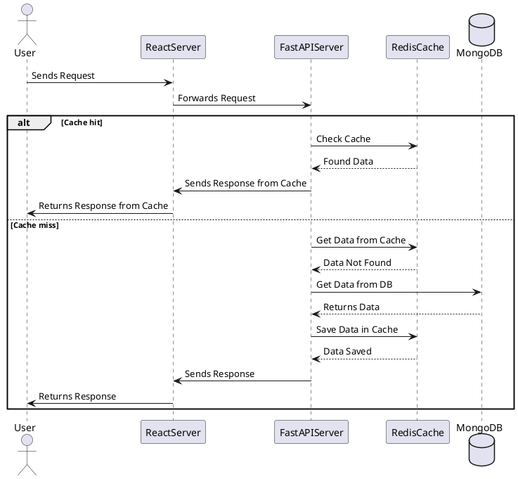
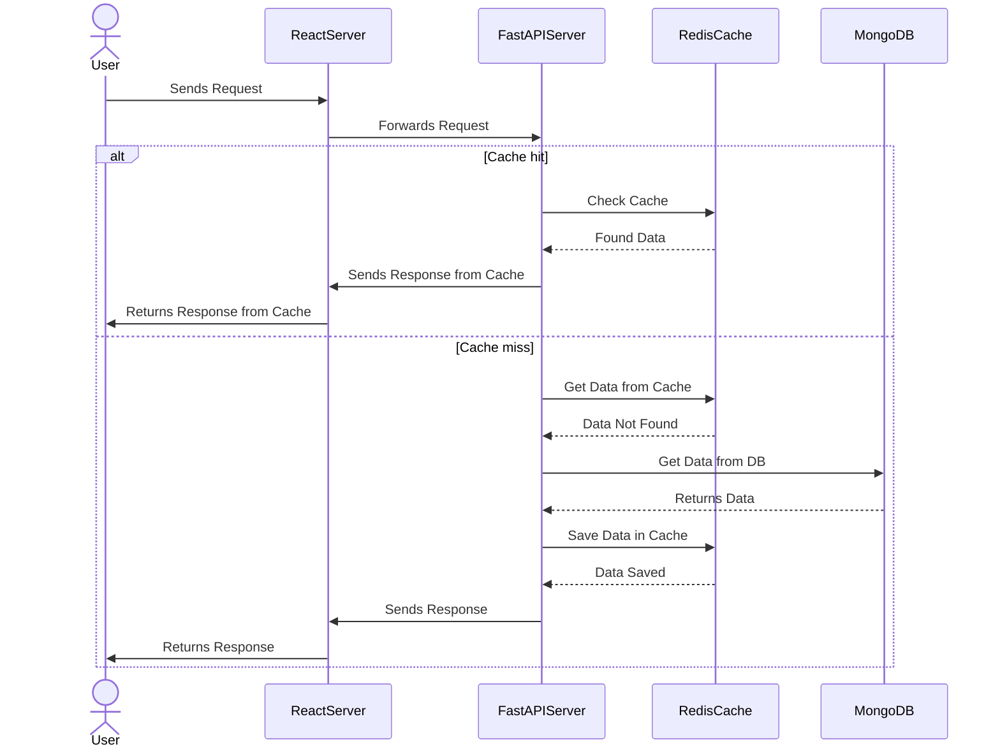

L’extension navigateur [AIPRM](https://www.aiprm.com/) ajoute des modèles de prompts réutilisables dans ChatGPT. Avec un **prompt structuré** (type de diagramme, ce qu’il faut représenter, pourquoi, et quel outil), vous obtenez des réponses cohérentes — que vous visiez du texte (**PlantUML**, **Mermaid**) ou une marche à suivre pour un outil graphique.

**[Article complet en anglais]()** (même slug — vous pouvez aussi choisir **EN** dans l’en-tête du site).

## Gabarit de prompt AIPRM (à copier et adapter)

Une ligne par dimension. Collez le bloc dans ChatGPT (avec ou sans AIPRM) et modifiez les valeurs entre crochets.

```text
[DIAGRAM TYPE] - Sequence | Use Case | Class | Activity | Component | State | Object | Deployment | Timing | Network | Wireframe | Archimate | Gantt | MindMap | WBS | JSON | YAML

[ELEMENT TYPE] - Actors | Messages | Objects | Classes | Interfaces | Components | States | Nodes | Edges | Links | Frames | Constraints | Entities | Relationships | Tasks | Events | Modules

[PURPOSE] - Communication | Planning | Design | Analysis | Modeling | Documentation | Implementation | Testing | Debugging
(optionnel : précisez la stack ou le scénario, ex. « Communication : frontend React server — backend FastAPI — cache Redis — base MongoDB »)

[DIAGRAMMING TOOL] - PlantUML | Mermaid | Draw.io | Lucidchart | Creately | Gliffy
```

### Exemple : diagramme de séquence pour une API avec cache

```text
[DIAGRAM TYPE] - Sequence
[ELEMENT TYPE] - Messages
[PURPOSE] - Communication Frontend React Server - Backend FastAPI - Cache Redis - Database MongoDB
[DIAGRAMMING TOOL] - PlantUML
```

## Lien public AIPRM

Prompt publié dans la bibliothèque AIPRM : [lien LinkedIn](https://lnkd.in/gcV25_BY). Utilisez-le comme point de départ, puis affinez `[PURPOSE]` et `[DIAGRAMMING TOOL]` selon votre stack et vos livrables.

## Les diagrammes de séquence en bref

Les diagrammes de séquence UML montrent les **messages** échangés dans le temps entre composants. Ils servent à l’onboarding, aux revues de conception et à documenter un parcours requête (surtout quand un cache ou une base est sur le chemin critique).

## Communication front–back avec mise en cache

L’illustration ci-dessous : une requête utilisateur traverse un front **React** et un back **FastAPI**, avec **Redis** comme cache et **MongoDB** comme source de vérité. Les extraits de code incluent une branche **cache hit** et une **cache miss**.


## PlantUML (hit et miss)



## Mermaid (hit et miss)



## Draw.io, Lucidchart, Creately et Gliffy

Ce sont des outils **orientés canevas**. Souvent le plus rapide est de faire générer **PlantUML ou Mermaid** dans ChatGPT, puis :

- **Exporter** depuis un serveur ou la CLI PlantUML en **SVG** ou **PNG** et **importer** ce graphique comme calque de base, ou
- Demander à ChatGPT (avec le gabarit) une **liste numérotée des lifelines et des messages**, et les reproduire avec les formes et connecteurs de l’outil.

Vous évitez la page blanche tout en gardant la main sur le style et les annotations.

## Conclusion

Un prompt structuré rend le diagramme **reproductible** : type de diagramme, éléments mis en avant, objectif (et contexte), et outil cible. AIPRM ne fait qu’accélérer l’accès à ce gabarit une fois qu’il est dans votre bibliothèque.

---

*Hashtags pour le partage :* #ChatGPT #diagramme #UML #logiciel #outilsdedesign #PlantUML #Mermaid #Drawio #Lucidchart #Creately #Gliffy
