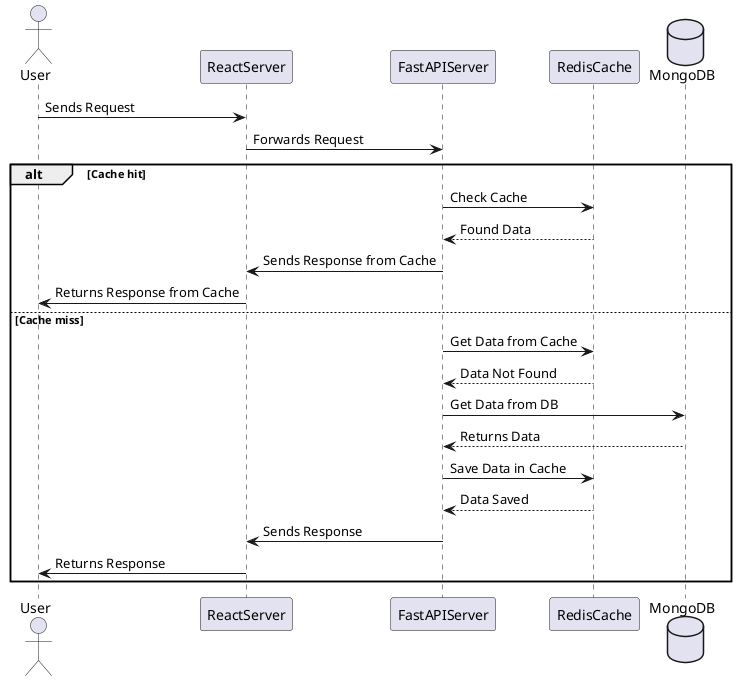
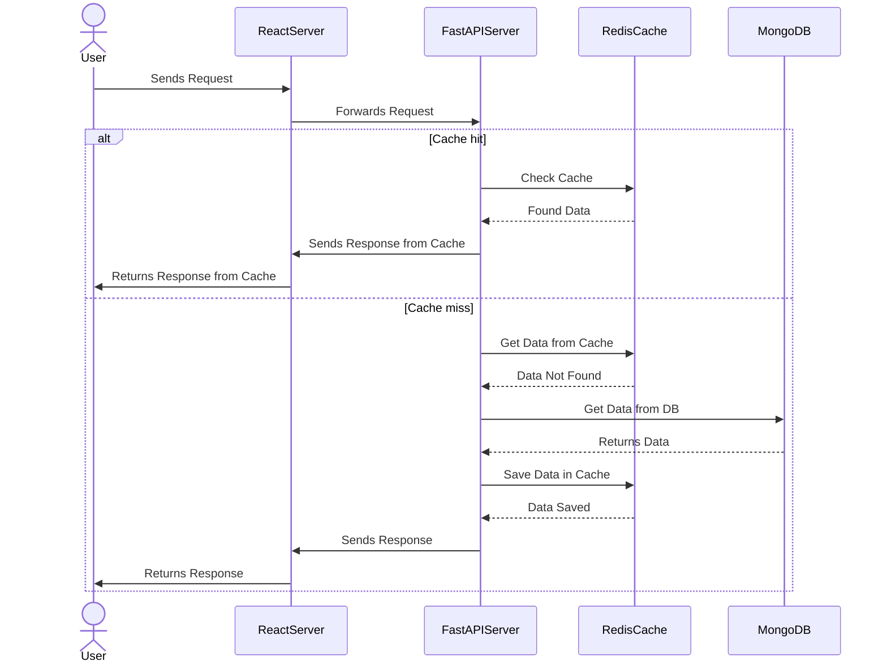

I got tired of one-off ChatGPT threads that “draw a sequence diagram” and return half-random syntax. **[AIPRM](https://www.aiprm.com/)** helps because the template lives in the browser; I lock four fields — **diagram type**, **elements**, **purpose**, **tool** — and the model stops guessing whether I want **PlantUML**, **Mermaid**, or notes for Draw.io. Related: the **[D2C OpenAI diagram plugin]()** post. **[Version française]()**.

<!--more-->

## AIPRM prompt template (copy and adapt)

Fill one line per dimension. You can paste the block below into ChatGPT (with or without AIPRM) and edit the bracketed values.

```text
[DIAGRAM TYPE] - Sequence | Use Case | Class | Activity | Component | State | Object | Deployment | Timing | Network | Wireframe | Archimate | Gantt | MindMap | WBS | JSON | YAML

[ELEMENT TYPE] - Actors | Messages | Objects | Classes | Interfaces | Components | States | Nodes | Edges | Links | Frames | Constraints | Entities | Relationships | Tasks | Events | Modules

[PURPOSE] - Communication | Planning | Design | Analysis | Modeling | Documentation | Implementation | Testing | Debugging
(optional: add your stack or scenario, e.g. "Communication: React server frontend — FastAPI backend — Redis cache — MongoDB database")

[DIAGRAMMING TOOL] - PlantUML | Mermaid | Draw.io | Lucidchart | Creately | Gliffy
```

### Example: sequence diagram for a cached API stack

```text
[DIAGRAM TYPE] - Sequence
[ELEMENT TYPE] - Messages
[PURPOSE] - Communication Frontend React Server - Backend FastAPI - Cache Redis - Database MongoDB
[DIAGRAMMING TOOL] - PlantUML
```

## Public AIPRM link

I published a prompt you can add from the AIPRM library here: [AIPRM prompt (LinkedIn)](https://lnkd.in/gcV25_BY). Use it as a starting point, then narrow `[PURPOSE]` and `[DIAGRAMMING TOOL]` for your team’s stack and deliverables.

## Introduction to sequence diagrams

Sequence diagrams are a type of UML diagram that show how parts of a system exchange **messages** over time. They are useful for onboarding, design reviews, and documenting request paths (especially when a cache or database sits on the critical path).

## Frontend–backend communication with caching

The figure below is a concrete example: a user request flows through a **React** frontend and **FastAPI** backend, with **Redis** as a cache and **MongoDB** as the system of record. The source listings that follow include both a **cache hit** and a **cache miss** branch.


## PlantUML (cache hit and cache miss)



## Mermaid (cache hit and cache miss)



## Draw.io, Lucidchart, Creately, and Gliffy

These tools are **canvas-first**: the fastest path is often to generate **PlantUML or Mermaid** in ChatGPT, then:

- **Export** from a PlantUML server or CLI to **SVG** or **PNG** and **import** that graphic into your diagram tool as a baseline layer, or
- Ask ChatGPT (using your template) for a **numbered list of lifelines and messages** in order, and recreate them with the tool’s shapes and connectors.

That avoids blank-canvas syndrome while keeping the diagram editable for styling and annotations your team expects.

## When to use this workflow

| Situation | Use structured ChatGPT + AIPRM |
|-----------|--------------------------------|
| Teaching a stack pattern once | Yes — same template for every cohort |
| One-off whiteboard photo | No — draw or photograph |
| Regulated architecture review | Yes — text diagrams diff in git |
| Pretty slides for executives | Export SVG, polish in Draw.io |

## Pitfalls

- Models confuse **cache hit** branches with **database** syntax — always render PlantUML/Mermaid locally before publishing.
- **AIPRM template drift** — copy the four lines into your repo README so you are not locked to a browser extension version.
- **Hashtag-style prompts** (“make a diagram”) without naming tool and diagram type — you get generic boxes.

## Related posts

- [D2C OpenAI diagram plugin]()
- [AI figurines / uml-mcp]()

## Takeaway

Once the four-line template is in AIPRM, diagram requests feel like filling a form instead of negotiating with the model. I still edit the output — but the first draft lands in the right language (PlantUML vs Mermaid vs bullet list for a canvas tool) often enough that reviews are faster.
