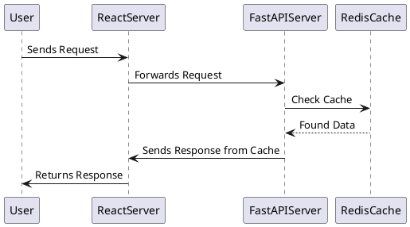
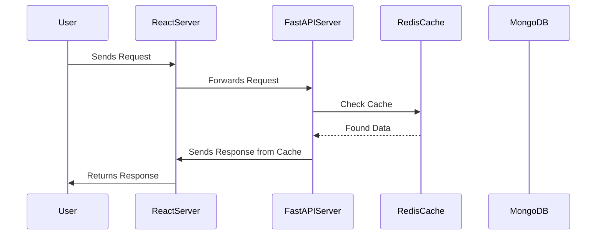

## Introduction to Sequence Diagrams

Sequence diagrams are a type of UML diagram that show how objects operate with one another and in what order. They are a key tool in software development for understanding system behavior and designing communication between components.

## Frontend-Backend Communication with Caching

This sequence diagram illustrates the process of a user request being handled by a React frontend, processed by a FastAPI backend, with caching implemented via Redis, and data persistence through MongoDB.

## Creating Diagrams with AIPRM and ChatGPT

Below are tutorials on how to create diagrams using the AIPRM Chrome extension with ChatGPT for various diagramming tools.

### PlantUML

### Mermaid

### Draw.io, Lucidchart, Creately, and Gliffy

For graphical tools like Draw.io, Lucidchart, Creately, and Gliffy, you can follow the interactive tutorials on their respective websites to recreate the sequence diagram based on the example provided.

## Conclusion

Understanding and creating sequence diagrams is essential for software development and communication. Using tools like AIPRM with ChatGPT can streamline this process and enhance your diagramming skills.