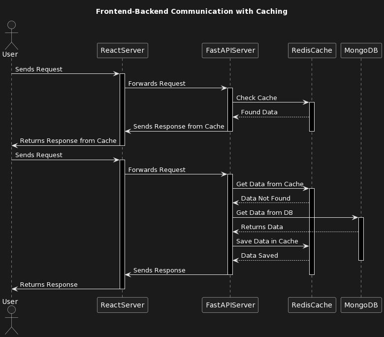
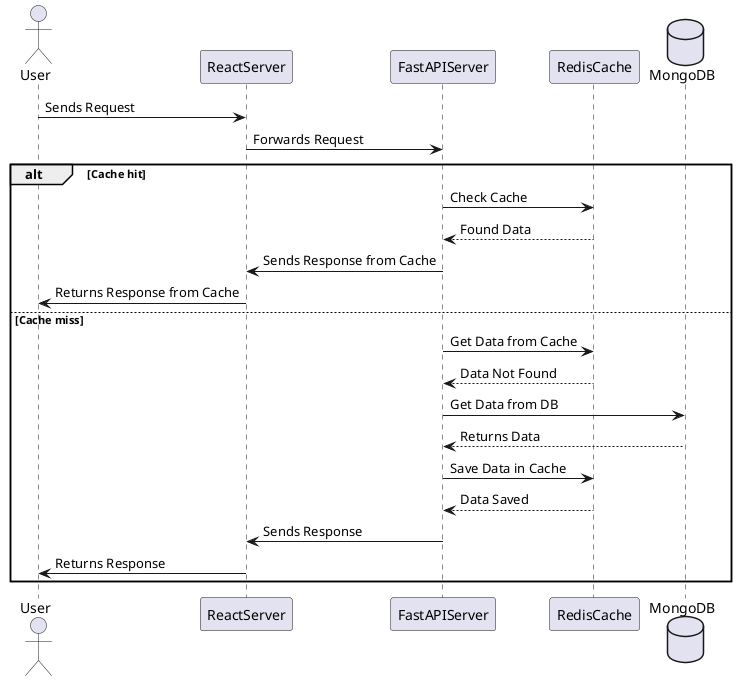
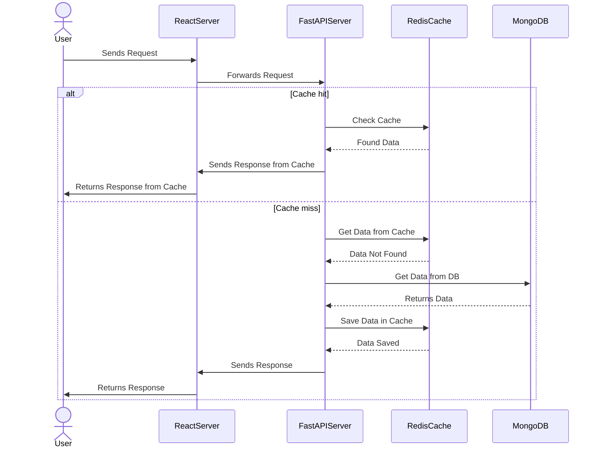

The [AIPRM](https://www.aiprm.com/) browser extension gives you reusable prompt templates inside ChatGPT. Combined with a small **structured prompt** (diagram type, what to draw, why, and which tool), you get consistent output whether you want text-first formats like **PlantUML** or **Mermaid**, or a recipe for redrawing the same flow in a canvas tool.

**[Full article in French]()** (same slug — you can also switch to **FR** in the site header).

## AIPRM prompt template (copy and adapt)

Fill one line per dimension. You can paste the block below into ChatGPT (with or without AIPRM) and edit the bracketed values.

```text
[DIAGRAM TYPE] - Sequence | Use Case | Class | Activity | Component | State | Object | Deployment | Timing | Network | Wireframe | Archimate | Gantt | MindMap | WBS | JSON | YAML

[ELEMENT TYPE] - Actors | Messages | Objects | Classes | Interfaces | Components | States | Nodes | Edges | Links | Frames | Constraints | Entities | Relationships | Tasks | Events | Modules

[PURPOSE] - Communication | Planning | Design | Analysis | Modeling | Documentation | Implementation | Testing | Debugging
(optional: add your stack or scenario, e.g. "Communication: React server frontend — FastAPI backend — Redis cache — MongoDB database")

[DIAGRAMMING TOOL] - PlantUML | Mermaid | Draw.io | Lucidchart | Creately | Gliffy
```

### Example: sequence diagram for a cached API stack

```text
[DIAGRAM TYPE] - Sequence
[ELEMENT TYPE] - Messages
[PURPOSE] - Communication Frontend React Server - Backend FastAPI - Cache Redis - Database MongoDB
[DIAGRAMMING TOOL] - PlantUML
```

## Public AIPRM link

I published a prompt you can add from the AIPRM library here: [AIPRM prompt (LinkedIn)](https://lnkd.in/gcV25_BY). Use it as a starting point, then narrow `[PURPOSE]` and `[DIAGRAMMING TOOL]` for your team’s stack and deliverables.

## Introduction to sequence diagrams

Sequence diagrams are a type of UML diagram that show how parts of a system exchange **messages** over time. They are useful for onboarding, design reviews, and documenting request paths (especially when a cache or database sits on the critical path).

## Frontend–backend communication with caching

The figure below is a concrete example: a user request flows through a **React** frontend and **FastAPI** backend, with **Redis** as a cache and **MongoDB** as the system of record. The source listings that follow include both a **cache hit** and a **cache miss** branch.



## PlantUML (cache hit and cache miss)



## Mermaid (cache hit and cache miss)



## Draw.io, Lucidchart, Creately, and Gliffy

These tools are **canvas-first**: the fastest path is often to generate **PlantUML or Mermaid** in ChatGPT, then:

- **Export** from a PlantUML server or CLI to **SVG** or **PNG** and **import** that graphic into your diagram tool as a baseline layer, or
- Ask ChatGPT (using your template) for a **numbered list of lifelines and messages** in order, and recreate them with the tool’s shapes and connectors.

That avoids blank-canvas syndrome while keeping the diagram editable for styling and annotations your team expects.

## Conclusion

Structured prompts make diagramming repeatable: you choose the **diagram type**, the **elements** to emphasize, the **purpose** (and context), and the **tool** so the model’s answer matches how you will ship the artifact. AIPRM simply makes that workflow one click away once the template lives in your library.

---

*Hashtags for sharing:* #ChatGPT #diagram #UML #software #designtools #PlantUML #Mermaid #Drawio #Lucidchart #Creately #Gliffy
