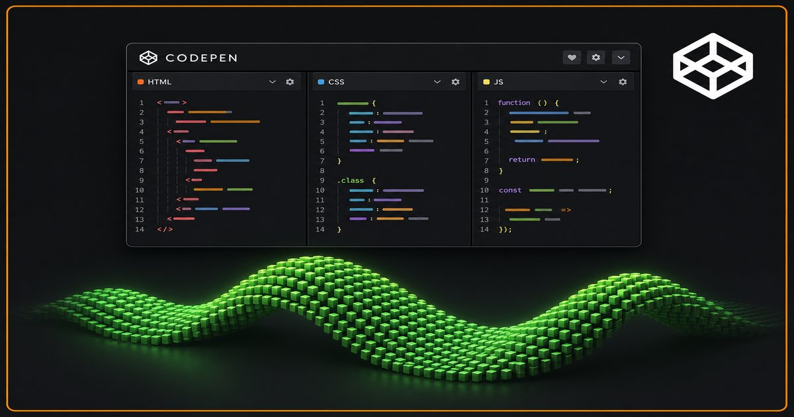

CodePen, c’était mon **carnet de labo public** avant ce blog Hugo — aperçu instantané, commentaires et forks sans déployer. Voici des **intégrations CodePen live** de l’ère jQuery et vanilla (~2016–2017) : petits labos UI, puis deux démos plus longues (Canvas et Three.js). Chaque carte reprend le **titre du pen** — pas seulement le slug. Forkez sur CodePen pour adapter. **[English version]()**.

<!--more-->

## Expériences UI et formulaires







## Widgets à la jQuery







## API navigateur





## Démos plus fournies






## Tous les pens (liens rapides)

| Pen | CodePen |
|-----|---------|
| Formulaire d’inscription | [BMdzwx](https://codepen.io/antoinebou13/pen/BMdzwx) |
| Console terminal | [JxrqQx](https://codepen.io/antoinebou13/pen/JxrqQx) |
| En-tête fixe + ancres | [ZEENwWB](https://codepen.io/antoinebou13/pen/ZEENwWB) |
| Barre d’étapes | [byVQKJ](https://codepen.io/antoinebou13/pen/byVQKJ) |
| Plage de dates | [jjzxER](https://codepen.io/antoinebou13/pen/jjzxER) |
| Minuteur | [xMXNyy](https://codepen.io/antoinebou13/pen/xMXNyy) |
| Capture d’écran | [qzQpYg](https://codepen.io/antoinebou13/pen/qzQpYg) |
| Tableau noir Canvas | [MLEdxr](https://codepen.io/antoinebou13/pen/MLEdxr) |
| Vague Three.js | [rNoqVOj](https://codepen.io/antoinebou13/pen/rNoqVOj) |

D’anciens articles détaillés sur certaines de ces idées ont été regroupés ici ; les alias du site pointent toujours vers cette page.
