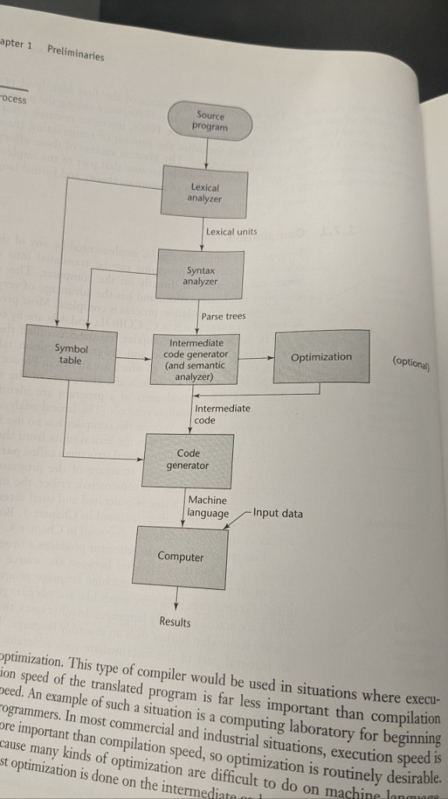
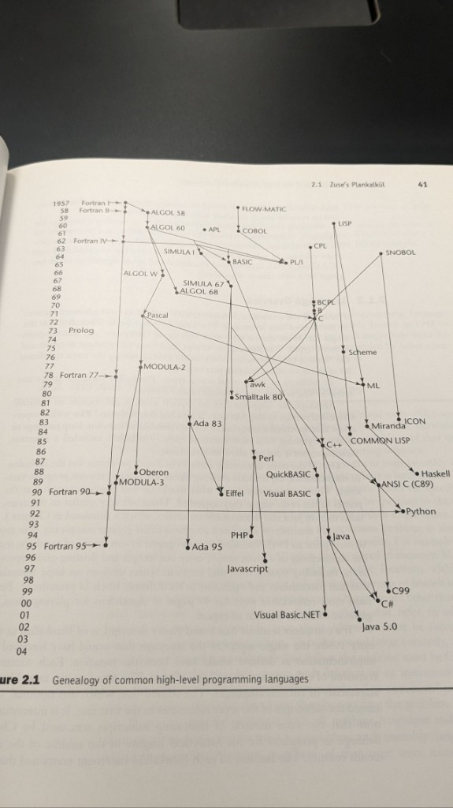
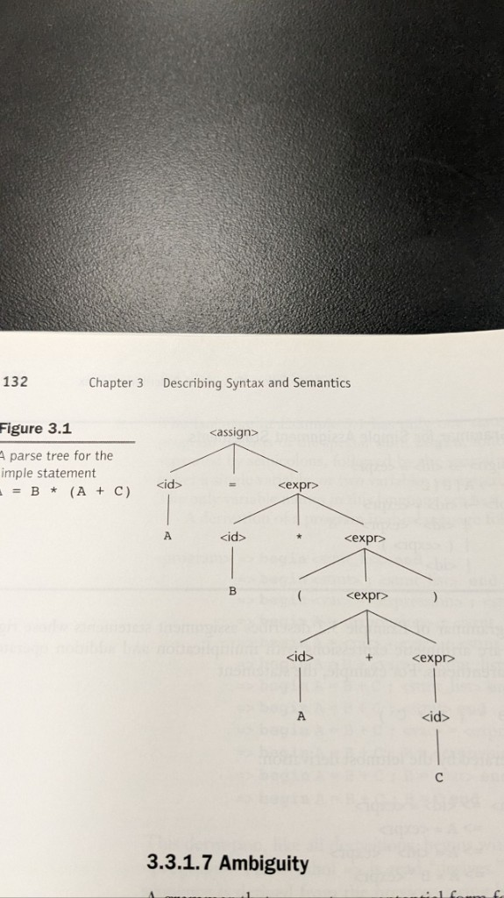
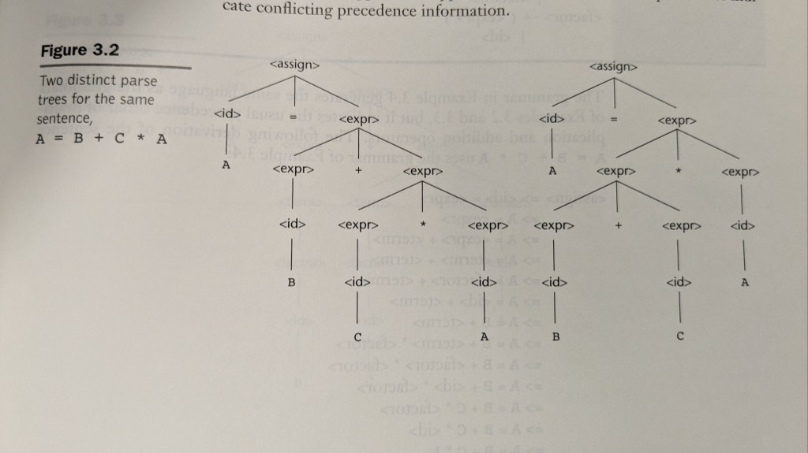
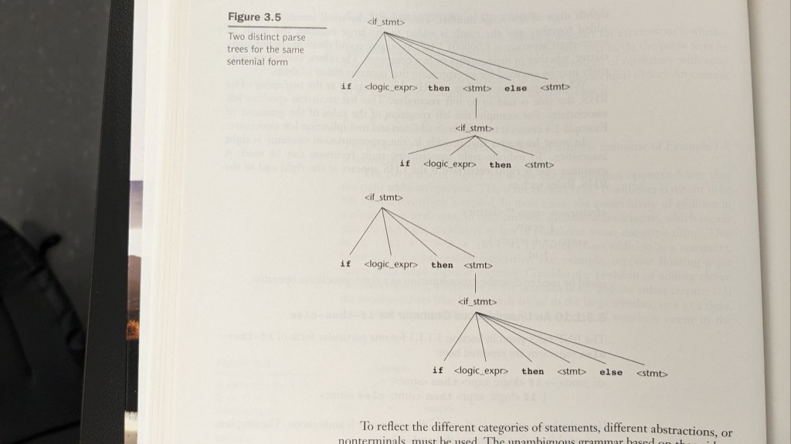
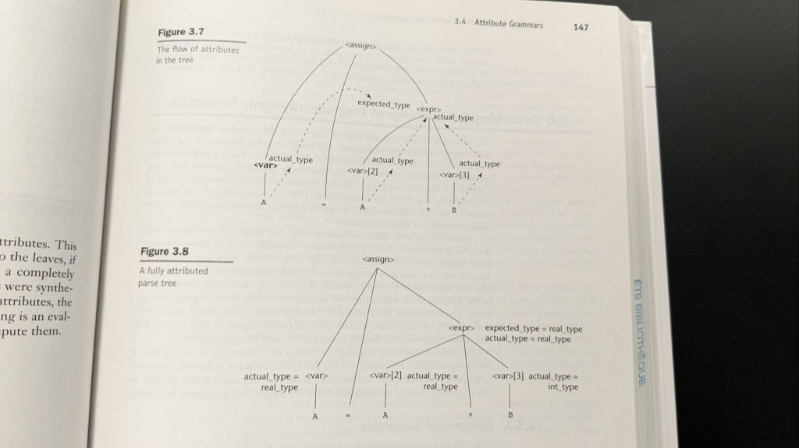

Ces figures proviennent d’un **manuel de langages de programmation / conception de compilateurs** que je lisais pour un cours. Je les ai gardées sur une seule page de référence : comment la compilation est découpée en phases, comment les langages d’aujourd’hui se situent historiquement, et où la **syntaxe** ne suffit plus — il faut des **règles de priorité**, une **désambiguïsation** pour le `else`, et des **attributs** pour la sémantique comme les types.

## Pipeline du compilateur

Le schéma habituel : **programme source** → **analyseur lexical** (jetons) → **analyseur syntaxique** (arbres d’analyse) → **code intermédiaire** (avec **analyse sémantique**) → **optimisation** optionnelle → **générateur de code** → **code machine** sur un **ordinateur**, plus **données d’entrée** et **résultats**. Une **table des symboles** accompagne les phases de face et alimente la fin de chaîne.

L’optimisation est marquée optionnelle dans le diagramme pour une raison pédagogique : enseigner les compilateurs et boucles édition-compilation-exécution rapides saute souvent l’optimisation lourde ; les compilateurs de production y investissent en général surtout sur le **code intermédiaire**, où les transformations sont plus simples qu’au niveau instructions machine.

## Généalogie des langages de haut niveau

La deuxième figure est un **graphe temporel** : langages comme nœuds, flèches comme influence ou descendance directe. On lit plusieurs fils — **Fortran**, **ALGOL** comme pivot, **C** comme autre pivot vers **C++**, **Java**, **C#**, **Perl** / **PHP** / **JavaScript**, **LISP** → **Scheme** → **ML** → **Haskell**, **BASIC** vers **Visual Basic**, plus **COBOL**, **Ada**, **Prolog**, etc.

C’est un rappel que « choisir un langage », c’est aussi hériter d’habitudes syntaxiques, de modèles d’exécution et de communautés forgées sur des décennies.

## Arbres d’analyse et une affectation non ambiguë

Pour l’instruction **`A = B * (A + C)`**, l’arbre d’analyse rend le regroupement explicite : le **`+`** est sous la sous-expression parenthésée, et **`*`** combine **`B`** avec toute cette sous-expression avant l’affectation. C’est l’artefact que l’analyseur syntaxique transmet aux phases suivantes.

## Ambiguïté : deux arbres pour `A = B + C * A`

Le contraste classique du manuel : la même chaîne de jetons peut correspondre à **deux arbres** si la grammaire l’autorise. Un arbre regroupe comme **`B + (C * A)`** (multiplication plus étroite que l’addition) ; l’autre comme **`(B + C) * A`**. Seul le premier correspond à la priorité arithmétique usuelle.

Les vraies grammaires corrigent cela en **stratifiant les expressions** (non-terminaux distincts pour termes et facteurs, ou déclarations de priorité dans les générateurs d’analyseurs) pour que l’analyseur ne puisse pas construire la mauvaise forme.

## Else pendouillant

Une deuxième classe d’ambiguïté est structurelle, pas arithmétique : des **`if`** imbriqués avec un seul **`else`**. Une analyse attache le **`else`** au **`if` externe** ; l’autre au **`if` interne**. Les langages adoptent une **règle concrète** (souvent : le **`else`** se lie au **`if` le plus proche**) et/ou exigent des **accolades** ou des marqueurs du type **`end if`** pour rendre l’intention syntaxiquement unique.

## Grammaires attribuées : les types parcourent l’arbre

La syntaxe seule ne porte pas les **types** ni la **signification**. Les **grammaires attribuées** décorent l’arbre : attributs **synthétisés** qui remontent (par ex. le **type réel** d’une expression depuis les feuilles) et attributs **hérités** qui descendent le contexte (par ex. le **type attendu** depuis le membre gauche d’une affectation). L’exemple du livre avec **`A = A + B`** montre **`expected_type`** sur l’expression et **`actual_type`** sur chaque **`var`**, ce qui est exactement la manière dont un compilateur justifie coercitions ou erreurs.

---

Si vous relisez les mêmes chapitres : le fil conducteur va **d’abord au pipeline**, puis **à l’histoire pour le contexte**, puis à la **syntaxe formelle** (arbres), puis **là où la syntaxe échoue** (ambiguïté), puis **comment la sémantique s’attache** (attributs). Ces scans sont mon aide-mémoire personnel ; **figures et texte d’origine appartiennent au manuel et à l’éditeur**.

**À lire aussi :** notes de cours sur le **cycle de vie logiciel** — [GOALS, waterfall, vérification vs validation]().
