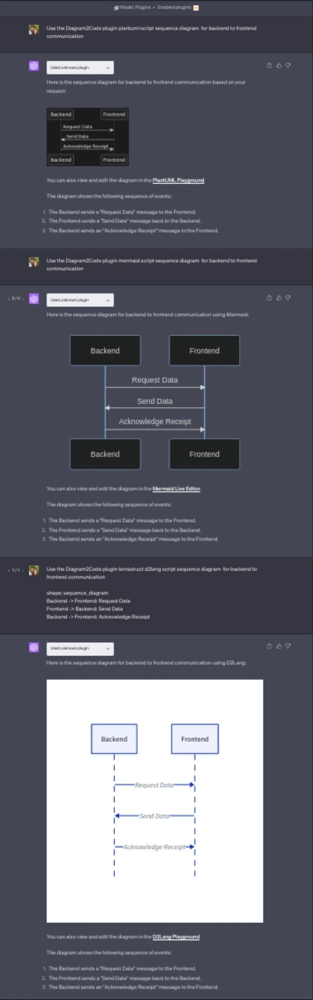
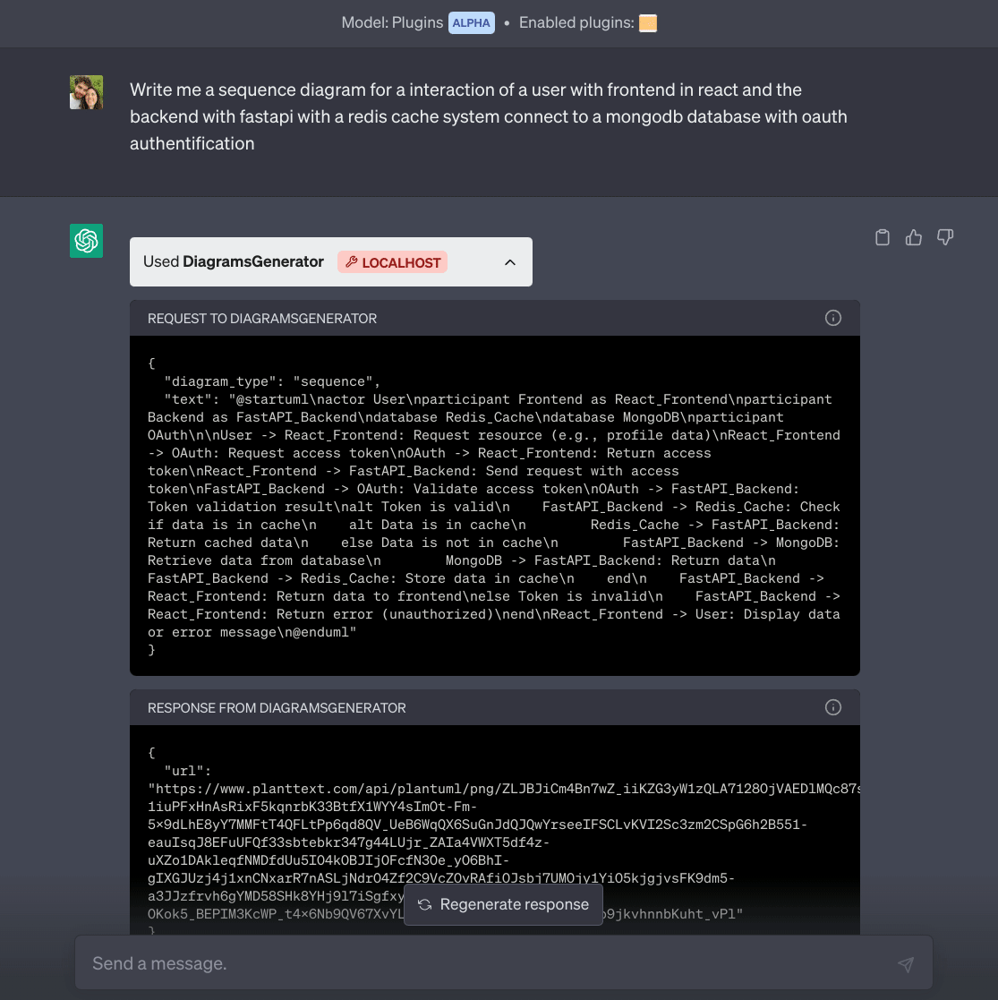

**D2COpenAIPlugin** est un plugin ChatGPT qui produit du **PlantUML**, **Mermaid** ou **D2** dans la conversation. Je l’ai écrit quand les plugins OpenAI étaient la voie d’extension principale — pratique pour l’architecture, les labs et les « dessine ce flux » en chat. **[English version]()**.

<!--more-->

## Pourquoi pas seulement des captures ?

Les tableaux blancs ne collent pas dans un dépôt Markdown. Je voulais des **diagrammes texte** pour Hugo, GitHub et les revues de design — même motivation que **[prompts AIPRM]()**, mais en **action plugin**.

## Installation

1. README : **[github.com/antoinebou12/D2COpenAIPlugin](https://github.com/antoinebou12/D2COpenAIPlugin).
2. Activer le plugin dans ChatGPT ([lien court](https://lnkd.in/exVNZMnT)).
3. Nommer le type de diagramme explicitement.

Le modèle peut encore inventer de la syntaxe ; le plugin **route** vers le bon rendu, il ne garantit pas l’UML parfait.

## Démo





## Formats

| Format | Usage |
|--------|--------|
| **PlantUML** | Séquences UML, classes, déploiement |
| **Mermaid** | Diagrammes natifs GitHub |
| **D2** | Schémas système déclaratifs |

## Exemples de prompts

```text
Diagramme de séquence PlantUML : utilisateur, React, FastAPI, Postgres — login et cache miss.
```

```text
Flowchart Mermaid : CI de git push à déploiement AWS.
```

```text
Diagramme D2 : homelab Caddy, CloudWatch, Lambda — boîtes lisibles.
```

## Limites

- **Évolution plateforme** — traiter comme outillage historique + dépôt.
- **Validation** — toujours rendre localement avant publication.
- **Secrets** — ne jamais diagrammer des credentials prod dans le chat.

Suite éditeurs : **[uml-mcp](https://github.com/antoinebou12/uml-mcp)**.

## Articles liés

- [Session Copilot à Cédille]()
- [Prompts diagrammes ChatGPT et AIPRM]()
