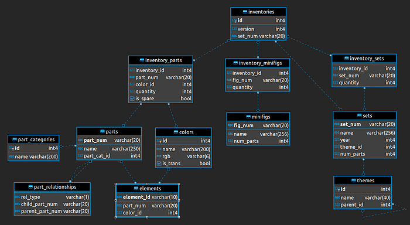
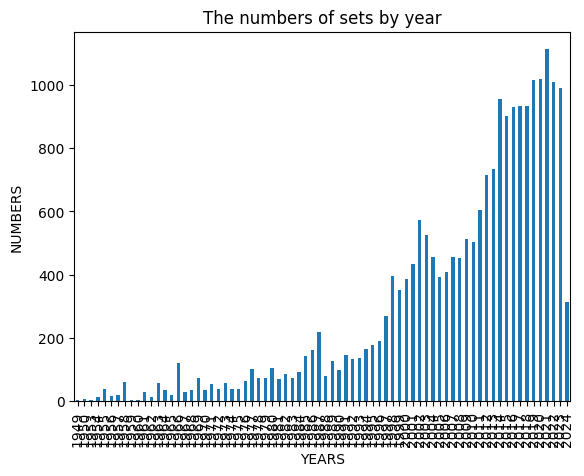
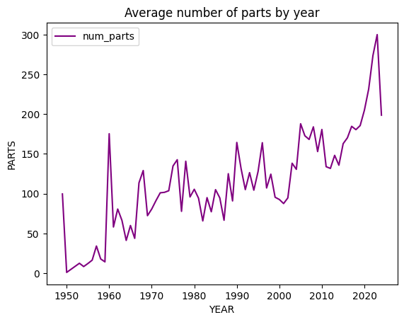
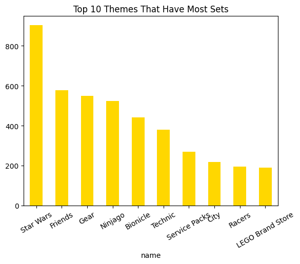
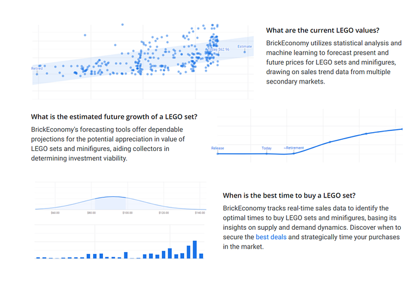
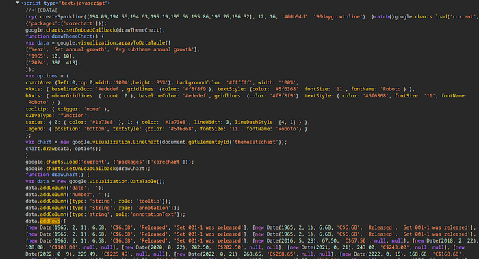
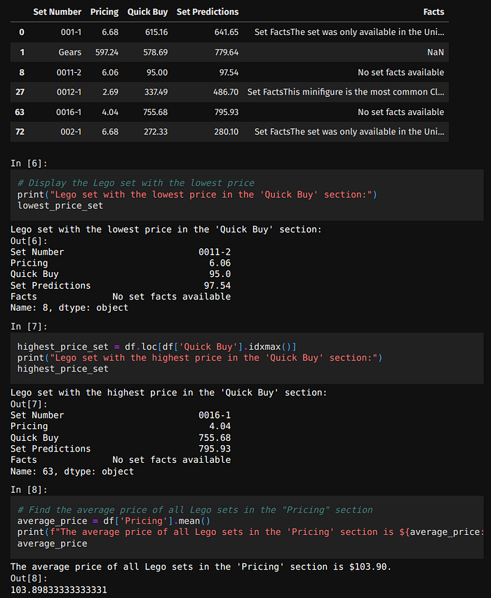
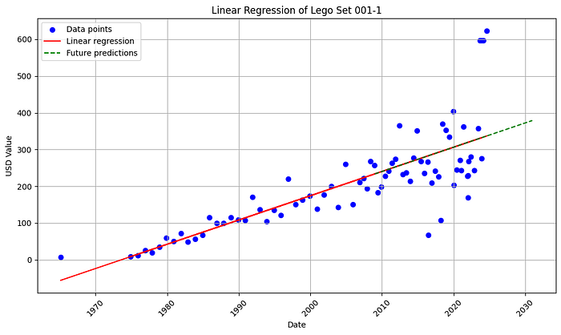
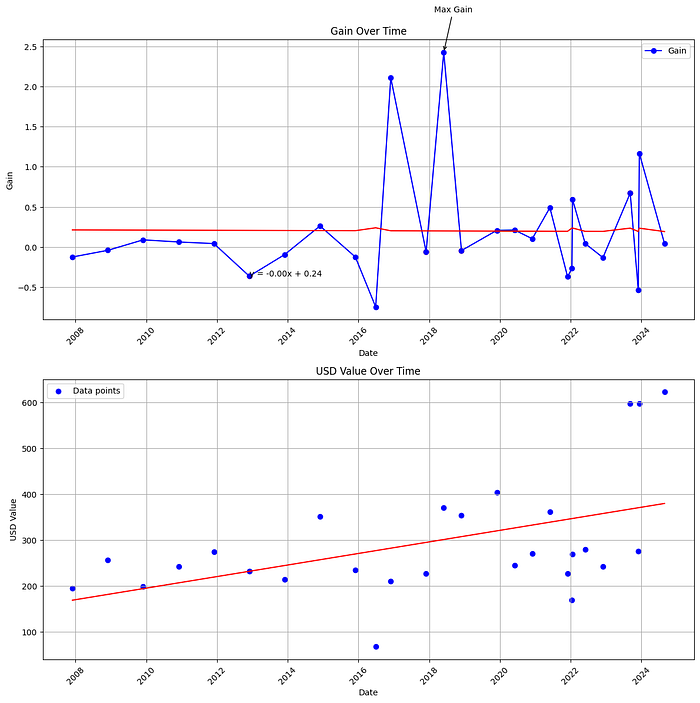

I collect LEGO and write Python — so I merged **Rebrickable** exports with a **BrickEconomy** scraper to see how sets, colors, and themes evolved, and whether a simple model could explain prices on classics like **001-1**. This page is the story with charts; full notebooks live in **[AlgoETS/LegosTracker](https://github.com/AlgoETS/LegosTracker)**. **[Version française]()**.

<!--more-->

## Data sources

| Dataset | What it gives you |
|---------|-------------------|
| **Rebrickable CSVs** | sets, themes, parts, colors, inventories — great for counts and joins |
| **BrickEconomy (scraped)** | historical resale-style prices Rebrickable does not ship |

Rebrickable files include `sets.csv`, `themes.csv`, `parts.csv`, `colors.csv`, and inventory tables — standard star schema for “how big is LEGO over time?”



## Sets over the decades

Two trends jump out when you group by `year`:

1. **Count of named sets** rises — LEGO product line expansion is real in the data.
2. **Average part count per set** climbs — models got denser, not just more numerous.





Narrative check: adult-targeted lines and licensed themes show up as tail mass in part counts, not only kid-scale sets.

## Themes — what dominates the catalog

Join `sets.theme_id` → `themes`, filter to top-level themes (no `parent_id`), bar-chart the top ten by set count.



Star Wars, City, Technic, and friends crowd the head — good sanity check that merges worked before you trust price scrapes.

## Why scrape BrickEconomy?

Rebrickable answers **what exists**; it does not answer **what people pay on the secondary market**. I used **Playwright + asyncio** to collect BrickEconomy pages — pydantic models for validation, aiohttp where fetch-only sufficed.



Scraper code, rate limits, and HTML drift handling: see `LegosTracker` repo — too long to paste here and keep maintainable.

## Environment (reference)

```bash
pip install playwright asyncio pydantic aiohttp pandas scikit-learn matplotlib
playwright install
```

Imports and async browser setup match the repo’s `scraper/` module — run from project root with tests on a single set before batching thousands.

## Price history for set 001-1

Classic **001-1** is a teaching anchor: long history, recognizable name, enough secondary-market churn to plot.

Pipeline:

1. Load scraped `001-1_history.csv` / `001-1_new.csv` from [LegosTracker data folder](https://github.com/AlgoETS/LegosTracker/tree/main/data).
2. Clean dates and outliers (bad rows from HTML changes).
3. Plot price vs time — look for step changes around reissues and collector spikes.



## Linear regression — humble forecast

Fit a simple **linear model** on engineered features (time, condition flags, maybe part count proxies) to predict logged price.

It is not alpha — it is **explainability practice**:

- Does trend dominate?
- Do residuals cluster by era?
- Would a tree model buy you much on N=small?





Full coefficient tables and train/test split notes: Medium [original article](https://medium.com/@antoine.boucher012/economics-of-lego-sets-with-data-science-a4ca07d613fb) and repo notebooks.

## Notebook excerpts

The Medium import contained pages of one-line pandas plots. Prefer the GitHub project for copy-pasteable cells:

- Theme merges and bar charts
- Scraper orchestration
- Price cleaning
- `sklearn` regression pipeline



## When not to trust this analysis

| Pitfall | Effect |
|---------|--------|
| Scraper breakage | Missing months look like price crashes |
| Survivorship in sets table | Discontinued sets skew counts |
| Linear model on hype sets | Residuals explode |
| Treating resale as MSRP | Different economic story |

## Takeaway

LEGO data is messy fun — good for **pandas practice**, **async scraping discipline**, and remembering that secondary prices are sentiment plus plastic, not fundamentals.

## Related posts

- [Economics of LEGO (FR)]() — same analysis in French
- [Vector databases / movie embeddings]() — another teaching dataset story
- [MarketWatch Python]() — different market, same curiosity

## References

- [Rebrickable downloads](https://rebrickable.com/downloads/)
- [BrickEconomy](https://www.brickeconomy.com)
- [AlgoETS/LegosTracker](https://github.com/AlgoETS/LegosTracker)
- [Exploring LEGO History (GitHub inspiration)](https://github.com/hevalhazalkurt/exploring_the_data_of_LEGO_history)

---

*Originally published on [Medium](https://medium.com/@antoine.boucher012/economics-of-lego-sets-with-data-science-a4ca07d613fb).*
