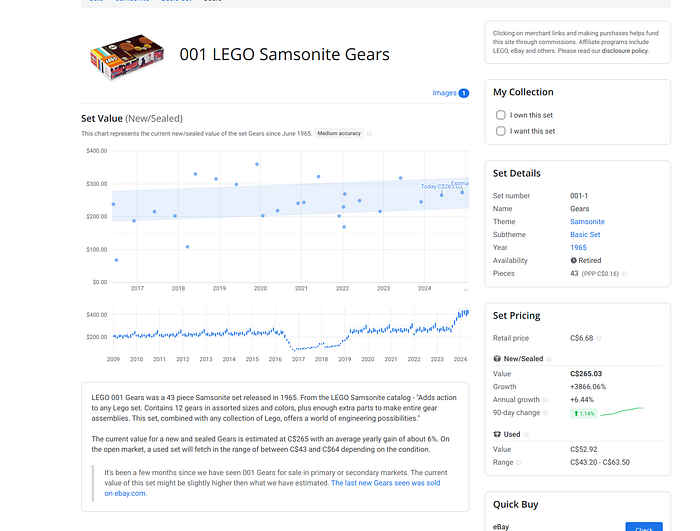
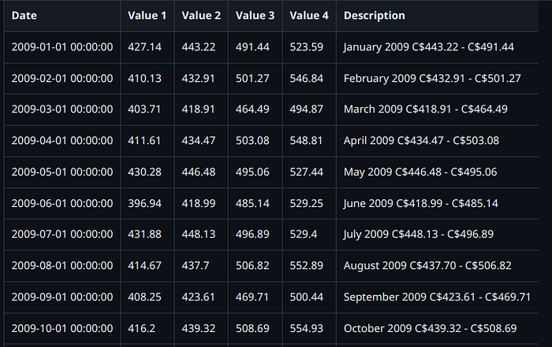
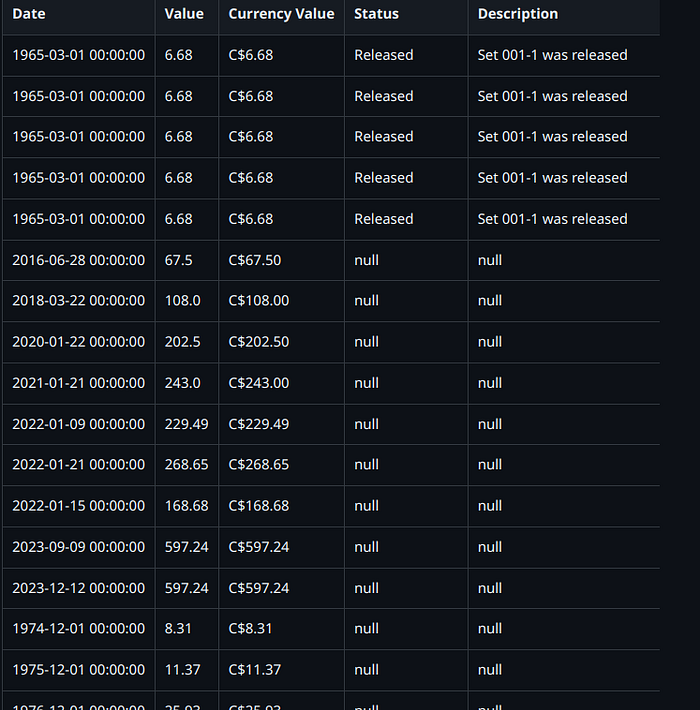

As a data enthusiast and LEGO fan, I decided to delve into the world of LEGO using historical data. My goal was to understand the trends, pricing, and characteristics of LEGO sets over time. Using datasets from Rebrickable and analysis tools like Pandas, Matplotlib, and Scikit-Learn, I conducted a comprehensive analysis. Here’s a journey through the history and economics of LEGO sets.

## Dataset Overview

The datasets used for this analysis include various aspects of LEGO sets, parts, and themes:

*   **colors.csv**: Information on LEGO colors, including unique IDs, names, RGB values, and transparency.
*   **inventories.csv**: Inventory details, including unique IDs, versions, and set numbers.
*   **inventory\_parts.csv**: Part inventories, including part numbers, colors, quantities, and spare parts.
*   **inventory\_sets.csv**: Information on which inventory is included in which sets.
*   **part\_categories.csv**: Part categories and their unique IDs.
*   **part\_relationships.csv**: Relationships between different parts.
*   **parts.csv**: Information on LEGO parts, including part numbers, names, and categories.
*   **sets.csv**: Details of LEGO sets, including set numbers, names, release years, themes, and part counts.
*   **themes.csv**: Information on LEGO themes, including unique IDs, names, and parent themes.

Press enter or click to view image in full size

## Set Analysis: Trends Over the Years

I explored the trends in LEGO sets over the years by visualizing the number of sets released each year and the average number of parts per set.

sets.groupby('year')\['name'\].nunique().plot(kind='bar')  
plt.title("The Numbers of Sets by Year")  
plt.xlabel("Year")  
plt.ylabel("Numbers")  
plt.show()  
  
parts\_by\_year = sets\[\['year', 'num\_parts'\]\].groupby('year', as\_index=False).mean()  
parts\_by\_year.plot(x='year', y='num\_parts', color="purple")  
plt.title("Average Number of Parts by Year")  
plt.xlabel("Year")  
plt.ylabel("Parts")  
plt.show()

## Theme Analysis: Top 10 Themes

Identifying the most popular LEGO themes, I plotted the top 10 themes with the most sets.

set\_themes = sets\["theme\_id"\].value\_counts()  
set\_themes = pd.DataFrame({"id": set\_themes.index, "count": set\_themes.values})  
set\_themes = pd.merge(set\_themes, themes, on="id")  
set\_themes\_no\_parent = set\_themes\[pd.isnull(set\_themes\["parent\_id"\])\]  
set\_themes\_top\_10 = set\_themes\_no\_parent.sort\_values(by=\["count"\], ascending=False)\[:10\]  
top\_10 = set\_themes\_top\_10\["count"\]  
top\_10.index = set\_themes\_top\_10\["name"\]  
top\_10.plot.bar(color="gold", rot=30)  
plt.title("Top 10 Themes That Have Most Sets")  
plt.show()

## Gathering Data with a Scraper

To obtain historical and current data for LEGO sets, I developed a web scraper using Playwright, asyncio, pydantic, and aiohttp. Initially, I intended to use datasets from Rebrickable, but I found that the specific historical pricing data I wanted wasn’t available. Thus, I turned to BrickEconomy, a website that provides detailed information on LEGO sets, including historical prices. The scraper automates the data collection process, ensuring we have comprehensive data for analysis.

Press enter or click to view image in full size

## Setting Up the Environment

First, we need to install the required packages:

!pip install playwright asyncio pydantic aiohttp  
!playwright install

### Imports and Initial Setup

The necessary libraries are imported, and the initial setup is done. Playwright is used for web scraping, asyncio for asynchronous programming, pydantic for data validation, and aiohttp for asynchronous HTTP requests.

import csv  
from pydantic import BaseModel  
from typing import Dict, List, Optional  
from playwright.async\_api import async\_playwright  
import asyncio  
import json  
import re  
from datetime import datetime

### Data Models

We define data models using pydantic to structure the data we will scrape. These models help ensure the data is clean and well-organized.

class SetDetails(BaseModel):  
    name: str  
    value: str  
  
class HistoryEntry(BaseModel):  
    date: datetime  
    number: float  
    tooltip: Optional\[str\]  
    annotation: Optional\[str\]  
    annotationText: Optional\[str\]  
  
class NewEntry(BaseModel):  
    date: datetime  
    value1: float  
    value2: float  
    value3: float  
    value4: float  
    description: Optional\[str\] = None  
  
class LegoSet(BaseModel):  
    details: List\[SetDetails\]  
    pricing: List\[SetDetails\]  
    quick\_buy: List\[SetDetails\]  
    set\_predictions: List\[SetDetails\]  
    set\_facts: str  
    subtheme\_analysis: List\[SetDetails\]

### Scraper Class

The `LegoAPI` class is responsible for scraping the data from BrickEconomy. It initializes with a list of LEGO set numbers, navigates to the BrickEconomy website, and extracts the required information.

class LegoAPI:  
    root\_url = "https://www.brickeconomy.com"  
  
    def \_\_init\_\_(self, set\_list):  
        self.set\_list = set\_list  
        self.output\_file = "lego\_sets.csv"  
  
    async def start(self):  
        try:  
            with open(self.set\_list, "r") as f:  
                set\_list = \[line.rstrip() for line in f.readlines()\]  
        except Exception as e:  
            print("Error opening input file")  
            raise e  
  
        async with async\_playwright() as p:  
            browser = await p.chromium.launch(headless=False)  
            page = await browser.new\_page()  
  
            for set\_num in set\_list:  
                search\_url = f"{self.root\_url}/search?query={set\_num}"  
                await page.wait\_for\_load\_state("load")  
                await page.goto(search\_url)  
  
                try:  
                    possible\_links = await page.query\_selector\_all(  
                        "#ContentPlaceHolder1\_ctlSetsOverview\_GridViewSets > tbody > tr:nth-child(2) > td.ctlsets-left > div.mb-5 > h4 > a"  
                    )  
                except Exception as e:  
                    raise ValueError(f"Error parsing HTML: {e}")  
  
                if not possible\_links:  
                    raise ValueError(f"No links found for set number: {set\_num}")  
  
                for link in possible\_links:  
                    href = await link.get\_attribute("href")  
                    print(href)  
                    test\_num = href.split("/")\[2\].split("-")\[0\]  
                    print(test\_num)  
                    if str(test\_num) in str(set\_num):  
                        set\_details = href.split("/")\[2:4\]  
                        await page.goto(self.root\_url + href)  
                        await page.wait\_for\_load\_state("load")  
                        await self.parse\_history(page, set\_num)  
                        await self.parse\_set(page, set\_details)  
  
            await browser.close()

**Initialization and Input Handling:**

*   The constructor (`__init__`) initializes the class with a list of LEGO set numbers and the output file name.
*   The `start` method reads the set numbers from a file and starts the Playwright browser.

**Navigation and Data Extraction:**

*   For each set number, the scraper navigates to the search results page on BrickEconomy.
*   It extracts links to individual set pages and checks if the set number matches.
*   The scraper then navigates to the set’s page and calls methods to parse historical data and set details.

Press enter or click to view image in full size

The data is in a script data at the end of the html

### Parsing Historical Data

The `parse_history` method extracts historical pricing data from the set's page.

## Get Antoine Boucher’s stories in your inbox

Join Medium for free to get updates from this writer.

Remember me for faster sign in

    async def parse\_history(self, page, set\_num):  
        try:  
            script\_tags = await page.query\_selector\_all("script")  
            desired\_script\_content = None  
  
            for script\_tag in script\_tags:  
                script\_content = await script\_tag.inner\_text()  
                if "data.addRows(\[" in script\_content:  
                    desired\_script\_content = script\_content  
                    break  
  
            if desired\_script\_content:  
                pattern = r"data\\.addRows\\((\\\[.\*?\\\]\\));"  
                matches = re.findall(pattern, desired\_script\_content, re.DOTALL)  
                if matches:  
                    history\_data = matches\[0\].replace("\\n", "").replace("null", "'null'")  
  
                    history\_entries = \[\]  
                    pattern\_date = re.compile(r"new Date\\((\\d+), (\\d+), (\\d+)\\), (\\d+\\.?\\d\*), '(\[^'\]\*)', '(\[^'\]\*)'(?:, '(\[^'\]\*)')?(?:, '(\[^'\]\*)')?")  
  
                    for match in pattern\_date.finditer(history\_data):  
                        year, month, day = map(int, match.groups()\[:3\])  
                        month += 1  
                        date = datetime(year, month, day)  
                        value = match.group(4)  
                        currency\_value = match.group(5)  
                        status = match.group(6) if match.group(6) else None  
                        description = match.group(7) if match.group(7) else None  
                        history\_entries.append(  
                            HistoryEntry(  
                                date=date,  
                                number=value,  
                                tooltip=currency\_value,  
                                annotation=status,  
                                annotationText=description,  
                            )  
                        )  
  
                    with open(f"{set\_num}\_history.csv", mode="w", newline="", encoding="utf-8") as file:  
                        writer = csv.writer(file)  
                        writer.writerow(  
                            \["Date", "Value", "Currency Value", "Status", "Description"\]  
                        )  
                        for entry in history\_entries:  
                            writer.writerow(  
                                \[  
                                    entry.date,  
                                    entry.number,  
                                    entry.tooltip,  
                                    entry.annotation,  
                                    entry.annotationText,  
                                \]  
                            )  
  
                    if len(matches) > 1:  
                        new\_data = matches\[1\].replace("\\n", "").replace("null", "'null'")  
                        pattern\_new = re.compile(r"new Date\\((\\d+), (\\d+), (\\d+)\\), (\\d+\\.?\\d\*), (\\d+\\.?\\d\*), (\\d+\\.?\\d\*), (\\d+\\.?\\d\*), '(\[^'\]\*)'")  
                        new\_entries = \[\]  
  
                        for match in pattern\_new.finditer(new\_data):  
                            year, month, day = map(int, match.groups()\[:3\])  
                            month += 1  
                            date = datetime(year, month, day)  
                            value1, value2, value3, value4 = map(float, match.groups()\[3:7\])  
                            description = match.group(8)  
                            new\_entries.append(  
                                NewEntry(  
                                    date=date,  
                                    value1=value1,  
                                    value2=value2,  
                                    value3=value3,  
                                    value4=value4,  
                                    description=description,  
                                )  
                            )  
  
                        with open(f"{set\_num}\_new.csv", mode="w", newline="", encoding="utf-8") as file:  
                            writer = csv.writer(file)  
                            writer.writerow(  
                                \["Date", "Value 1", "Value 2", "Value 3", "Value 4", "Description"\]  
                            )  
                            for entry in new\_entries:  
                                writer.writerow(  
                                    \[  
                                        entry.date,  
                                        entry.value1,  
                                        entry.value2,  
                                        entry.value3,  
                                        entry.value4,  
                                        entry.description,  
                                    \]  
                                )  
                    else:  
                        pass  
  
                else:  
                    print("Could not find 'data.addRows(\[...\]);' in the script content.")  
            else:  
                print("Script tag with 'data.addRows(\[' not found.")  
        except Exception as e:  
            print(f"An error occurred while extracting data: {e}")

## Get Antoine Boucher’s stories in your inbox

**Extracting Script Content:**

*   The method searches for a script tag containing historical data in the `data.addRows` format.

**Parsing and Writing Data:**

*   If found, it extracts the data and parses it using regular expressions to create `HistoryEntry` objects.
*   The data is then written to a CSV file.

### Parsing Set Details

The `parse_set` method extracts various details about the LEGO set, including pricing, quick buy options, predictions, and subtheme analysis.

    async def parse\_set(self, page, set\_details):  
        set\_details\_div = await page.query\_selector("div#ContentPlaceHolder1\_SetDetails")  
        set\_details\_rows = await set\_details\_div.query\_selector\_all(".row.rowlist")  
  
        set\_info = \[\]  
        for row in set\_details\_rows:  
            key\_element = await row.query\_selector(".text-muted")  
            value\_element = await row.query\_selector(".col-xs-7")  
            if key\_element and value\_element:  
                key = await key\_element.inner\_text()  
                value = await value\_element.inner\_text()  
                set\_info.append(SetDetails(name=key.strip(), value=value.strip()))  
  
        set\_pricing\_div = await page.query\_selector("div#ContentPlaceHolder1\_PanelSetPricing")  
        pricing\_rows = await set\_pricing\_div.query\_selector\_all(".row.rowlist")  
  
        pricing\_info = \[\]  
        for row in pricing\_rows:  
            key\_element = await row.query\_selector(".text-muted")  
            value\_element = await row.query\_selector(".col-xs-7")  
            if key\_element and value\_element:  
                key = await key\_element.inner\_text()  
                value = await value\_element.inner\_text()  
                pricing\_info.append(SetDetails(name=key.strip(), value=value.strip()))  
  
        quick\_buy\_div = await page.query\_selector("div#ContentPlaceHolder1\_PanelSetBuying")  
        quick\_buy\_rows = await quick\_buy\_div.query\_selector\_all(".row.rowlist")  
  
        quick\_buy\_info = \[\]  
        for row in quick\_buy\_rows:  
            key\_element = await row.query\_selector(".text-muted")  
            value\_element = await row.query\_selector(".col-xs-7")  
            if key\_element and value\_element:  
                key = await key\_element.inner\_text()  
                value = await value\_element.inner\_text()  
                quick\_buy\_info.append(SetDetails(name=key.strip(), value=value.strip()))  
  
        set\_predictions\_div = await page.query\_selector("div#ContentPlaceHolder1\_PanelSetPredictions")  
        set\_predictions\_rows = await set\_predictions\_div.query\_selector\_all(".row.rowlist")  
  
        set\_predictions\_info = \[\]  
        for row in set\_predictions\_rows:  
            key\_element = await row.query\_selector(".text-muted")  
            value\_element = await row.query\_selector(".col-xs-7")  
            if key\_element and value\_element:  
                key = await key\_element.inner\_text()  
                value = await value\_element.inner\_text()  
                set\_predictions\_info.append(SetDetails(name=key.strip(), value=value.strip()))  
  
        set\_facts\_div = await page.query\_selector("div#ContentPlaceHolder1\_PanelSetFacts")  
        if set\_facts\_div:  
            set\_facts = await set\_facts\_div.inner\_text()  
            set\_facts = set\_facts.strip()  
        else:  
            set\_facts = "No set facts available"  
  
        subtheme\_analysis\_div = await page.query\_selector("div#ContentPlaceHolder1\_PanelSetAnalysis")  
        subtheme\_analysis\_rows = await subtheme\_analysis\_div.query\_selector\_all(".row.rowlist")  
  
        subtheme\_analysis\_info = \[\]  
        for row in subtheme\_analysis\_rows:  
            key\_element = await row.query\_selector(".text-muted")  
            value\_element = await row.query\_selector(".col-xs-7")  
            if key\_element and value\_element:  
                key = await key\_element.inner\_text()  
                value = await value\_element.inner\_text()  
                subtheme\_analysis\_info.append(SetDetails(name=key.strip(), value=value.strip()))  
  
        lego\_set = LegoSet(  
            details=set\_info,  
            pricing=pricing\_info,  
            quick\_buy=quick\_buy\_info,  
            set\_predictions=set\_predictions\_info,  
            set\_facts=set\_facts,  
            subtheme\_analysis=subtheme\_analysis\_info,  
        )  
  
        await self.write\_to\_csv(lego\_set)

**Extracting Set Details:**

*   The method extracts various details about the set, such as general information, pricing, quick buy options, predictions, and subtheme analysis.

**Creating and Writing Data:**

*   These details are stored in `SetDetails` objects and combined into a `LegoSet` object, which is then written to a CSV file.

### Writing Data to CSV

The `write_to_csv` method writes the scraped data to a CSV file.

    async def write\_to\_csv(self, lego\_set):  
        with open(self.output\_file, mode="a", newline="", encoding="utf-8") as file:  
            writer = csv.writer(file)  
  
            writer.writerow(  
                \[  
                    "Details",  
                    "Pricing",  
                    "Quick Buy",  
                    "Set Predictions",  
                    "Set Facts",  
                    "Subtheme Analysis",  
                \]  
            )  
  
            max\_length = max(  
                len(lego\_set.details),  
                len(lego\_set.pricing),  
                len(lego\_set.quick\_buy),  
                len(lego\_set.set\_predictions),  
                len(lego\_set.subtheme\_analysis),  
            )  
  
            for i in range(max\_length):  
                row = \[  
                    lego\_set.details\[i\].value if i < len(lego\_set.details) else "",  
                    lego\_set.pricing\[i\].value if i < len(lego\_set.pricing) else "",  
                    lego\_set.quick\_buy\[i\].value if i < len(lego\_set.quick\_buy) else "",  
                    lego\_set.set\_predictions\[i\].value if i < len(lego\_set.set\_predictions) else "",  
                    lego\_set.set\_facts if i == 0 else "",    
                    lego\_set.subtheme\_analysis\[i\].value if i < len(lego\_set.subtheme\_analysis) else "",  
                \]  
                writer.writerow(row)

**Preparing the CSV File:**

*   The method opens the CSV file in append mode and writes the headers.

**Writing Rows:**

*   It writes rows of data to the CSV file, ensuring that all details are included, even if some lists are shorter than others.

### Running the Scraper

Finally, the main function runs the scraper.

async def main():  
    with open("lego\_sets.csv", mode="w", newline="", encoding="utf-8") as file:  
        pass  
  
    lego\_api = LegoAPI("set\_list.txt")  
    await lego\_api.start()  
  
loop = asyncio.get\_event\_loop()  
asyncio.run\_coroutine\_threadsafe(main(), loop)

By using this scraper, I was able to gather detailed historical and current data on LEGO sets, enabling comprehensive analysis and insights into the world of LEGO.

Press enter or click to view image in full size

## [001–1\_history.csv](https://github.com/AlgoETS/LegosTracker/blob/main/data/001-1_history.csv)

Press enter or click to view image in full size

## [001–1\_new.csv](https://github.com/AlgoETS/LegosTracker/blob/main/data/001-1_new.csv)

Press enter or click to view image in full size

## Price Analysis: Historical and Future Predictions

I focused on the historical pricing of a specific LEGO set (001–1) and predicted its future prices using linear regression.

## Historical Data Cleaning

Cleaning the historical data is a crucial step to ensure the accuracy and reliability of the analysis. Here’s a detailed breakdown of the data cleaning process:

import pandas as pd  
import matplotlib.pyplot as plt  
from sklearn.linear\_model import LinearRegression  
from sklearn.tree import DecisionTreeRegressor  
from sklearn.ensemble import RandomForestRegressor  
from sklearn.ensemble import GradientBoostingRegressor  
import numpy as np  
from scipy import stats  
from scipy.stats import norm, skew  
  
df = pd.read\_csv("data/lego\_sets.csv")  
  
\# Remove duplicate rows  
df.drop\_duplicates(inplace=True)  
  
\# Handle missing values in other columns  
df\['Pricing'\] = df\['Pricing'\].fillna(0)  
  
\# Convert "Details" column to string data type  
df\['Details'\] = df\['Details'\].astype(str)  
  
\# Standardize currency values to USD  
\# Ensure the column containing currency values exists and has the correct name  
if 'Pricing' in df.columns:  
    \# Remove currency symbols and any other non-numeric characters  
    df\['Pricing'\] = df\['Pricing'\].str.replace('\[^\\d.\]', '', regex=True)  
    \# Convert to float  
    df\['Pricing'\] = pd.to\_numeric(df\['Pricing'\], errors='coerce')  
  
  
if 'Set Predictions' in df.columns:  
    df\['Set Predictions'\] = df\['Set Predictions'\].astype(str)  
    df\['Set Predictions'\].fillna('', inplace=True)  
    df\['Set Predictions'\] = df\['Set Predictions'\].str.replace('\[^\\d.\]', '', regex=True)  
    df\['Set Predictions'\] = pd.to\_numeric(df\['Set Predictions'\], errors='coerce')  
  
\# Drop irrelevant columns  
df.drop(\['Subtheme Analysis'\], axis=1, inplace=True)  
  
\# Rename columns for clarity  
df.rename(columns={'Details': 'Set Number', 'Set Facts': 'Facts'}, inplace=True)  
  
\# Remove leading and trailing whitespace from the "Facts" column  
df\['Facts'\] = df\['Facts'\].str.strip().replace('\\n', '', regex=True)  
  
\# Replace non-numeric characters in "Quick Buy" with empty strings  
if 'Quick Buy' in df.columns and df\['Quick Buy'\].dtype == 'object':  
    df\['Quick Buy'\] = df\['Quick Buy'\].str.replace('\[^\\d.\]', '', regex=True)  
  
\# Convert "Quick Buy" column to numeric, coercing errors to NaN  
if 'Quick Buy' in df.columns:  
    df\['Quick Buy'\] = pd.to\_numeric(df\['Quick Buy'\], errors='coerce')  
  
\# Drop rows with NaN values in the "Quick Buy" column  
df.dropna(subset=\['Quick Buy'\], inplace=True)  
  
\# Find the Lego set with the lowest price in the "Quick Buy" section  
if 'Quick Buy' in df.columns:  
    lowest\_price\_set = df.loc\[df\['Quick Buy'\].idxmin()\]

Press enter or click to view image in full size

\# Step 1: Remove duplicate rows  
df\_0011.drop\_duplicates(inplace=True)  
  
\# Step 2: Handle missing values in the 'Currency Value' column  
df\_0011\['Currency Value'\] = df\_0011\['Currency Value'\].fillna(0)  
  
\# Step 3: Standardize currency values to USD  
\# Remove currency symbols and any other non-numeric characters  
df\_0011\['Currency Value'\] = df\_0011\['Currency Value'\].str.replace('\[^\\d.\]', '', regex=True)  
\# Convert to float  
df\_0011\['Currency Value'\] = pd.to\_numeric(df\_0011\['Currency Value'\], errors='coerce')  
  
\# Step 4: Drop unnecessary columns  
df\_0011.drop(\['Value', 'Status'\], axis=1, inplace=True)  
  
df\_0011\['Date'\] = pd.to\_datetime(df\_0011\['Date'\], errors='coerce')  
  
\# Step 5: Rename columns for clarity  
df\_0011.rename(columns={'Currency Value': 'USD Value', 'Description': 'Set Description'}, inplace=True)  
  
\# remove NAN values  
df\_0011\['USD Value'\] = df\_0011\['USD Value'\].fillna(0)  
  
df\_0011 = df\_0011\[df\_0011\['USD Value'\] != 0\]  
  
\# remove nan values description remplace by ''  
df\_0011\['Set Description'\] = df\_0011\['Set Description'\].fillna('')

## Linear Regression and Future Predictions

Once the historical data is cleaned, we can use it to make future price predictions using linear regression.

X = df\_0011\['Date'\].map(pd.Timestamp.toordinal).values.reshape(-1, 1)  
y = df\_0011\['USD Value'\].values  
  
\# Fit the model  
model = LinearRegression().fit(X, y)  
  
\# Prepare future dates and predict  
future\_dates = pd.date\_range('2008-12-31', '2030-12-31', freq='Y')  
future\_dates\_ordinal = future\_dates.map(pd.Timestamp.toordinal).values.reshape(-1, 1)  
future\_predictions = model.predict(future\_dates\_ordinal)  
  
\# Plotting, making sure to convert ordinal dates back to datetime for readability  
plt.figure(figsize=(10, 6))  
plt.scatter(df\_0011\['Date'\], df\_0011\['USD Value'\], color='blue', label='Data points')  
plt.plot(df\_0011\['Date'\], model.predict(X), color='red', label='Linear regression')  
plt.plot(future\_dates, future\_predictions, color='green', label='Future predictions', linestyle='--')  
  
plt.title('Linear Regression of Lego Set 001-1')  
plt.xlabel('Date')  
plt.ylabel('USD Value')  
plt.xticks(rotation=45)  
plt.legend()  
plt.grid(True)  
plt.tight\_layout()  
plt.show()

Once the historical data is cleaned, we can use it to make future price predictions using linear regression.

Press enter or click to view image in full size

\# Create subplots  
fig, axes = plt.subplots(nrows=2, ncols=1, figsize=(12, 12))  
  
\# Plot 1: Gain Over Time  
axes\[0\].plot(df\_0011\['Date'\], df\_0011\['Gain'\], marker='o', linestyle='-', color='b', label='Gain')  
axes\[0\].set\_title('Gain Over Time')  
axes\[0\].set\_xlabel('Date')  
axes\[0\].set\_ylabel('Gain')  
axes\[0\].grid(True)  
axes\[0\].legend()  
  
\# Add trend line to the first plot  
slope, intercept, r\_value, p\_value, std\_err = stats.linregress(df\_0011.index, df\_0011\['Gain'\])  
axes\[0\].plot(df\_0011\['Date'\], intercept + slope \* df\_0011.index, color='red', label='Trend line')  
  
\# Annotate the trend line equation  
axes\[0\].text(df\_0011\['Date'\].iloc\[5\], df\_0011\['Gain'\].iloc\[5\], f'y = {slope:.2f}x + {intercept:.2f}', fontsize=10, color='black')  
  
\# Rotate x-axis labels for better readability  
axes\[0\].tick\_params(axis='x', rotation=45)  
  
\# Annotate the maximum gain if df\_0011 is not empty  
if not df\_0011.empty:  
    max\_gain\_index = df\_0011\['Gain'\].idxmax()  
    if not pd.isna(max\_gain\_index):  
        max\_gain\_date = df\_0011.loc\[max\_gain\_index, 'Date'\]  
        max\_gain\_value = df\_0011.loc\[max\_gain\_index, 'Gain'\]  
        axes\[0\].annotate('Max Gain', xy=(max\_gain\_date, max\_gain\_value),  
                         xytext=(max\_gain\_date - pd.Timedelta(days=100), max\_gain\_value + 0.5),  
                         arrowprops=dict(facecolor='black', arrowstyle='->'))  
  
\# Highlight points of interest if df\_0011 is not empty  
if not df\_0011.empty:  
    points\_of\_interest\_index = \[5, 11, 13, 23\]  
    points\_of\_interest = df\_0011.iloc\[points\_of\_interest\_index\]  
    axes\[0\].scatter(points\_of\_interest\['Date'\], points\_of\_interest\['Gain'\], color='red', label='Points of Interest')  
  
\# Plot 2: USD Value Over Time  
axes\[1\].scatter(df\_0011\['Date'\], df\_0011\['USD Value'\], color='blue', label='Data points')  
axes\[1\].set\_title('USD Value Over Time')  
axes\[1\].set\_xlabel('Date')  
axes\[1\].set\_ylabel('USD Value')  
axes\[1\].legend()  
axes\[1\].grid(True)  
  
\# Linear Regression for USD Value over Time  
X = df\_0011\['Date'\].astype(int).values.reshape(-1, 1)  \# Convert datetime to numerical representation  
y = df\_0011\['USD Value'\].values  
model = LinearRegression().fit(X, y)  
axes\[1\].plot(df\_0011\['Date'\], model.predict(X), color='red', label='Linear regression')  
  
\# Rotate x-axis labels for better readability  
for ax in axes:  
    ax.tick\_params(axis='x', rotation=45)  
  
plt.tight\_layout()  
plt.show()

Press enter or click to view image in full size

## Conclusion

This analysis provided a detailed look into the world of LEGO, from color distribution to historical pricing trends and future predictions. With data science tools, we can uncover fascinating insights about beloved toys, making the data journey both educational and enjoyable.

## Reference

*   [BrickEconomy](https://www.brickeconomy.com)
*   [Rebrickable](https://rebrickable.com/downloads/)
*   [Exploring the Data of LEGO History](https://github.com/hevalhazalkurt/exploring_the_data_of_LEGO_history)

---

*Originally published on [Medium](https://medium.com/@antoine.boucher012/economics-of-lego-sets-with-data-science-a4ca07d613fb).*
