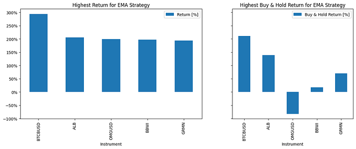

I batch-ran **EMA** and **MACD** strategies across many tickers with [BatchBacktesting](https://github.com/AlgoETS/BatchBacktesting) — FMP for equities, Binance for crypto. This post explains **what the runner does**, how to **read outrageous leaderboard rows**, and why that is not a live trading system. **[Version française]()**.

<!--more-->

## What BatchBacktesting is

A Python project that:

1. Pulls OHLCV via **Financial Modeling Prep** (S&P list) or **Binance** (crypto list).
2. Applies a strategy class (**EMA** or **MACD**) per ticker.
3. Writes **CSV + optional HTML charts** under `output/`.

It is a **screening hammer**, not a portfolio manager.

## Install and run (sketch)

```bash
pip install numpy httpx rich backtesting pandas_ta
```

```python
from batch_backtesting import run_backtests, EMA, MACD

tickers = get_SP500()
run_backtests(tickers, strategy=EMA, num_threads=12, generate_plots=True)
run_backtests(get_all_crypto(), strategy=MACD, num_threads=12, generate_plots=True)
```

Exact imports and API keys live in the [GitHub README](https://github.com/AlgoETS/BatchBacktesting) — do not commit keys.

## Interpreting example leaderboard rows

From an EMA batch (illustrative):

| Ticker | Return | Gut check |
|--------|--------|-----------|
| BTCBUSD | +293% | Crypto volatility + parameter fit |
| BTTBUSD | -99% | Penny-style blow-up — liquidity not modeled |
| UAL / NCLH | deep negative | COVID-era windows punish naive trend rules |

**Top and bottom lists are diagnostics**, not buy/sell lists. Always open the per-ticker chart ([example AAPL chart](https://algoets.github.io/BatchBacktesting/output/charts/EMA/AAPL-2018-04-04-2023-04-03.html)) before storytelling.



## What the Medium import left out on purpose

The original article embedded long pasted code blocks for every helper — maintenance belongs in the repo, not this Hugo page. For:

- HTTP helpers, threading, CSV writers → see `BatchBacktesting` source.
- Full French walkthrough → [Medium canonical URL](https://medium.com/@antoine.boucher012/exp%C3%A9rimentation-des-indicateurs-technique-avec-python-et-backtesting-828bf93e92cc).

## When not to use this

| Misuse | Why it hurts |
|--------|--------------|
| Deploy top row ticker live | Overfit to window |
| Ignore fees/slippage | Backtest inflates |
| Skip out-of-sample dates | Regime change breaks rule |

## Takeaway

Batch runs teach **distribution of outcomes** under a dumb rule — invaluable for humility, dangerous as autopilot.

## Related posts

- [Multiple indicators backtesting]() — scaled leaderboard version
- [MarketWatch Python]() — paper trading API
- [Monte Carlo risk bands]()

---

*Originally published on [Medium](https://medium.com/@antoine.boucher012/exp%C3%A9rimentation-des-indicateurs-technique-avec-python-et-backtesting-828bf93e92cc).*
