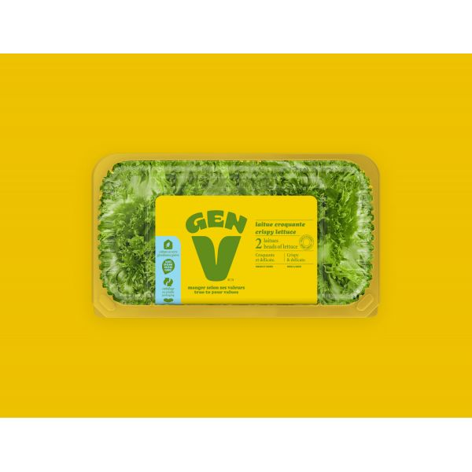
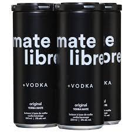
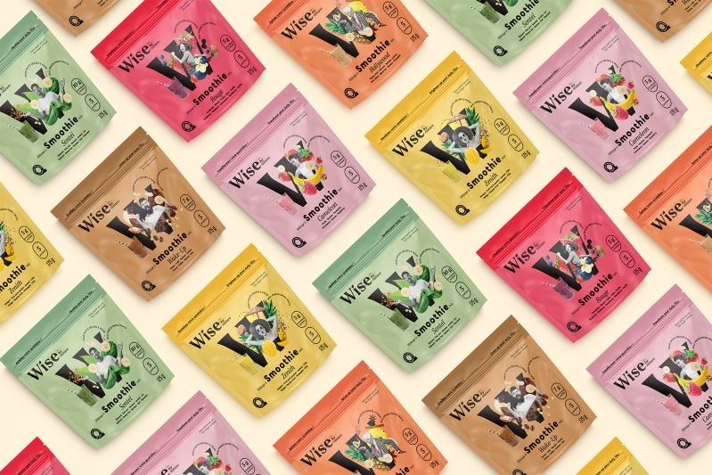

I recently took part in **Expo Manger Santé 2023** at **Place des Congrès** in Montreal. Event photos were taken by **OS7Media** (os7mediamatrix@gmail.com) — thank you for the shots used here.

## A Successful Sales Endeavor

As a salesman, I am passionate about the rich, savory taste of olives and their health benefits. Over two days, I had the opportunity to share this passion with attendees, which translated into remarkable sales, netting $300. It was not just about the sales, though; it was about the connections made and the stories shared over the love of olives.

## A Feast for the Senses

The expo was a haven for anyone with an appreciation for fresh produce. I indulged in a variety of fruits and vegetables, but the Gen V lettuces were particularly memorable for their crisp freshness.

## Exploring High-End Natural Products

Among the many exhibitors, BKind products stood out for their premium quality, although their prices matched their upscale image. It's always intriguing to see the range of products that align with a healthier lifestyle.

## Neighbors Worth Noting

Adjacent to my kiosk was Mate Libre, a brand that left a lasting impression with their delicious drinks. As a fan of maté, I was delighted by their offerings. The matéina drink, in particular, was a standout for its unique flavor profile.

## Morning Rush Solutions

A discovery that I'm eager to incorporate into my routine is the Wise smoothie mix, both in green and red varieties. They're perfect for those busy mornings when you need a nutritious boost on the go.

## In conclusion

Expo Manger Santé 2023 was a celebration of health, taste, and community. I’m grateful for the experience and look forward to the next edition.
