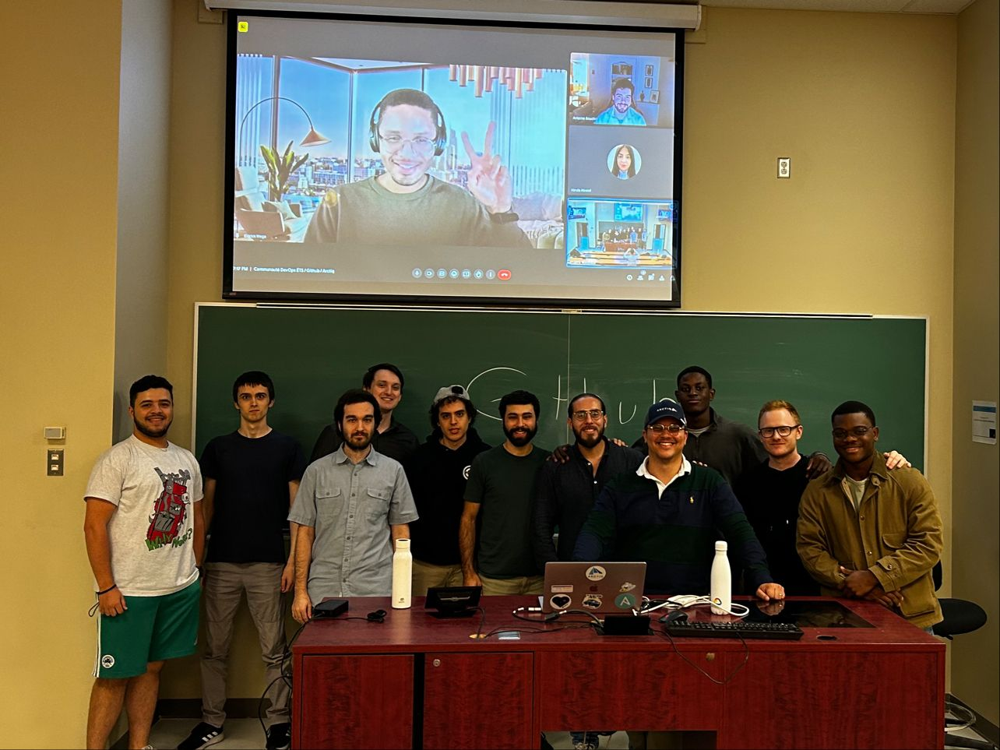
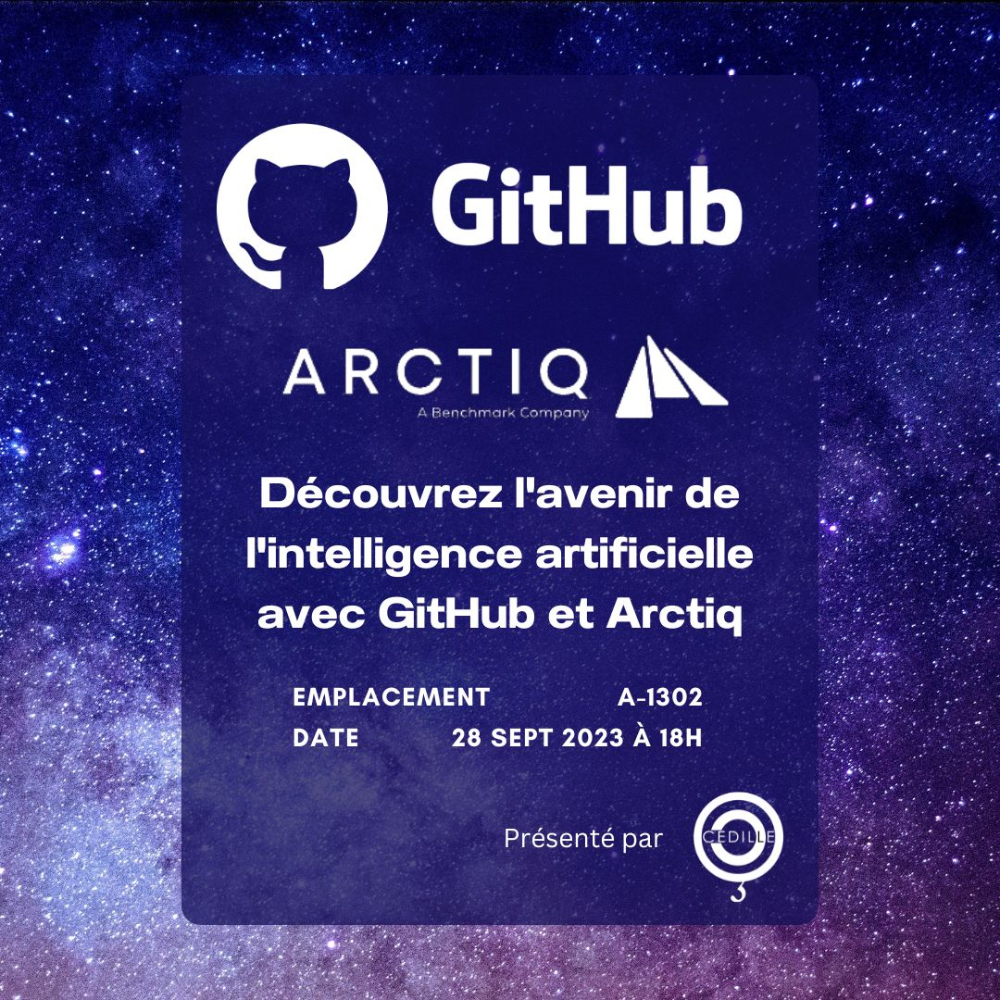
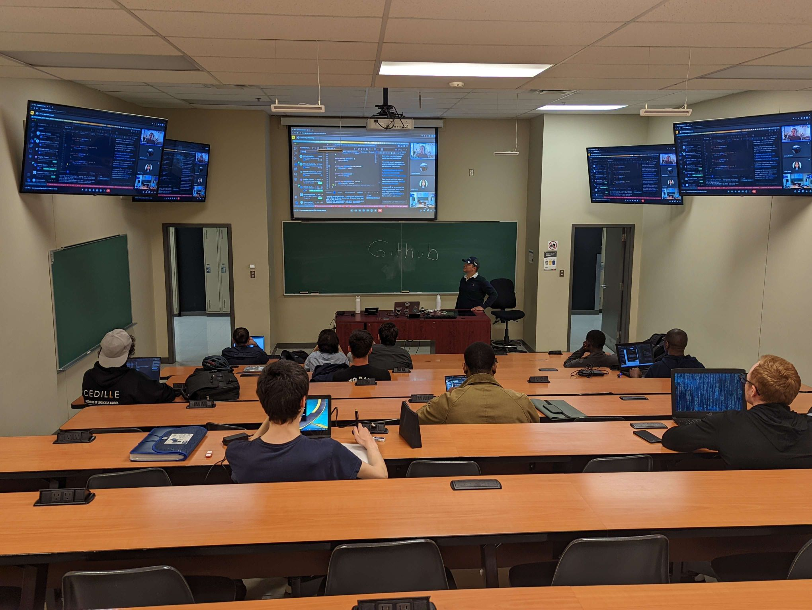

Les nouveautés de GitHub Copilot qui m'intéressent personnellement à voir prochainement.

## Copilot Chat et /createNotebook

GitHub Copilot Chat avec `/createNotebook` permet de créer rapidement un carnet Jupyter à partir du code existant — utile pour la documentation et le prototypage, notamment pour les personnes en data science et en enseignement.

## GitHub Next

[GitHub Next](https://githubnext.com) regroupe les expérimentations et pistes d’innovation autour des produits GitHub.

## Session à Cédille

Chez **Cédille**, nous avons assisté à une session avec **GitHub** et **Arctiq** centrée sur Copilot et les offres IA autour du développement.

Merci aux intervenants **Thierry Madkaud** et **Eldrick Wega** pour les présentations.

Ces échanges renforcent le lien entre milieu académique et industrie. Merci aux participant·e·s et partenaires.

À bientôt pour de prochains événements.

