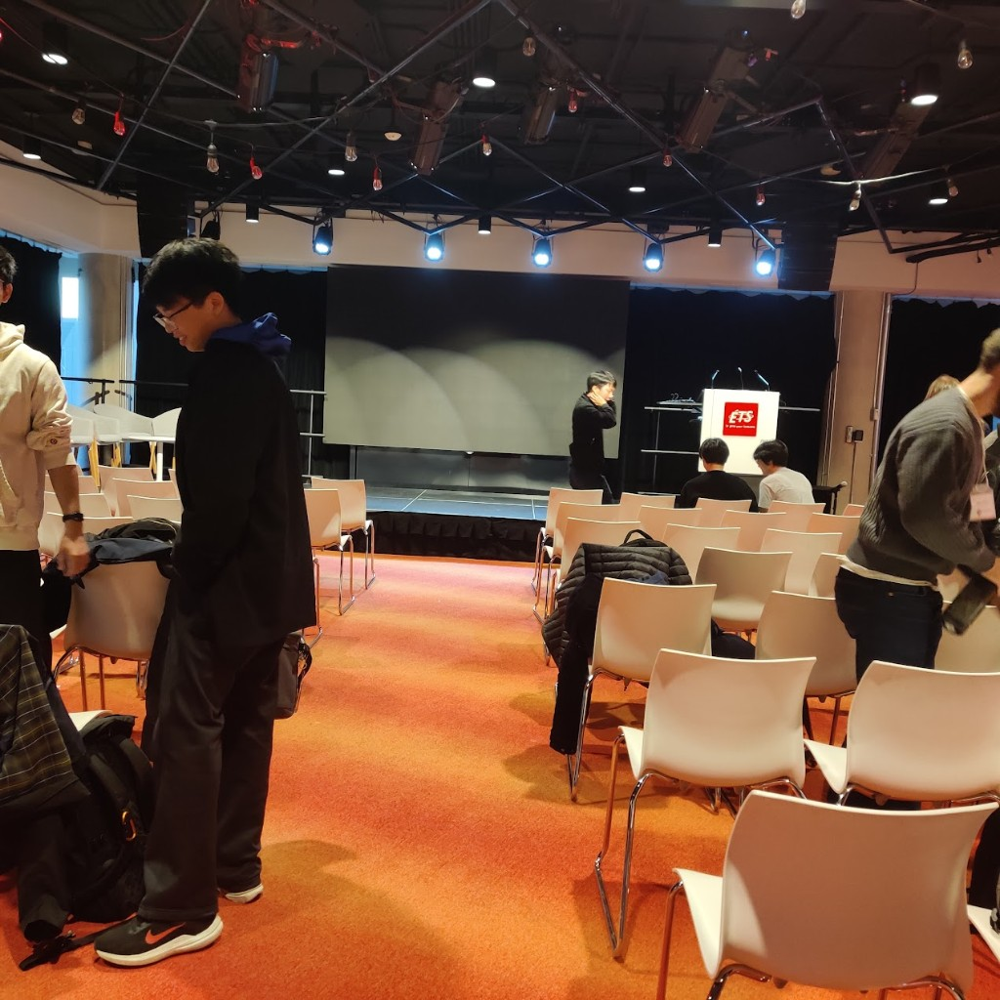
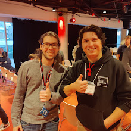

**GraphQuon** (anciennement MOTOGRAPH) est l’atelier annuel Québec–Ontario pré-SIGGRAPH pour les laboratoires de graphique de l’Est du Canada. L’édition **2024** s’est tenue les **9 et 10 novembre 2024** à l’**École de technologie supérieure (ÉTS)** à Montréal. J’ai contribué à **créer et héberger le site** sur [graphquon.github.io](https://graphquon.github.io/) — horaires, inscription et archives des éditions au même endroit. **[English version]()**.

<!--more-->

## À quoi sert GraphQuon

D’après la page **About the event** : les étudiant·es présentent des travaux en vue de SIGGRAPH devant un public **bienveillant et critique**, pour recevoir des retours avant les vraies dates de soumission. Les groupes du Québec et de l’Ontario alternent l’accueil ; en **2024**, c’était l’ÉTS.

Questions : [graphquon@etsmtl.ca](mailto:graphquon@etsmtl.ca).

### Noms des éditions passées

| Année | Nom | Dates |
|------|------|--------|
| 2018 | MOTOGRAPH | 17–18 nov. |
| 2019 | MOTOGRAPH | 7–8 déc. |
| 2021 | Tomatograph | 3–4 déc. |
| 2022 | FOIEGRAPH | 11–12 nov. |
| 2023 | GRAPHQUON | 2–3 déc. |
| **2024** | **GRAPHQUON** | **9–10 nov.** @ ÉTS |

## Horaire 2024 (repères)

Les grilles complètes sont sur [graphquon.github.io](https://graphquon.github.io/). Quelques jalons du programme publié :

**Samedi 9 novembre**

- Matinée : notamment **Quoc-Minh Ton-That**, **Melissa Katz** (McGill), **Ivan Puhachov** (UdeM) parmi les **mentions honorables**.
- Milieu de journée (ÉTS / Sherbrooke) : **Justin Benoist**, **Arthur Delon**, **Joel Pelletier-Guenette**.
- Après-midi : **Abhishek Madan** (Toronto) ; **Clara Kim** (Waterloo) — **meilleure présentation**.

**Dimanche 10 novembre**

- Matinée : mentions honorables dont **Victor Rong**, **Ryusuke Sugimoto**, **Yue Chang**, **Ege Ciklabakkal**.
- Fin d’après-midi : **Alex Hoang-Cao** (ÉTS), **Darsh Kaushik** (MILA).

La salle collait à l’ambiance atelier : auditorium ÉTS, tapis rouge, scène simple, chaises blanches remplies entre les sessions.

## En coulisse : Masha Shugrina (NVIDIA)

Entre deux sessions, j’ai discuté avec **Masha Shugrina** (NVIDIA Spatial Intelligence Lab / outils créatifs IA). Deux démos sont restées :

1. **[Diffusion Texture Painting](https://research.nvidia.com/labs/toronto-ai/DiffusionTexturePainting/)** (SIGGRAPH 2024) — peindre sur maillages UV avec un pinceau diffusion : traits continus et mélange de textures de référence complexes en interactif.
2. Un environnement type **Gaussian splat** / scan de scène — parcours simple dans un décor scanné, l’idée d’un collider/environnement immédiat sans pipeline offline lourd. (Le groupe publie aussi sur la [peinture de splats gaussiens](https://shumash.com/research) ; à l’époque la conversation visait surtout cette direction.)

Discussion utile : des outils concrets pour un labo, pas un nuage de mots-clés.

## Mon rôle et la suite en 2025

En **2024**, j’étais surtout côté **organisation / site web** (GitHub Pages, pages d’horaire, contact). En **2025**, j’ai **présenté** à Toronto — voir **[GraphQuon 2025 — Université de Toronto]()** (*Where to Wear?* avec Sheldon Andrews).

## Liens

- [GraphQuon 2024 — graphquon.github.io](https://graphquon.github.io/)
- [GraphQuon 2025 — Toronto]()
- [Diffusion Texture Painting (labo NVIDIA Toronto)](https://research.nvidia.com/labs/toronto-ai/DiffusionTexturePainting/)
- [Masha Shugrina — recherche](https://shumash.com/research)
