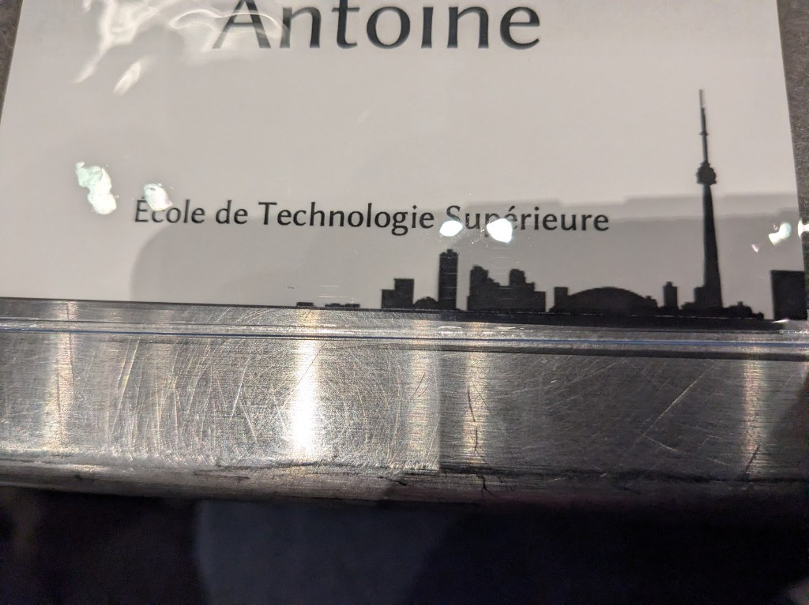
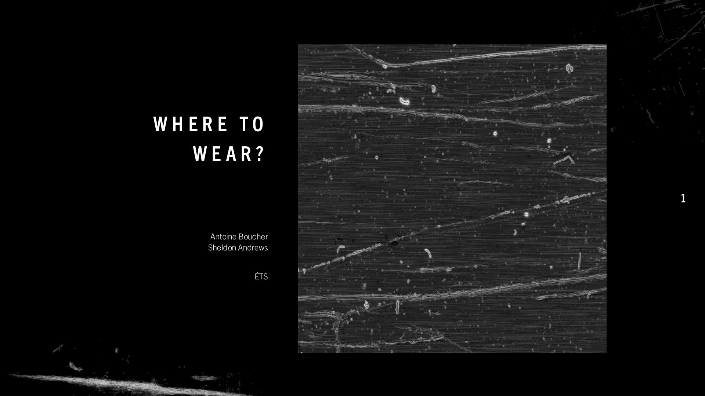
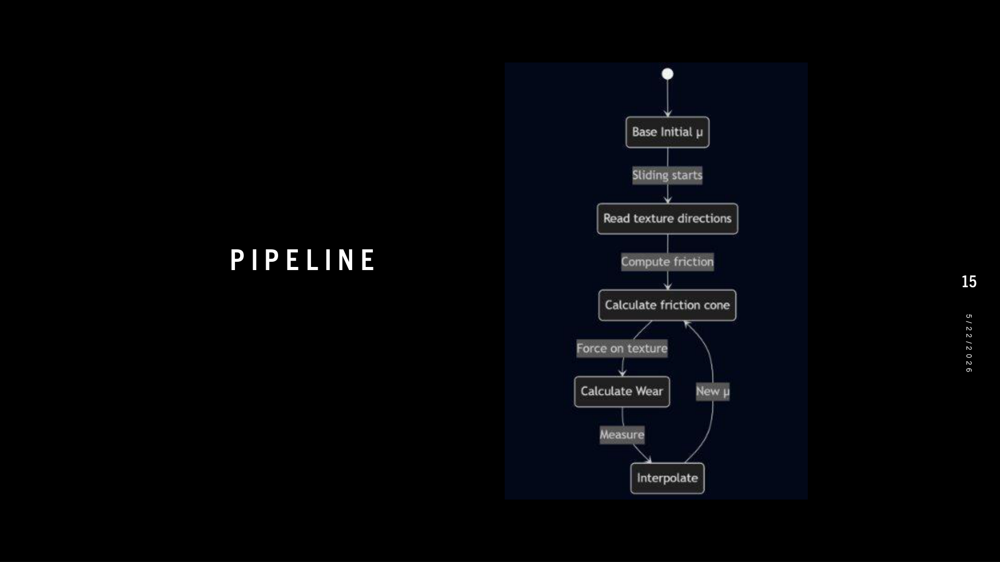
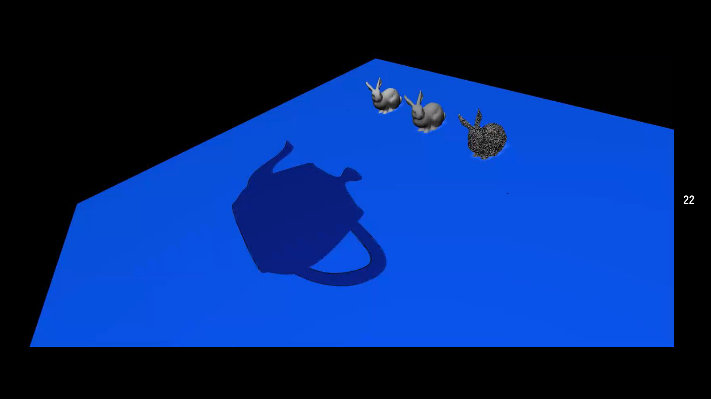
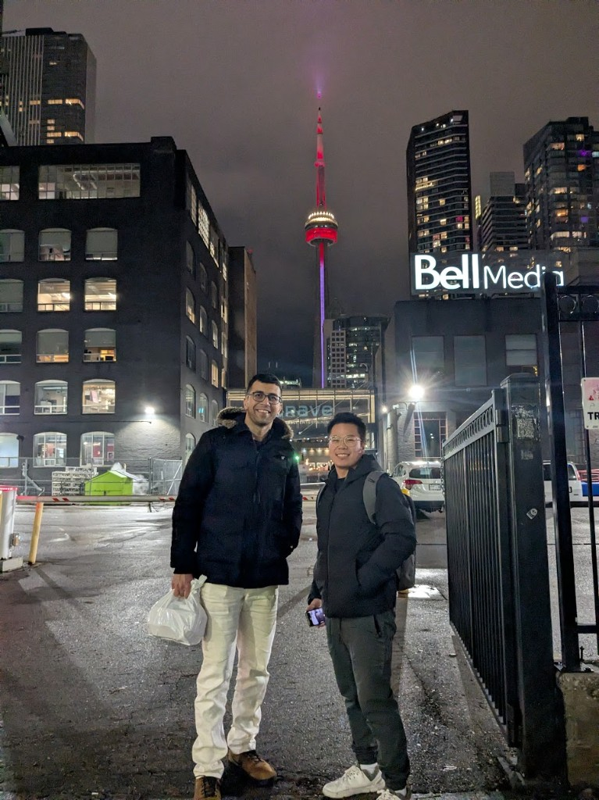
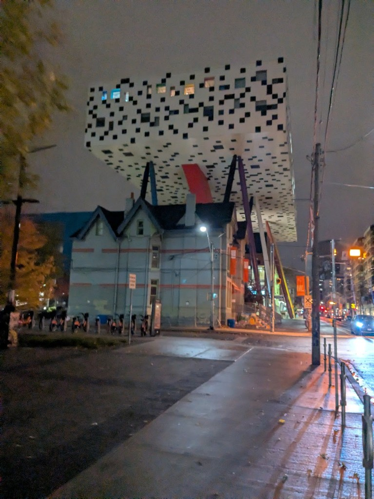
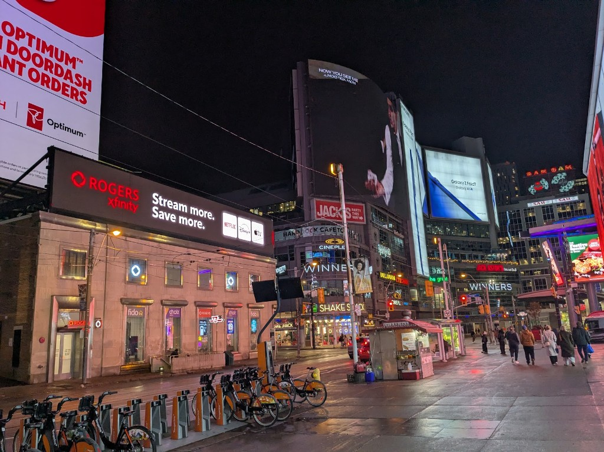
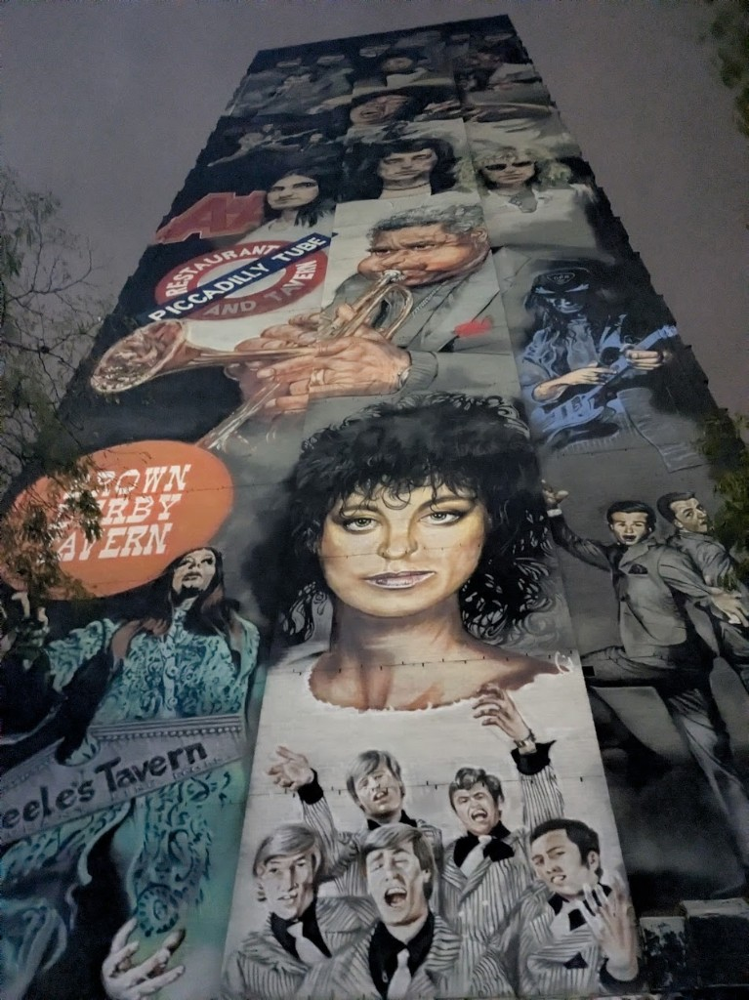
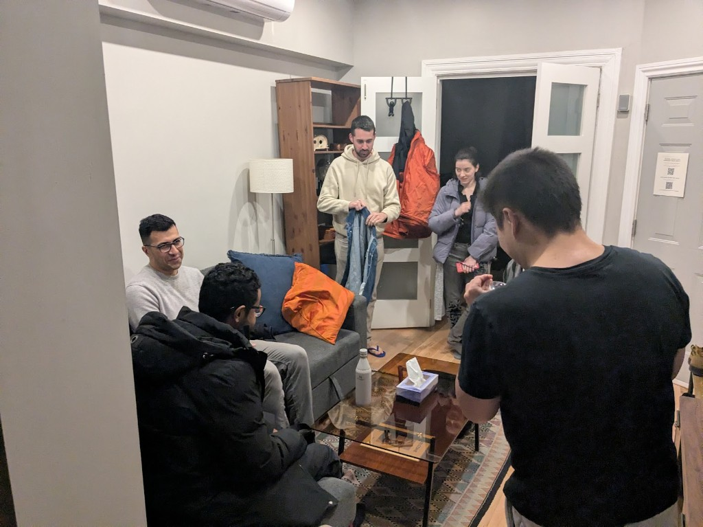

**GraphQuon** est l’atelier annuel Québec–Ontario pré-SIGGRAPH. L’édition **2025** s’est tenue les **15 et 16 novembre 2025** à l’**Université de Toronto** ([page de la série](https://www.dgp.toronto.edu/graphquon/)). J’y ai **présenté** avec **Sheldon Andrews** (ÉTS) : **Where to Wear?** — comment le contact frictionnel écrit l’histoire d’une surface, et comment en faire un retour utile en infographie et en génie. **[English version]()**.

<!--more-->

## Ce que j’ai présenté

Titre : **Where to Wear?** (sous-titre sur la première diapo : *Every surface has a biography written by frictional contact*).

L’idée est simple à dire et exigeante à simuler : le **temps**, le **contact** et la **dissipation d’énergie** modifient l’apparence et le comportement d’une surface — des traces d’usure dans des salles de bain d’école d’ingénierie aux rayures sur outils, matériaux de jeu et préhenseurs robotiques. Les diapos vont de la motivation à la mécanique (usure d’Archard, lois énergétiques), puis à un **pipeline orienté rendu** (masque de contact, volumes orthographiques, champs de vitesse et de traction tangentiels, intégration en texture), et à des pistes de validation (**capture GelSight**, interpolation d’atlas de matériaux).

### Pipeline (en un coup d’œil)

Rendu avec [uml-mcp](https://github.com/antoinebou12/uml-mcp) depuis [`wear-pipeline-flow.mmd`](./images/wear-pipeline-flow.mmd) :

### Pourquoi GraphQuon

GraphQuon, c’est l’endroit où les **labos d’infographie du Québec et de l’Ontario** partagent leurs travaux avant la saison SIGGRAPH — exposés courts, affiches et retours francs de gens qui construisent simulateurs et moteurs de rendu. Après avoir contribué au site **[GraphQuon 2024]()** à l’ÉTS, présenter à Toronto en 2025, c’était la même communauté, de l’autre côté du trajet.

Ce fil de recherche rejoint mon travail à l’**ÉTS** sur la **fabrication et validation de surfaces 3D avec frottement** ([description du projet](https://www.etsmtl.ca/recherche/etudes-superieures-et-recherche/projets-de-recherche-pour-etudiants/3d-fabrication-and-validation-of-frictional-su-1)).

## Diapositives et téléchargements

| Format | Fichier | Notes |
|--------|---------|--------|
| **PDF** | [graphquon-2025-where-to-wear.pdf](./graphquon-2025-where-to-wear.pdf) | Export complet (28 diapos). Idéal pour lecture dans le navigateur. |
| **PowerPoint** | [graphquon-final.pptx](./graphquon-final.pptx) | Présentation éditable d’origine (~116 Mo). Téléchargement ci-dessous ; aperçu : préférer le PDF. |

**PowerPoint (.pptx)** — présentation complète avec actifs embarqués :



## Toronto, novembre 2025

Quelques photos du séjour — badge, architecture près du campus, et promenades en centre-ville entre les sessions.

## Liens

- [GraphQuon 2025 — DGP, Université de Toronto](https://www.dgp.toronto.edu/graphquon/)
- [GraphQuon 2024 à l’ÉTS (Montréal)]() · [graphquon.github.io](https://graphquon.github.io/)
- [ÉTS — projet surfaces à frottement](https://www.etsmtl.ca/recherche/etudes-superieures-et-recherche/projets-de-recherche-pour-etudiants/3d-fabrication-and-validation-of-frictional-su-1)
