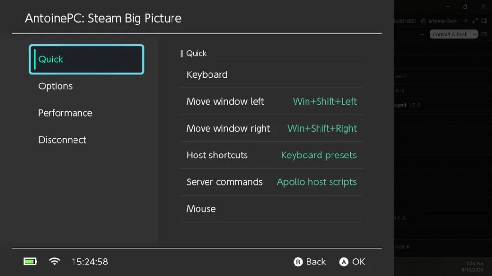
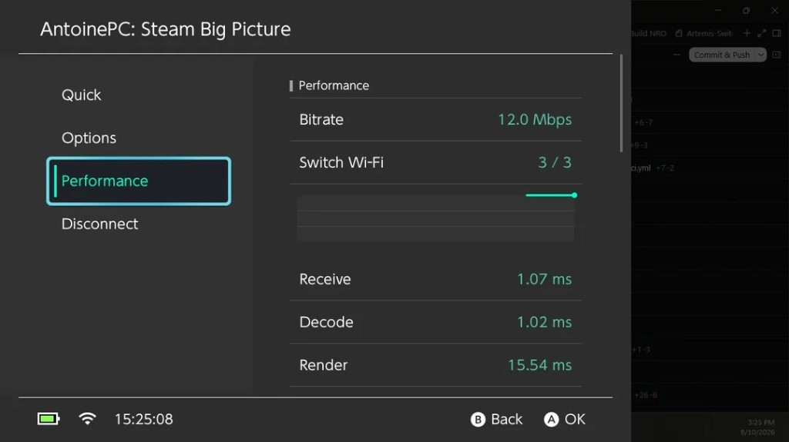

---
post_kind: article
title: "Handheld streaming and homebrew — Artemis-Switch, moonlight-N3DS, sm64coopdx-switch"
date: 2026-09-02T12:00:00-04:00
lastmod: 2026-09-02T12:00:00-04:00
description: "PC game streaming on Nintendo Switch with Artemis (Apollo/Sunshine), Moonlight on New 3DS, and a Switch port of sm64coopdx — three homebrew repos and what each one does."
translationKey: handheld-streaming-homebrew
tags:
  - Nintendo Switch
  - Nintendo 3DS
  - Moonlight
  - Homebrew
  - C++
images:
  - artemis-performance.png
---

Three repos I maintain on the side: **[Artemis-Switch](https://github.com/antoinebou12/Artemis-Switch)** for Apollo/Sunshine streaming on Switch, **[moonlight-N3DS](https://github.com/antoinebou12/moonlight-N3DS)** for GameStream on New 3DS, and **[sm64coopdx-switch](https://github.com/antoinebou12/sm64coopdx-switch)** as a Switch build of cooperative Super Mario 64. They share the same itch — run something interesting on hardware that was not designed for it — but the stack and constraints differ. **[Version française]()**.

<!--more-->

## Artemis-Switch — PC streaming on Switch

[Artemis-Switch](https://github.com/antoinebou12/Artemis-Switch) is my fork of [XITRIX/Moonlight-Switch](https://github.com/XITRIX/Moonlight-Switch), wired for **Apollo** (Sunshine) hosts instead of classic NVIDIA GameStream. I stream Steam Big Picture from my desktop (`AntoinePC`) and use the in-app overlay for quick host shortcuts and a live performance panel.

The **Quick** tab exposes window-management shortcuts (`Win+Shift+Left` / `Right`), keyboard presets, and Apollo host scripts without leaving the stream. Handy when the host is a Windows box and the Switch is just the display.

**Performance** shows bitrate (~12 Mbps in this capture), Switch Wi-Fi bars, and receive / decode / render timings. Render is usually the bottleneck on Switch; sub-millisecond receive and decode means the network and decoder are healthy and the frame budget is mostly compositing.

Repo: **[github.com/antoinebou12/Artemis-Switch](https://github.com/antoinebou12/Artemis-Switch)** (★ 12). Upstream Moonlight-Switch work also shows up on my CV as [merged toolchain fixes](https://github.com/XITRIX/Moonlight-Switch) for newer devkitPro toolchains — separate from the Artemis fork, same Moonlight lineage.

## moonlight-N3DS — GameStream on New 3DS

[moonlight-N3DS](https://github.com/antoinebou12/moonlight-N3DS) tracks [zoeyjodon/moonlight-N3DS](https://github.com/zoeyjodon/moonlight-N3DS), a GameStream client for **New 3DS** (extra RAM and CPU vs OG 3DS). My fork is where I experiment with build fixes and integration; star count on **my** repo is still low — the community interest lives on upstream (~300★), which is the right place to look for installs and issues.

Constraints are brutal: 400×240 top screen, software decode, Wi-Fi on a 2015 handheld. Expect lower bitrate and higher latency than Switch; the win is having *any* Moonlight path on 3DS at all.

Repo: **[github.com/antoinebou12/moonlight-N3DS](https://github.com/antoinebou12/moonlight-N3DS)**.

## sm64coopdx-switch — co-op Mario 64 on Switch

[sm64coopdx-switch](https://github.com/antoinebou12/sm64coopdx-switch) ports [coop-deluxe/sm64coopdx](https://github.com/coop-deluxe/sm64coopdx) to Switch homebrew. sm64coopdx is the continuation of sm64ex-coop: online co-op, Lua mods, and QoL the decomp scene added over years.

**Legal note:** like every SM64 port, you must supply your own **legally obtained ROM**. The repo builds the port; it does not ship game assets.

Repo: **[github.com/antoinebou12/sm64coopdx-switch](https://github.com/antoinebou12/sm64coopdx-switch)**.

## How these fit together

| Project | Platform | Upstream | Role |
|---------|----------|----------|------|
| Artemis-Switch | Switch | XITRIX/Moonlight-Switch | Apollo/Sunshine streaming + overlay UX |
| moonlight-N3DS | New 3DS | zoeyjodon/moonlight-N3DS | GameStream client experiments |
| sm64coopdx-switch | Switch | coop-deluxe/sm64coopdx | Homebrew port of co-op SM64 |

Project pages: [Artemis-Switch](), [moonlight-N3DS](), [sm64coopdx-switch]().

## Related

- Diagram tooling for write-ups: **[uml-mcp]()** and the [uml-mcp project page]().
