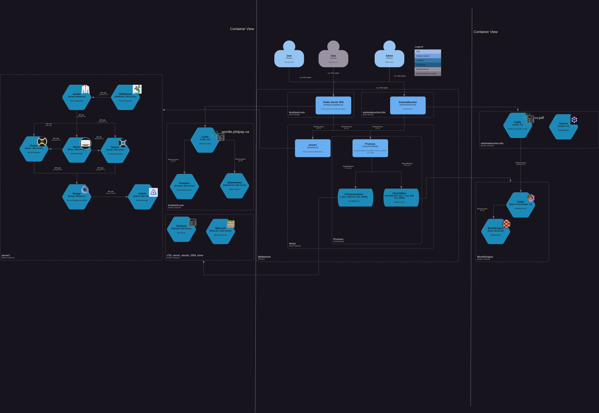

I've recently embarked on a journey to overhaul my home network setup. The transition from Draw.io to PlantUML C4 for creating deployment diagrams has been a game-changer. 🏡

PlantUML C4 offers a text-based 📝approach that integrates seamlessly with version control systems, making it an ideal tool for infrastructure as code (IaC)🏗️ .

I am also moving to Cloudflare for DNS management ✅
I gonna also use Terraform and Github action as CD🔁

On the virtualization front, I am now using Proxmox and XCP-ng as hypervisors, with Talos OS powering my Kubernetes deployments from my personal project. 💻