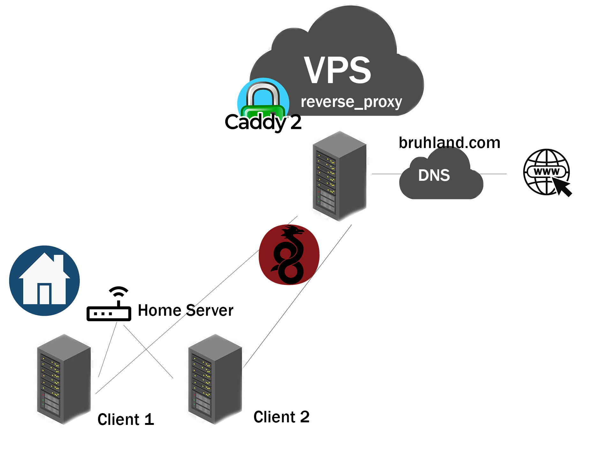
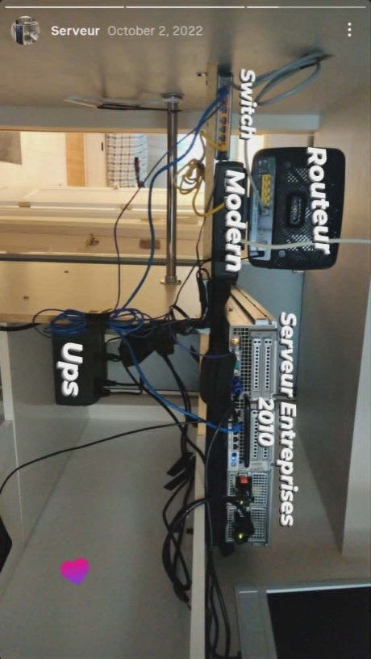
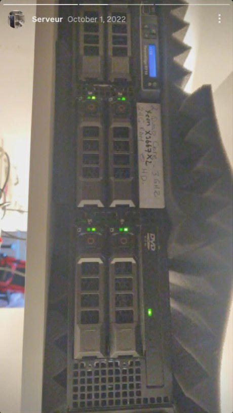
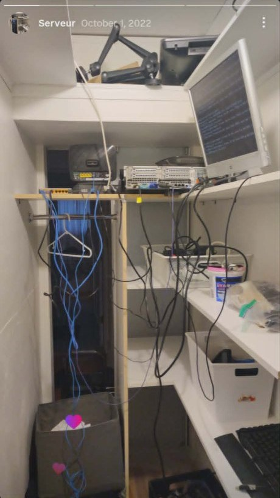
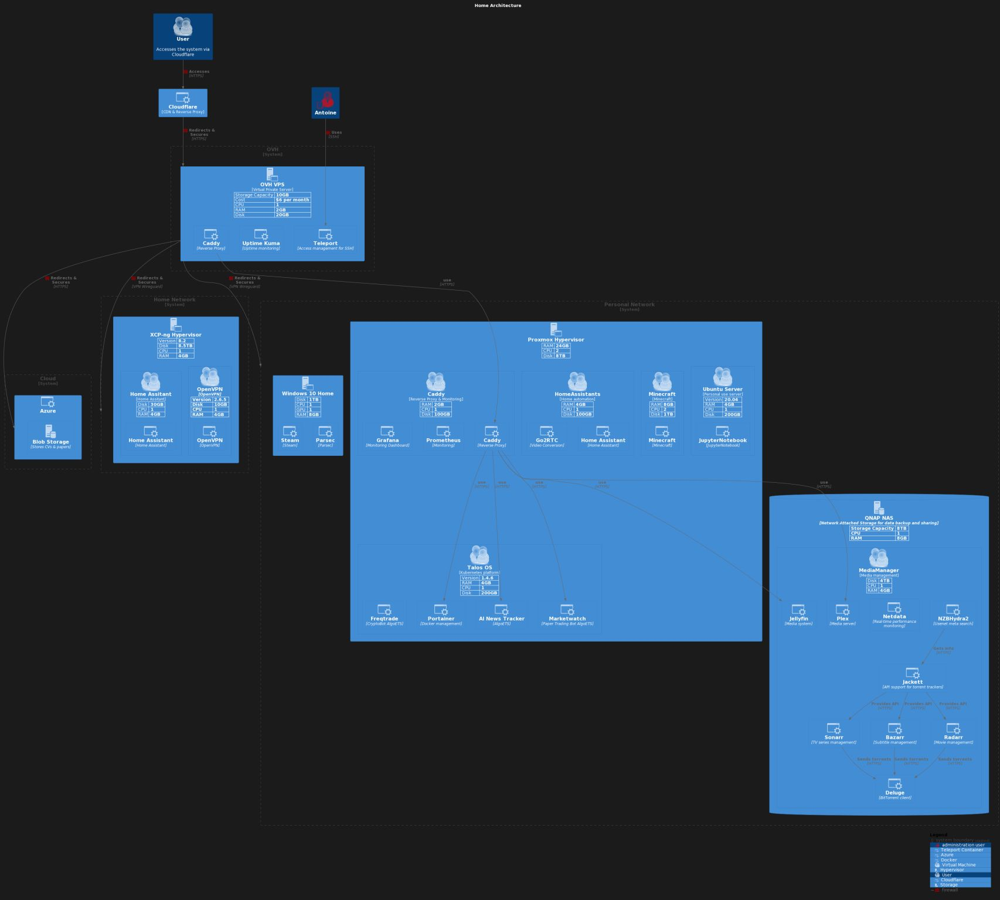

Les factures cloud m’ont poussé vers un **lab maison** : vieux PC, Docker là où un SaaS suffisait, et assez de scripts pour tout reconstruire après un mauvais week-end. Ce billet raconte comment le réseau a grandi — pas un design parfait, mais une école de routage, VPN et virtualisation en cassant des choses chez moi. **[English version]()**.

<!--more-->

## Pourquoi un lab

Les cours couvraient IP, VPN et routage sur papier. Faire tourner des services à la maison rend les compromis concrets : courant, bruit, sauvegardes, et « qui a SSH quand le routeur lâche ».

## Docker en premier

J’ai aligné des **stacks conteneur gratuites** sur des jobs payés dans le cloud — média, tableaux de bord, petits outils. Docker comme porte d’entrée vers des services composables plutôt qu’un seul serveur « animal ».

## Bash et deux machines

Matériel : un **Dell** pas cher et une machine de 2004. Scripts **bash** pour **Ubuntu**, **CentOS** et **Proxmox** — assez reproductibles pour que les réinstallations après expériences fassent moins mal.

### Rack physique (octobre 2022)

Avant les schémas Lucidchart, le lab tenait dans des **placards et étagères** — nœud de câbles compris. Photos recadrées d’anciennes stories ; c’est le vrai câblage, pas un rendu 3D.

**Pile murale** — switch, modem, routeur, **serveur entreprise (génération ~2010)**, onduleur, étiquetée pendant que j’apprenais encore qui branchait quoi :

**Dell PowerEdge R710** — deux **Xeon X5667** (quad ~3 GHz), **24 Go RAM**, à côté de mousse acoustique. Le ruban adhésif sur le bezel, c’était mon inventaire :

**Placard** — serveur rack à l’horizontale, switch jaune, écran pour les installs locales, et assez de câbles bleus pour apprendre la patience :

La virtualisation compte quand tu snapshots avant une idée douteuse. Un hôte dédié bat le tout bare-metal.

## Accès distant et bordure

**Caddy** en reverse proxy ; exposition via un frontal **OVH** pour ne pas n’exposer que l’IP résidentielle. Admin à distance et santé des services dans la même histoire que « rendre le service joignable ».

**WireGuard** pour le VPN — pénible la première fois, rapide une fois en place. J’ai contribué à de petits aides-setup pour des ami·e·s.

## Après le déménagement

Nouvel appartement, plus de curiosité VLAN, VMs **Proxmox** pour des projets de club. **Lucidchart** pour le schéma mural ; vue type **C4** pour expliquer la pile.

Plus tard, sites publics vers l’**hébergement statique** (S3/GitHub Pages) pour réduire le always-on — le lab est resté pour le privé.

## Pannes mémorables

- **Un seul disque, pas de sauvegarde** — un `apt upgrade` raté et un week-end de réinstall.
- **Ports admin exposés** — admin derrière VPN seulement, appris à la dure.
- **Bruit thermique** — le R710 m’a fait penser aux courbes ventilateur avant « serveur » = « chambre à côté ».

## Bilan

Un homelab, c’est un bac à sable pour les réflexes **plateforme** : automatiser, documenter la topologie, supposer la panne. Liens actuels : **[MediaBoxDockerCompose](https://github.com/antoinebou12/MediaBoxDockerCompose)** sur le CV.

## Articles connexes

- [Catalogue MediaBox Docker — 86 apps, 28 implémentées]() — tableur, compose et scripts Proxmox
- [Renpho + Home Assistant]() — données santé à la maison
- [Rack à planches — CAO vers bois]() — projets physiques entre les câbles
- [Caddy sur AWS]() — mêmes idées de proxy, autre facture
