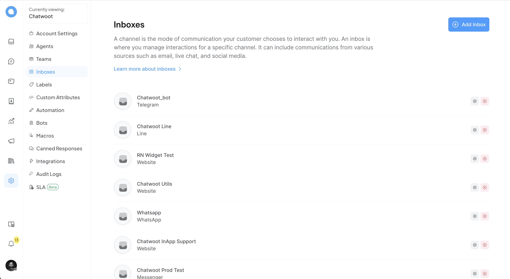
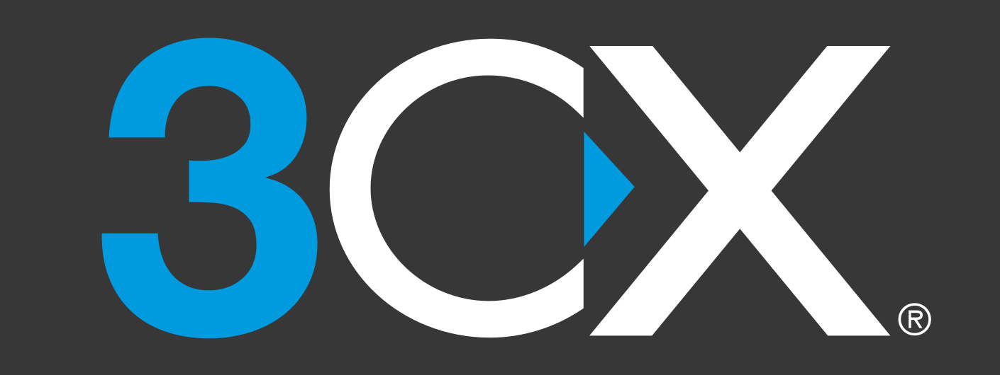
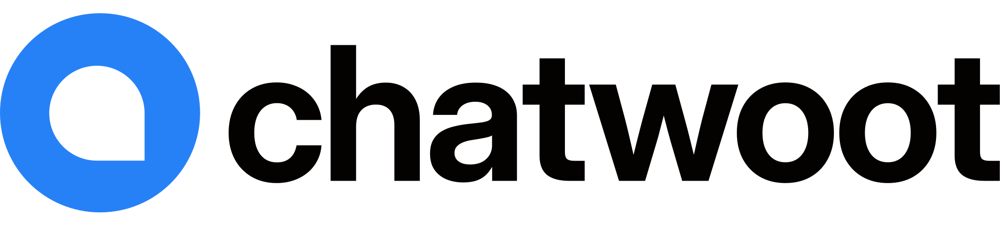

I wrote these notes while helping a bilingual storefront team choose **live chat**, a **bot**, and something agents could actually work from. The four products below are **not** interchangeable: one is a phone system with chat bolted on, one is marketing automation, one is managed bot-to-human handoff, and one is an open-source helpdesk you can host yourself. **Pricing and channels change often**—use this as a map, then confirm on each vendor’s site. **[Version française]()**.

<!--more-->

## How I used this matrix

I scored each option on **agent training time**, **French/English inbox**, **who owns the server**, and **whether marketing owns the bot**. No vendor won every row — the winner was “least new moving parts for this team,” which is why 3CX and Chatwoot show up most often in my notes below.

## Start with the job, not the logo

Before you compare feature matrices, ask what you are really buying:

- **One queue for voice + web chat** → telephony-first stack.
- **Instagram/Facebook growth flows** → conversational marketing.
- **Bot opens, human finishes** → managed CX SaaS.
- **Shared inbox you can run on your own metal** → open-source desk.

Decision flow ([`platform-picker-flow.mmd`](./images/platform-picker-flow.mmd), rendered with [uml-mcp](https://github.com/antoinebou12/uml-mcp)):

| | | |
|:---:|:---:|:---:|
|  | **ManyChat** · [manychat.com](https://manychat.com) | **Kommunicate** · [kommunicate.io](https://www.kommunicate.io) |
| |  | |

## 3CX — phones first, chat in the same queue

[3CX](https://www.3cx.com) is **UCaaS / PBX** at heart: extensions, meetings, call routing. The **website live chat** and **Talk** widgets live in that world. If you already standardize on 3CX for voice, adding chat can mean **one vendor, one agent desk, one set of queues** instead of bolting a separate inbox on the side.

That was the draw when I configured **Live Chat and Talk** on a CommerceBuild site: support and sales could stay inside a stack the business already paid for, including a **3CX chatbot** path for simple questions. The catch is you are buying a **communications platform**, not a neutral helpdesk. Ticketing depth, CRM flexibility, and “we only want email + chat SaaS” workflows may feel secondary.

**Setup:** for WordPress and other CMS plugins, follow the **current** [3CX documentation](https://www.3cx.com/docs/)—wizard labels and integration names shift between releases. I kept **French setup notes** for the Live Chat and Talk plugin from an older guide; treat them as a draft and **reconcile with the official docs** before production.

**Tangent (not 3CX):** if you are exploring **Microsoft** bot patterns with analytics dashboards, this walkthrough is unrelated to picking a chat vendor but still useful: [YouTube — Microsoft ChatBot (Power BI)](https://www.youtube.com/watch?v=nWxguR5B5-s).

## ManyChat — campaigns and Meta, not a helpdesk

[ManyChat](https://manychat.com) is built for **conversational marketing**: broadcasts, sequences, lead capture, with a strong lean toward **Meta** (Instagram, Facebook). Teams use it to grow and automate DMs, not to run a sober multi-channel support desk with SLAs across email, phone, and web in one place.

**Good fit:** growth experiments, funnel automation, social-first support scripts.  
**Weak fit:** “we need one open-core inbox for web + email + phone with deep ticketing.”

Check [ManyChat pricing](https://manychat.com/pricing) for seat and contact limits before you design flows around it.

## Kommunicate — bot first, human when it matters

[Kommunicate](https://www.kommunicate.io) targets **human + bot collaboration**: the bot takes the first turn, then **hands off** to agents on the site and common messaging channels. You integrate and configure a **managed SaaS**—no Kubernetes weekend required.

Useful when you want **Dialogflow-style wiring** and a polished agent UI without operating the stack. Compare **total cost**, **data residency**, and **model lock-in** (they advertise compatibility with several LLM providers) against self-hosted options if compliance matters.

## Chatwoot — shared inbox, cloud or your Docker host

[Chatwoot](https://www.chatwoot.com) is an **AGPL** customer-engagement suite. Run **Chatwoot Cloud** or **self-host** (Docker and operator guides in their developer docs).

Conceptually it is **“shared inbox + omnichannel threads”**, closer to Intercom/Zendesk territory than to a PBX or a pure marketing bot:

- **Unified inbox** for the web widget, email, and other channels (the exact channel list evolves—see their docs).
- **Teams, labels, automation**, and history aimed at support and sales follow-up.
- **APIs and webhooks** when you outgrow the default UI.

**Trade-offs:** self-hosting buys control and can cut per-seat SaaS cost, but you own **backups, upgrades, and security**. Voice and some enterprise CRM integrations may lag proprietary suites—verify your must-haves on their roadmap.

- [Chatwoot on GitHub](https://github.com/chatwoot/chatwoot)
- [Chatwoot developer documentation](https://developers.chatwoot.com)

## Quick comparison

| | Primary focus | Typical deployment | Open source |
|---|----------------|-------------------|-------------|
| **3CX** | Telephony + UC + web chat in one stack | Cloud or on-prem PBX + agents | No |
| **ManyChat** | Marketing automation, often Meta-first | SaaS | No |
| **Kommunicate** | Bot + human handoff, managed CX | SaaS | No |
| **Chatwoot** | Omnichannel inbox, support-oriented | SaaS (cloud) or self-hosted | Yes (AGPL) |

## Links to verify before you buy

- [3CX documentation](https://www.3cx.com/docs/)
- [ManyChat pricing](https://manychat.com/pricing)
- [Kommunicate](https://www.kommunicate.io)
- [Chatwoot](https://www.chatwoot.com) · [GitHub](https://github.com/chatwoot/chatwoot) · [Developer docs](https://developers.chatwoot.com)
- [Microsoft ChatBot + Power BI (YouTube)](https://www.youtube.com/watch?v=nWxguR5B5-s)

## Related posts

- [Portfolio Hugo week 1]() — embedding third-party tools on a static site
- [Home networking evolution]() — self-hosting mindset vs SaaS chat
