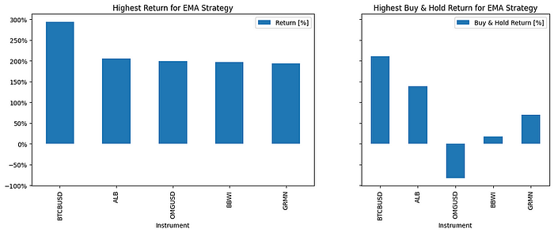

## Introduction

In this report, we present an experiment with technical indicators using the BatchBacktesting project available on GitHub at the following link: [BatchBacktesting](https://github.com/AlgoETS/BatchBacktesting).

## Installing Dependencies

To get started, install the necessary libraries:

!pip install numpy httpx richp

## Importing Modules

Here are the modules to import for the script:

import pandas as pd  
import numpy as np  
from datetime import datetime  
import httpx  
import concurrent.futures  
import glob  
import warnings  
from rich.progress import track  
  
warnings.filterwarnings("ignore")

## API Configuration

Replace the placeholders `FMP_API_KEY` and `BINANCE_API_KEY` with your actual API keys to access the data from the respective services.

BASE\_URL\_FMP = "https://financialmodelingprep.com/api/v3"  
BASE\_URL\_BINANCE = "https://fapi.binance.com/fapi/v1/"  
FMP\_API\_KEY = "YOUR\_FMP\_API\_KEY"  
BINANCE\_API\_KEY = "YOUR\_BINANCE\_API\_KEY"

## API Request Functions

The following functions allow you to make API requests to different endpoints and retrieve historical price data for cryptocurrencies and stocks.

def make\_api\_request(api\_endpoint, params):  
    with httpx.Client() as client:  
        response = client.get(api\_endpoint, params=params)  
        if response.status\_code == 200:  
            return response.json()  
        print("Error: Failed to retrieve data from API")  
        return None  
  
def get\_historical\_price\_full\_crypto(symbol):  
    api\_endpoint = f"{BASE\_URL\_FMP}/historical-price-full/crypto/{symbol}"  
    params = {"apikey": FMP\_API\_KEY}  
    return make\_api\_request(api\_endpoint, params)  
  
def get\_historical\_price\_full\_stock(symbol):  
    api\_endpoint = f"{BASE\_URL\_FMP}/historical-price-full/{symbol}"  
    params = {"apikey": FMP\_API\_KEY}  
    return make\_api\_request(api\_endpoint, params)  
  
def get\_SP500():  
    api\_endpoint = "https://en.wikipedia.org/wiki/List\_of\_S%26P\_500\_companies"  
    data = pd.read\_html(api\_endpoint)  
    return list(data\[0\]\['Symbol'\])  
  
def get\_all\_crypto():  
    return \[  
        "BTCUSD", "ETHUSD", "LTCUSD", "BCHUSD", "XRPUSD", "EOSUSD",  
        "XLMUSD", "TRXUSD", "ETCUSD", "DASHUSD", "ZECUSD", "XTZUSD",  
        "XMRUSD", "ADAUSD", "NEOUSD", "XEMUSD", "VETUSD", "DOGEUSD",  
        "OMGUSD", "ZRXUSD", "BATUSD", "USDTUSD", "LINKUSD", "BTTUSD",  
        "BNBUSD", "ONTUSD", "QTUMUSD", "ALGOUSD", "ZILUSD", "ICXUSD",  
        "KNCUSD", "ZENUSD", "THETAUSD", "IOSTUSD", "ATOMUSD", "MKRUSD",  
        "COMPUSD", "YFIUSD", "SUSHIUSD", "SNXUSD", "UMAUSD", "BALUSD",  
        "AAVEUSD", "UNIUSD", "RENBTCUSD", "RENUSD", "CRVUSD", "SXPUSD",  
        "KSMUSD", "OXTUSD", "DGBUSD", "LRCUSD", "WAVESUSD", "NMRUSD",  
        "STORJUSD", "KAVAUSD", "RLCUSD", "BANDUSD", "SCUSD", "ENJUSD"  
    \]  
  
def get\_financial\_statements\_lists():  
    api\_endpoint = f"{BASE\_URL\_FMP}/financial-statement-symbol-lists"  
    params = {"apikey": FMP\_API\_KEY}  
    return make\_api\_request(api\_endpoint, params)

## Implementing the EMA Strategy

The EMA (Exponential Moving Average) is a type of moving average that places a greater weight and significance on the most recent data points. The EMA reacts more quickly to recent price changes than the simple moving average (SMA), which assigns equal weight to all observations in the period.

class EMA(Strategy):  
    n1 = 20  
    n2 = 80  
  
    def init(self):  
        close = self.data.Close  
        self.ema20 = self.I(taPanda.ema, close.s, self.n1)  
        self.ema80 = self.I(taPanda.ema, close.s, self.n2)  
  
    def next(self):  
        price = self.data.Close  
        if crossover(self.ema20, self.ema80):  
            self.position.close()  
            self.buy(sl=0.90 \* price, tp=1.25 \* price)  
        elif crossover(self.ema80, self.ema20):  
            self.position.close()  
            self.sell(sl=1.10 \* price, tp=0.75 \* price)

In this strategy:

*   `ema20` and `ema80` are calculated for a given stock or cryptocurrency.
*   A buy signal is generated when `ema20` crosses above `ema80`.
*   A sell signal is generated when `ema80` crosses above `ema20`.
*   Stop loss (`sl`) and take profit (`tp`) levels are set to limit potential losses and secure gains.

## Implementing the MACD Strategy

The MACD (Moving Average Convergence Divergence) is a trend-following momentum indicator that shows the relationship between two moving averages of a security’s price. It is calculated by subtracting the 26-period EMA from the 12-period EMA. The result is the MACD line. A nine-day EMA of the MACD called the “signal line” is then plotted on top of the MACD line, which can function as a trigger for buy and sell signals.

class MACD(Strategy):  
    short\_period = 12  
    long\_period = 26  
    signal\_period = 9  
  
    def init(self):  
        close = self.data.Close  
        self.macd = self.I(taPanda.macd, close.s, self.short\_period, self.long\_period, self.signal\_period)  
  
    def next(self):  
        macd\_line = self.macd.macd  
        signal\_line = self.macd.signal  
        if crossover(macd\_line, signal\_line):  
            self.position.close()  
            self.buy()  
        elif crossover(signal\_line, macd\_line):  
            self.position.close()  
            self.sell()

In this strategy:

*   `macd_line` and `signal_line` are calculated using short-term (12-period) and long-term (26-period) EMAs.
*   A buy signal is generated when the `macd_line` crosses above the `signal_line`.
*   A sell signal is generated when the `signal_line` crosses above the `macd_line`.

## Running Backtests

The following functions allow you to process instruments and run backtests with specified strategies.

def run\_backtests\_strategies(instruments, strategies):  
    strategies = \[x for x in STRATEGIES if x.\_\_name\_\_ in strategies\]  
    outputs = \[\]  
    with concurrent.futures.ThreadPoolExecutor() as executor:  
        futures = \[\]  
        for strategy in strategies:  
            future = executor.submit(run\_backtests, instruments, strategy, 4)  
            futures.append(future)  
        for future in concurrent.futures.as\_completed(futures):  
            outputs.extend(future.result())  
    return outputs  
  
def check\_crypto(instrument):  
    return instrument in get\_all\_crypto()  
  
def check\_stock(instrument):  
    return instrument not in get\_financial\_statements\_lists()  
  
def process\_instrument(instrument, strategy):  
    try:  
        if check\_crypto(instrument):  
            data = get\_historical\_price\_full\_crypto(instrument)  
        else:  
            data = get\_historical\_price\_full\_stock(instrument)  
        if data is None or "historical" not in data:  
            print(f"Error processing {instrument}: No data")  
            return None  
        data = clean\_data(data)  
        bt = Backtest(data, strategy=strategy, cash=100000, commission=0.002, exclusive\_orders=True)  
        output = bt.run()  
        output = process\_output(output, instrument, strategy)  
        return output, bt  
    except Exception as e:  
        print(f"Error processing {instrument}: {str(e)}")  
        return None  
  
def clean\_data(data):  
    data = data\["historical"\]  
    data = pd.DataFrame(data)  
    data.columns = \[x.title() for x in data.columns\]  
    data = data.drop(\["Adjclose", "Unadjustedvolume", "Change", "Changepercent", "Vwap", "Label", "Changeovertime"\], axis=1)  
    data\["Date"\] = pd.to\_datetime(data\["Date"\])  
    data.set\_index("Date", inplace=True)  
    data = data.iloc\[::-1\]  
    return data  
  
def process\_output(output, instrument, strategy, in\_row=True):  
    if in\_row:  
        output = pd.DataFrame(output).T  
    output\["Instrument"\] = instrument  
    output\["Strategy"\] = strategy.\_\_name\_\_  
    output.pop("\_strategy")  
    return output  
  
def save\_output(output, output\_dir, instrument, start, end):  
    print(f"Saving output for {instrument}")  
    fileNameOutput = f"{output\_dir}/{instrument}-{start}-{end}.csv"  
    output.to\_csv(fileNameOutput)  
  
def plot\_results(bt, output\_dir, instrument, start, end):  
    print(f"Saving chart for {instrument}")  
    fileNameChart = f"{output\_dir}/{instrument}-{start}-{end}.html"  
    bt.plot(filename=fileNameChart, open\_browser=False)  
  
def run\_backtests(instruments, strategy, num\_threads=4, generate\_plots=False):  
    outputs = \[\]  
    output\_dir = f"output/raw/{strategy.\_\_name\_\_}"  
    output\_dir\_charts = f"output/charts/{strategy.\_\_name\_\_}"  
    if not os.path.exists(output\_dir):  
        os.makedirs(output\_dir)  
    if not os.path.exists(output\_dir\_charts):  
        os.makedirs(output\_dir\_charts)  
    with concurrent.futures.ThreadPoolExecutor(max\_workers=num\_threads) as executor:  
        future\_to\_instrument = {executor.submit(process\_instrument, instrument, strategy): instrument for instrument in instruments}  
        for future in concurrent.futures.as\_completed(future\_to\_instrument):  
            instrument = future\_to\_instrument\[future\]  
            output = future.result()  
            if output is not None:  
                outputs.append(output\[0\])  
                save\_output(output\[0\], output\_dir, instrument, output\[0\]\["Start"\].to\_string().strip().split()\[1\], output\[0\]\["End"\].to\_string().strip().split()\[1\])  
                if generate\_plots:  
                    plot\_results(output\[1\], output\_dir\_charts, instrument, output\[0\]\["Start"\].to\_string().strip().split()\[1\], output\[0\]\["End"\].to\_string().strip().split()\[1\])  
    data\_frame = pd.concat(outputs)  
    start = data\_frame\["Start"\].to\_string().strip().split()\[1\]  
    end = data\_frame\["End"\].to\_string().strip().split()\[1\]  
    fileNameOutput = f"output/{strategy.\_\_name\_\_}-{start}-{end}.csv"  
    data\_frame.to\_csv(fileNameOutput)  
    return data\_frame

## Executing the Scripts

To execute the backtests, use the following functions:

tickers = get\_SP500()  
run\_backtests(tickers, strategy=EMA, num\_threads=12, generate\_plots=True)  
run\_backtests(tickers, strategy=MACD, num\_threads=12, generate\_plots=True)  
  
ticker = get\_all\_crypto()  
run\_backtests(ticker, strategy=EMA, num\_threads=12, generate\_plots=True)  
run\_backtests(ticker, strategy=MACD, num\_threads=12, generate\_plots=True)

The link you shared corresponds to the output directory of the BatchBacktesting project on GitHub: [BatchBacktesting Output Directory](https://github.com/AlgoETS/BatchBacktesting/tree/main/output). However, it appears that this directory does not contain pre-calculated results. It is likely that the project authors chose not to include test results in the GitHub repository to avoid cluttering the repository with user-specific data.

## Get Antoine Boucher’s stories in your inbox

To obtain calculated values for your own tests, you will need to run the script locally on your machine with your chosen parameters and strategies. After executing the script, the results will be saved in the output directory of your local project.

Here is an example output link for reference: [EMA Chart for AAPL](https://algoets.github.io/BatchBacktesting/output/charts/EMA/AAPL-2018-04-04-2023-04-03.html).

## Results Analysis

Here is an example of the results obtained for the instruments with the highest and lowest returns for EMA:

*   **Top 5 instruments with the highest returns:**
*   BTCBUSD: 293.78%
*   ALB: 205.97%
*   OMGUSD: 199.62%
*   BBWI: 196.82%
*   GRMN: 193.47%
*   **Top 5 instruments with the lowest returns:**
*   BTTBUSD: -99.93%
*   UAL: -82.63%
*   NCLH: -81.51%
*   LNC: -78.02%
*   CHRW: -76.38%

Press enter or click to view image in full size

## Conclusion

In conclusion, the BatchBacktesting project offers a flexible and powerful approach for testing and analyzing the performance of technical indicators on stock and cryptocurrency markets. The provided functions allow easy integration with financial services APIs and straightforward data manipulation. The experimental results can be used to develop and refine algorithmic trading strategies based on observed performance.

---

*Originally published on [Medium](https://medium.com/@antoine.boucher012/multiple-technical-indicators-backtesting-on-multiple-tickers-using-python-a5c933d3f1bf).*
