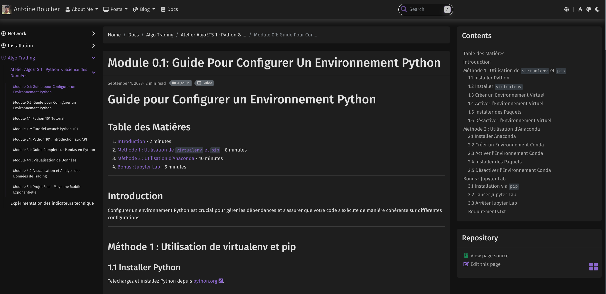

## Introduction

Welcome to my personal blog, a chronicle of my journey in developing a multifaceted portfolio using Hugo. As a software engineer, I am excited to share the nuances of building a dynamic and interactive website, where my professional skills intersect with personal passions. This inaugural post marks the beginning of a series in which I'll delve into various aspects of web development, data analysis, and the integration of advanced web technologies.

## What to Expect

### Visual Storytelling

This blog will feature screenshots of the Hugo interface, illustrative graphics, and maps to enhance the storytelling aspect.

### Helpful Resources

I'll share resources such as Hugo templates, links to my Substack, and tech tools like particles.js, providing a valuable resource trove for budding software engineers and web developers.

## Choosing Hugo and the HBTheme

When deciding to create my portfolio, I was drawn to Hugo for its reputation for speed and flexibility. As a software engineer, efficiency and scalability are always at the forefront of my decision-making. After exploring several options, I chose the HBTheme for its comprehensive feature set. The theme's support for comments, its seamless integration with npm (Node Package Manager), and the availability of a variety of Hugo modules made it an obvious choice. These features not only enhanced my blog's functionality but also aligned perfectly with my professional workflow, enabling me to implement advanced web technologies with ease.

## Merging Data Analysis with Web Development

One of my initial projects involved a detailed analysis of car thefts in Montreal. The project was not just an exercise in data analysis, but also a personal endeavor, inspired by stories from friends and family. Using Hugo's capabilities, I was able to embed and showcase these complex datasets in an accessible and engaging manner. This integration exemplified Hugo's capacity to handle data-intensive content, a crucial aspect for any software engineer looking to present technical work in a clear and compelling manner. You can view the study here: [Étude des vols de voitures à Montréal](https://mohamedilias.substack.com/p/etude-des-vols-de-voitures-a-montreal).

## The Versatility of Substack

Alongside my Hugo blog, I've ventured into Substack. This platform offers a distinct ecosystem conducive to in-depth writing and engaged readership. My Substack page serves as a complementary space where I delve deeper into topics that require more expansive coverage. It allows me to reach a broader audience and provides a different format for interaction and discussion.

## Merging Professional Development and Blogging

This blog also serves as a platform for discussing academic and professional development. I plan to share insights on pursuing advanced degrees and balancing them with career objectives. As someone working to complete his master's degree, I'll explore how academic knowledge can be applied in practical software development and the broader tech industry.

## Crafting a Unique Online Presence

In creating my blog, I paid special attention to aesthetics and functionality. By experimenting with various Hugo themes and incorporating interactive elements like particles.js, I aimed to create a visually appealing and user-friendly interface. These design choices reflect my belief in the importance of a clean and efficient user experience, a philosophy I carry over from my software engineering background.

## Conclusion

This blog is an embodiment of my journey in the tech world, blending personal experiences with professional growth. Through this platform, I aim to share my insights into software engineering, web development, and much more. I invite you to join me on this exploration, to learn, to be inspired, and to discover the endless possibilities in the world of technology.
