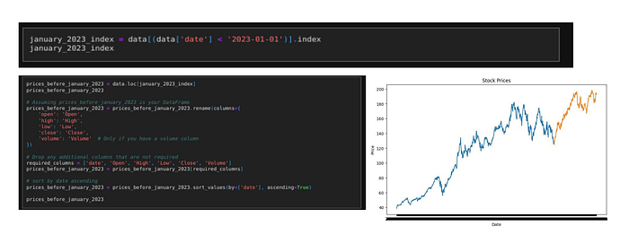
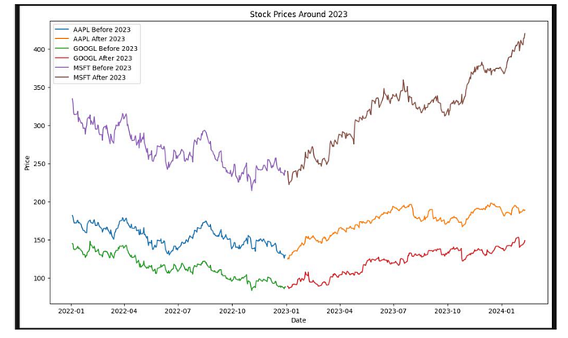
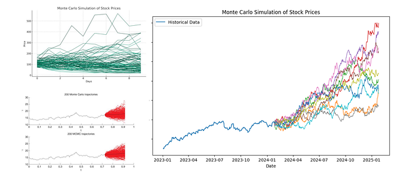
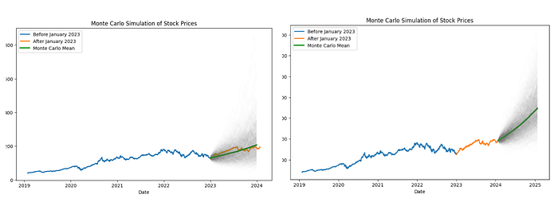
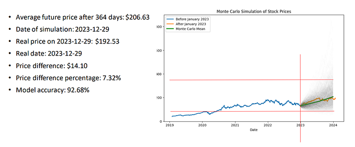
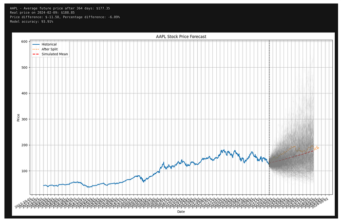
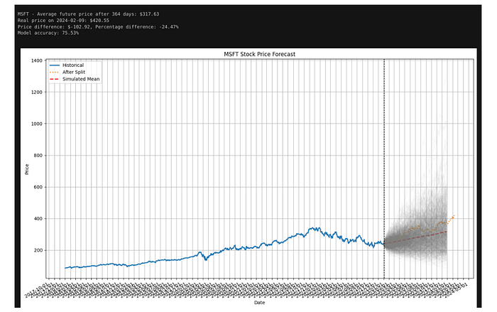

## Introduction

In the world of finance, accurately predicting stock prices is a critical task. With the advent of advanced computational techniques, we can leverage powerful algorithms like Monte Carlo simulations and Markov chains to forecast future stock prices. This article explores how to implement these methods using Python, along with the visualization and evaluation of their performance.

## Step 1: Setting Up the Environment

To start, we need to install the necessary Python libraries. These libraries include `pandas`, `numpy`, `httpx`, `backtesting`, `pandas_ta`, `matplotlib`, `scipy`, `rich`, and others. Here's how to install them:

import pandas as pd  
import numpy as np  
from datetime import datetime  
import concurrent.futures  
import warnings  
from rich.progress import track  
from backtesting import Backtest, Strategy  
import pandas\_ta as ta  
import matplotlib.pyplot as plt  
from scipy.stats import norm  
import httpx  
  
warnings.filterwarnings("ignore")

## Step 2: Defining Utility Functions

We need functions to fetch historical stock prices and crypto prices from APIs:

def make\_api\_request(api\_endpoint, params):  
    with httpx.Client() as client:  
        \# Make the GET request to the API  
        response = client.get(api\_endpoint, params=params)  
        if response.status\_code == 200:  
            return response.json()  
        print("Error: Failed to retrieve data from API")  
        return None  
  
def get\_historical\_price\_full\_crypto(symbol):  
    api\_endpoint = f"{BASE\_URL\_FMP}/historical-price-full/crypto/{symbol}"  
    params = {"apikey": FMP\_API\_KEY}  
    return make\_api\_request(api\_endpoint, params)  
  
  
def get\_historical\_price\_full\_stock(symbol):  
    api\_endpoint = f"{BASE\_URL\_FMP}/historical-price-full/{symbol}"  
    params = {"apikey": FMP\_API\_KEY}  
  
    return make\_api\_request(api\_endpoint, params)  
  
def get\_SP500():  
    api\_endpoint = "https://en.wikipedia.org/wiki/List\_of\_S%26P\_500\_companies"  
    data = pd.read\_html(api\_endpoint)  
    return list(data\[0\]\['Symbol'\])  
  
def get\_all\_crypto():  
    return \[  
        "BTCUSD", "ETHUSD", "LTCUSD", "BCHUSD", "XRPUSD", "EOSUSD",  
        "XLMUSD", "TRXUSD", "ETCUSD", "DASHUSD", "ZECUSD", "XTZUSD",  
        "XMRUSD", "ADAUSD", "NEOUSD", "XEMUSD", "VETUSD", "DOGEUSD",  
        "OMGUSD", "ZRXUSD", "BATUSD", "USDTUSD", "LINKUSD", "BTTUSD",  
        "BNBUSD", "ONTUSD", "QTUMUSD", "ALGOUSD", "ZILUSD", "ICXUSD",  
        "KNCUSD", "ZENUSD", "THETAUSD", "IOSTUSD", "ATOMUSD", "MKRUSD",  
        "COMPUSD", "YFIUSD", "SUSHIUSD", "SNXUSD", "UMAUSD", "BALUSD",  
        "AAVEUSD", "UNIUSD", "RENBTCUSD", "RENUSD", "CRVUSD", "SXPUSD",  
        "KSMUSD", "OXTUSD", "DGBUSD", "LRCUSD", "WAVESUSD", "NMRUSD",  
        "STORJUSD", "KAVAUSD", "RLCUSD", "BANDUSD", "SCUSD", "ENJUSD",  
    \]  
  
def get\_financial\_statements\_lists():  
    api\_endpoint = f"{BASE\_URL\_FMP}/financial-statement-symbol-lists"  
    params = {"apikey": FMP\_API\_KEY}  
    return make\_api\_request(api\_endpoint, params)

## Step 3: Splitting Data into Training and Testing Sets

Next, we’ll fetch the historical stock prices for a given symbol and split the data into training and testing sets:

stock\_symbol = "AAPL"  
stock\_prices = get\_historical\_price\_full\_stock(stock\_symbol)  
data = pd.DataFrame(stock\_prices\['historical'\])  
  
\# Splitting the data  
january\_2023\_index = data\[(data\['date'\] < '2023-01-01')\].index  
prices\_after\_january\_2023 = data.drop(january\_2023\_index)  
  
\# Assuming prices\_after\_january\_2023 is your DataFrame  
prices\_after\_january\_2023 = prices\_after\_january\_2023.rename(columns={  
    'open': 'Open',  
    'high': 'High',  
    'low': 'Low',  
    'close': 'Close',  
    'volume': 'Volume'  \# Only if you have a volume column  
})  
  
\# Drop any additional columns that are not required  
required\_columns = \['date', 'Open', 'High', 'Low', 'Close', 'Volume'\]  
prices\_after\_january\_2023 = prices\_after\_january\_2023\[required\_columns\]  
  
\# sort by date ascending  
prices\_after\_january\_2023 = prices\_after\_january\_2023.sort\_values(by=\['date'\], ascending=True)

plt.figure(figsize=(10, 6))  
plt.title('Stock Prices')  
plt.xlabel('Date')  
plt.ylabel('Price')  
plt.plot(prices\_before\_january\_2023\['date'\], prices\_before\_january\_2023\['Close'\])  
plt.plot(prices\_after\_january\_2023\['date'\], prices\_after\_january\_2023\['Close'\])  
plt.show()

Press enter or click to view image in full size

Press enter or click to view image in full size

## Step 4: Monte Carlo Simulation

We will perform a Monte Carlo simulation to predict future stock prices:

## Get Antoine Boucher’s stories in your inbox

Join Medium for free to get updates from this writer.

Remember me for faster sign in

def monte\_carlo\_simulation(data, days, iterations):  
    if isinstance(data, pd.Series):  
        data = data.to\_numpy()  
    if not isinstance(data, np.ndarray):  
        raise TypeError("Data must be a numpy array or pandas Series")  
  
    log\_returns = np.log(data\[1:\] / data\[:-1\])  
    mean = np.mean(log\_returns)  
    variance = np.var(log\_returns)  
    drift = mean - (0.5 \* variance)  
    daily\_volatility = np.std(log\_returns)  
  
    future\_prices = np.zeros((days, iterations))  
    current\_price = data\[-1\]  
    for t in range(days):  
        shocks = drift + daily\_volatility \* norm.ppf(np.random.rand(iterations))  
        future\_prices\[t\] = current\_price \* np.exp(shocks)  
        current\_price = future\_prices\[t\]  
    return future\_prices

## Get Antoine Boucher’s stories in your inbox

Press enter or click to view image in full size

Press enter or click to view image in full size

## Visualisation

simulation\_days = 364  
mc\_iterations = 1000  
mc\_prices = monte\_carlo\_simulation(prices\_before\_january\_2023\['Close'\], simulation\_days, mc\_iterations)  
  
\# Last closing price repeated for each iteration  
last\_close\_price = np.full((1, mc\_iterations), prices\_before\_january\_2023\['Close'\].iloc\[-1\])  
  
\# Combine the last closing price with the Monte Carlo simulation prices  
mc\_prices\_combined = np.concatenate((last\_close\_price, mc\_prices), axis=0)  
  
\# Adjust the periods in the date range to match the number of rows in mc\_prices\_combined  
last\_date = prices\_before\_january\_2023\['date'\].iloc\[-1\]  
simulated\_dates = pd.date\_range(start=last\_date, periods=simulation\_days + 1)  
  
\# Visualizing the Monte Carlo simulation alongside historical data  
plt.figure(figsize=(10, 6))  
  
\# Plot historical data  
plt.plot(pd.to\_datetime(prices\_before\_january\_2023\['date'\]), prices\_before\_january\_2023\['Close'\], label='Before January 2023', linewidth=2)  
plt.plot(pd.to\_datetime(prices\_after\_january\_2023\['date'\]), prices\_after\_january\_2023\['Close'\], label='After January 2023', linewidth=2)  
  
\# Taking average of all simulations on the 365th day  
future\_price\_mcmc = np.mean(mc\_prices\_combined\[364, :\])  
print(f"Average future price after 364 days: ${future\_price\_mcmc:.2f}")  
print(f"Date of simulation: {simulated\_dates\[364\].date()}")  
simulated\_date = simulated\_dates\[364\].date()  
real\_price = prices\_after\_january\_2023\['Close'\]\[18\]  
real\_date = prices\_after\_january\_2023\['date'\]\[18\]  
print(f"Real price on {real\_date}: ${real\_price:.2f}")  
print(f"Price difference: ${future\_price\_mcmc - real\_price:.2f}")  
print(f"Price difference percentage: {(future\_price\_mcmc - real\_price) / real\_price \* 100:.2f}%")  
print(f"Model accuracy: {100 - abs((future\_price\_mcmc - real\_price) / real\_price \* 100):.2f}%")  
  
\# Plot Monte Carlo simulations mean  
plt.plot(simulated\_dates, mc\_prices\_combined.mean(axis=1), label='Monte Carlo Mean', linewidth=3)  
  
\# Plot each simulation path  
for i in range(mc\_iterations):  
    plt.plot(simulated\_dates, mc\_prices\_combined\[:, i\], linewidth=0.5, color='gray', alpha=0.01)  
  
plt.title('Monte Carlo Simulation of Stock Prices')  
plt.xlabel('Date')  
plt.ylabel('Price')  
plt.legend()  
plt.show()

Press enter or click to view image in full size

Press enter or click to view image in full size

Press enter or click to view image in full size

Press enter or click to view image in full size

## Conclusion

Monte Carlo simulations modeling provides a robust framework for predicting future stock prices. By backtesting various strategies, we can evaluate their performance and make informed decisions.

## GitHub - AlgoETS/MarkokChainMonteCarlo: MarkokChainMonteCarlo Stratification Algo

### MarkokChainMonteCarlo Stratification Algo . Contribute to AlgoETS/MarkokChainMonteCarlo development by creating an…

## Reference

*   [Neural Networks in Finance: Markov Chain Monte Carlo (MCMC) and Stochastic Volatility Modeling](/analytics-vidhya/neural-networks-in-finance-markov-chain-monte-carlo-mcmc-and-stochastic-volatility-modelling-3f4f148c3046)
*   [Monte Carlo Simulation Basics](https://www.investopedia.com/articles/investing/112514/monte-carlo-simulation-basics.asp)
*   [https://www.semanticscholar.org/paper/MODELLING-OF-STOCK-PRICES-BY-THE-MARKOV-CHAIN-MONTE-Landauskas-Valakevi%C4%8Dius/ced26fa31b2306e747d69de10b77aaf3b9704e7a](https://www.semanticscholar.org/paper/MODELLING-OF-STOCK-PRICES-BY-THE-MARKOV-CHAIN-MONTE-Landauskas-Valakevi%C4%8Dius/ced26fa31b2306e747d69de10b77aaf3b9704e7a)
*   [https://www3.mruni.eu/ojs/intellectual-economics/article/download/817/774](https://www3.mruni.eu/ojs/intellectual-economics/article/download/817/774)

---

*Originally published on [Medium](https://medium.com/@antoine.boucher012/predicting-stock-prices-with-monte-carlo-simulations-0884ef32c35b).*
