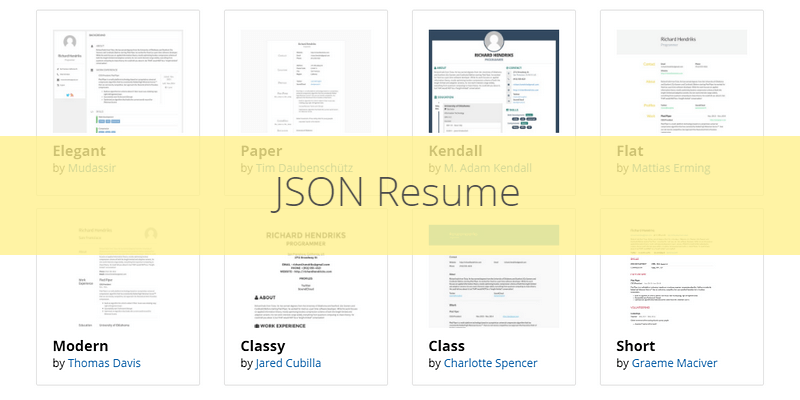

Most hiring flows start online. **JSON Resume** lets you keep one structured `resume.json` and render it as HTML, PDF, or data inside your own site. **[Version française]()** covers the same walkthrough.

<!--more-->

## Why JSON?

[JSON Resume](https://jsonresume.org/) is an open, community-maintained schema for CVs. Because the file is plain JSON, themes and CLIs can swap the presentation without you rewriting content. The ecosystem ships many visual styles—the grid above shows themes like **Elegant**, **Paper**, **Kendall**, and **Flat**.

You get portability: update the data once, regenerate exports, or pipe the same file into static site generators. This site’s **[Hugo week 1]()** post is the shell; JSON Resume is the structured CV underneath when you want PDF exports without maintaining Word.

## Main sections

A typical `resume.json` groups your story into predictable blocks.

### Basics

Name, headline, email, site, short summary, location, and social profiles (LinkedIn, GitHub, etc.).

```json
"basics": {
  "name": "Your Name",
  "label": "Job Title",
  "email": "your.email@example.com",
  "website": "https://yourwebsite.com",
  "summary": "A brief summary about yourself.",
  "location": {
    "city": "City",
    "region": "Region",
    "countryCode": "Country Code"
  },
  "profiles": [
    {
      "network": "LinkedIn",
      "username": "yourusername",
      "url": "https://www.linkedin.com/in/yourusername/"
    }
  ]
}
```

### Work

Roles with company, title, dates, and a short summary of what you did.

```json
"work": [
  {
    "name": "Company Name",
    "position": "Your Position",
    "startDate": "YYYY-MM-DD",
    "endDate": "YYYY-MM-DD",
    "summary": "Description of your role."
  }
]
```

### Education

School, field, degree type, and study dates.

```json
"education": [
  {
    "institution": "University Name",
    "area": "Field of Study",
    "studyType": "Degree Type",
    "startDate": "YYYY-MM-DD",
    "endDate": "YYYY-MM-DD"
  }
]
```

### Skills

Skill groups with optional level and keyword tags (languages, frameworks, tools).

```json
"skills": [
  {
    "name": "Programming",
    "level": "Intermediate",
    "keywords": ["Python", "JavaScript"]
  }
]
```

### Projects

Side work or portfolio pieces with dates, description, and URL.

```json
"projects": [
  {
    "name": "Project Name",
    "startDate": "YYYY-MM-DD",
    "endDate": "YYYY-MM-DD",
    "description": "Project description.",
    "url": "https://projecturl.com"
  }
]
```

## CLI workflow

Install the command-line tool globally:

```bash
npm install -g resume-cli
```

Author `resume.json` against the [schema](https://jsonresume.org/schema/), pick a theme, then export:

```bash
resume export resume.html
resume export resume.pdf
```

You can also publish to the free [JSON Resume Registry](https://registry.jsonresume.org/) for a hosted page.

Same data, multiple outputs—handy when you want a printable PDF and a web version that stay in sync.

## Hugo and friends

If your site already runs on **Hugo**, modules like [hugo-mod-json-resume](https://github.com/schnerring/hugo-mod-json-resume) map JSON sections into templates (including multilingual variants). That is how you move from a standalone export to a CV section inside a personal blog.

Other tools worth bookmarking:

- **[Profile Studio](https://profile-studio.netlify.app/#/preview)** — live preview while you edit JSON.
- **[SkillSet](https://jac21.github.io/SkillSet/)** — D3 visualization for the skills block.
- **[LinkedIn to JSON Resume](https://github.com/joshuatz/linkedin-to-jsonresume)** — bootstrap `resume.json` from an existing profile.

## Takeaway

JSON Resume is not magic—it is discipline. You maintain one source of truth, lean on themes for layout, and plug the same file into CLIs or Hugo when you outgrow a static PDF. For a developer portfolio, that separation between **content** and **presentation** ages well.

## When JSON Resume is enough

| Situation | Fit |
|-----------|-----|
| Developer CV with frequent updates | Strong |
| Heavy design portfolio (art direction) | Export PDF only; custom layout elsewhere |
| ATS-only corporate portals | Still paste plain text — JSON helps you generate it |
| Academic CV (publications list) | Extend schema or add a custom section |

## Pitfalls

- Letting `resume.json` rot — set a calendar reminder after each job change.
- Theme drift across npm major versions — pin theme package in CI.
- Stuffing every project — curate; interviewers skim.

## Related posts

- [Portfolio Hugo week 1]() — site shell around the same era
- [Software engineering journey]() — narrative behind the bullets
- [QcES lean discovery pitch]() — another way to tell your story out loud
