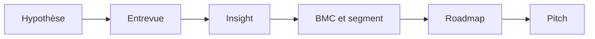

J’ai suivi **QcES** (cohorte printemps 2024) en parallèle d’un parcours de découverte lean : canevas d’affaires, entrevues, pitch court, et le reste. Ce texte est ma synthèse personnelle—pas un document officiel du programme. **[Version anglaise]()** sur le même sujet.

<!--more-->

## Ce qui m’est resté

Le programme revenait souvent aux mêmes idées. Le **Business Model Canvas** sert de carte commune pour créer, livrer et capturer de la valeur—et pour tester désirabilité, faisabilité et viabilité. On commence en général par **pour qui** et **quelle promesse**, puis on ajuste quand le marché répond.

**Segmenter**, ce n’est pas académique : dès qu’on pitch « les médecins » ou « les parents », on voit le flou. Séparer B2B (firmographie) et B2C (démographie, comportement) rend le marché **atteignable**.

Les **entrevues** servent à apprendre, pas à conclure une vente. Les formateurs l’ont répété : connecter, pas convaincre ; rester curieux du **problème**, pas attaché à la première solution.

Des tours de **feedback** courts (une force réelle, une piste d’amélioration) et un **pitch d’environ 90 secondes sans diapos** forcent la clarté tôt. Une **roadmap**, c’est une vue stratégique dans le temps—pas un diagramme de Gantt. Et **PoC**, **prototype** et **MVP** ne sont pas interchangeables : est-ce que ça peut marcher, comment les gens interagissent, quelle est la plus petite version testable.

Pour le pitch : **Intéresser → Croire → Rejoindre**—problème d’abord, crédibilité ensuite, demande précise à la fin.

## Comment les blocs s’enchaînent

On ne remplit pas le canevas une fois pour l’éternité. Hypothèse, discussions, ajustement des segments et de la proposition de valeur, priorisation sur une roadmap, puis pratique à l’oral.

## Canevas d’affaires

Neuf blocs, une page : segments, proposition de valeur, canaux, relations, revenus, ressources, activités, partenaires, coûts. L’enjeu n’est pas le dessin—c’est la survie du projet. Le canevas doit bouger quand le marché ou la concurrence bouge.

On nous a poussés à clarifier **pour qui** et **comment on aide** avant d’optimiser le reste. Ça colle à la boucle hypothèse–validation : tester des croyances sur le client et le problème, pas seulement la pile technique.

## Segment de clientèle

Celui qui paie n’est pas toujours celui qui utilise. Un client « early » a souvent un vrai problème, le sait, cherche des options, bricole parfois déjà, et peut avoir un budget.

B2B : taille, secteur, dynamique d’achat. B2C : profil et comportement. Le gain, c’est de remplacer des étiquettes vagues par des groupes qu’on peut retrouver, contacter et interviewer.

## Partager l’idée

Quatre-vingt-dix secondes, sans deck : problème en langage clair, bénéficiaire, offre, pourquoi ça compte. Pas besoin de citer le TAM au jour un—c’est un filtre de clarté.

Pour recevoir du feedback : écouter pour comprendre. Pour en donner : nommer ce qui fonctionne, puis une piste concrète « ce serait plus fort si… ».

## Entrevues

C’était le cœur de la cohorte pour moi. Les entrevues comblent les trous d’un premier canevas. Ne pas pitcher sa solution pendant l’appel—apprendre comment l’autre vit le problème.

Rencontrer au-delà du « client idéal » : utilisateurs de solutions de rechange, experts, fournisseurs, communautés. La découverte continue après trois appels, surtout quand on pivote.

Trouver les gens, obtenir un créneau, mener un échange utile : ça s’apprend. La phrase que je répète encore : tomber amoureux du problème, pas de la solution.

## Roadmap, PoC, prototype, MVP

Une roadmap dit où on va, pour quel public (équipe, investisseurs, partenaires), sur quel horizon. Ce n’est pas un plan de projet détaillé.

La preuve de concept vérifie si l’approche peut fonctionner. Le prototype explore l’interaction—souvent avant un vrai lancement. Le MVP est la plus petite version mise entre des mains réelles pour apprendre vite, y compris quand ça casse.

La roadmap change de forme en découverte, validation et croissance. Ça m’a évité de sur-planifier trop tôt.

## Marché et proposition de valeur

Comprendre le marché, ce n’est pas compter des courriels. Macro, dynamique sectorielle, comportement client, tendances : contraintes et opportunités.

Proposition de valeur = offre + bénéfice client. Les points de douleur deviennent des questions d’entrevue, pas du remplissage de diapositive.

## Pitch : Intéresser, Croire, Rejoindre

Un pitch cherche une suite concrète : temps, intro, labo, financement. Les formats varient ; la structure aide.

1. **Intéresser** — le problème et pourquoi il compte pour un public identifiable. Ne pas commencer par le produit.
2. **Croire** — solution, différenciation, preuves (traction, équipe, résultats récents).
3. **Rejoindre** — demande précise : montant, expertise, partenariat, introduction.

Gabarit simple (~1 min 30) : qui vous êtes, problème, offre pour une cible, proposition de valeur, contraste avec l’existant, nouvelle récente, appel à l’action.

## En conclusion

QcES a relié outils et habitudes : canevas, segmentation, roadmap d’un côté ; entrevues, feedback, pitch de l’autre. Le fil conducteur : problème au centre, hypothèses testables, communication assez claire pour que les autres **aident**—pas seulement applaudissent.

Dans un programme similaire, quelques entrevues bien menées valent souvent mieux qu’un canevas parfaitement décoré. La régularité bat le polish.
