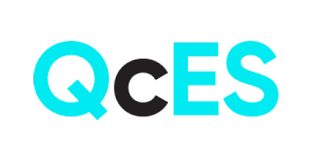
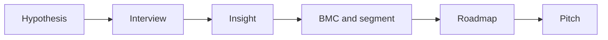

I took part in **QcES** (Spring 2024 cohort) while working through lean discovery: business model canvas, customer interviews, short pitches, and everything in between. This post is my own recap—not an official program document. **[Full article in French]()** if you prefer.

<!--more-->

## What stuck with me

The program kept coming back to a few ideas. The **Business Model Canvas** is a shared map for how you create, deliver, and capture value—and whether the idea is desirable, feasible, and viable. You usually start with **who** you serve and **what** you promise them, then revise as the market talks back.

**Segmentation** sounds dry until you try pitching to “doctors” or “parents.” Splitting B2B (firmographics) from B2C (demographics, behavior) makes the market something you can actually reach.

**Interviews** are for learning, not closing a sale. The facilitators repeated it until it landed: connect, don’t convince; stay curious about the **problem**, not married to your first solution.

Short **feedback** rounds (one real strength, one growth angle) and a **~90 second pitch without slides** force clarity early. A **roadmap** is a strategic view over time—not a Gantt chart. And **PoC**, **prototype**, and **MVP** are different beats: can it work, how do people interact, what is the smallest thing you can put in front of real users.

For pitching, **Hook → Believe → Join** showed up again and again: problem first, then why you’re credible, then a specific ask.

## How the pieces connect

You do not fill the canvas once and frame it. You state a hypothesis, talk to people, adjust segments and value proposition, decide what belongs on a roadmap, then practice explaining it out loud.

## Business model canvas

Nine blocks, one page: segments, value proposition, channels, relationships, revenue, resources, activities, partners, costs. The point is not decoration—it is survival. Every block can break you if you ignore it, and the canvas should move when customers or competitors shift.

We were pushed to nail **for whom** and **how you help** before optimizing the rest. That matches the hypothesis–validation loop: test beliefs about the customer and the problem, not only the tech stack.

## Customer segments

Who pays is not always who uses. An early customer often has a real problem, knows it, is looking for options, maybe already hacked a workaround, and might have budget.

B2B segments lean on company size, sector, and buying dynamics. B2C adds lifestyle and behavior. The win is replacing vague labels with groups you can find, email, and interview.

## Sharing the idea

Ninety seconds, no deck: state the problem in plain language, who benefits, what you offer, and why it matters. You are not expected to quote TAM on day one—it is a clarity filter.

When you receive feedback, listen to understand. When you give it, name something that works, then one concrete “what would make this stronger.”

## Interviews

This was the heart of the cohort for me. Interviews fill the gaps a first canvas always has. Do not pitch your fix on the call—learn how the other person lives the problem.

Talk to people beyond the “ideal customer”: users of substitutes, experts, suppliers, communities. Discovery does not end after three calls; it continues through pivots.

Finding people, booking time, and running a useful conversation are skills. The line I still repeat: fall in love with the problem, not the solution.

## Roadmap, PoC, prototype, MVP

A roadmap answers where you are headed for a given audience (team, investors, partners) over a chosen horizon. It is not the same as a detailed project plan.

Proof of concept checks whether the approach can work. A prototype explores interaction—often before a real launch. An MVP is the smallest version you put in front of real users to learn fast, including from what breaks.

Roadmaps look different in discovery, validation, and growth. That alone saved me from over-planning too early.

## Market and value proposition

Market work is more than counting accounts. Macro forces, industry dynamics, customer behavior, and trends set constraints and openings.

Value proposition is offer plus customer benefit—what you deliver and why someone cares. Pain points and “why now” become interview questions, not slide filler.

## Pitching: Hook, Believe, Join

A pitch asks for a next step: time, intros, lab access, funding. Formats vary; structure helps.

1. **Hook** — the problem and why it matters to a real audience. Do not open with the product.
2. **Believe** — the solution, differentiation, evidence (traction, team, recent wins).
3. **Join** — a specific ask: money, expertise, partnership, introduction.

A simple ~90 second scaffold: who you are, problem, offer for a target, value proposition, contrast with alternatives, recent milestone, call to action.

## Closing

QcES tied tools to habits: canvas, segmentation, roadmap on one side; interviews, feedback, pitching on the other. The thread is keeping the problem central, making assumptions testable, and speaking clearly enough that people can help—not just nod.

If you are in a similar program, a few well-run interviews usually teach more than a perfectly styled canvas. Consistency beats polish.
