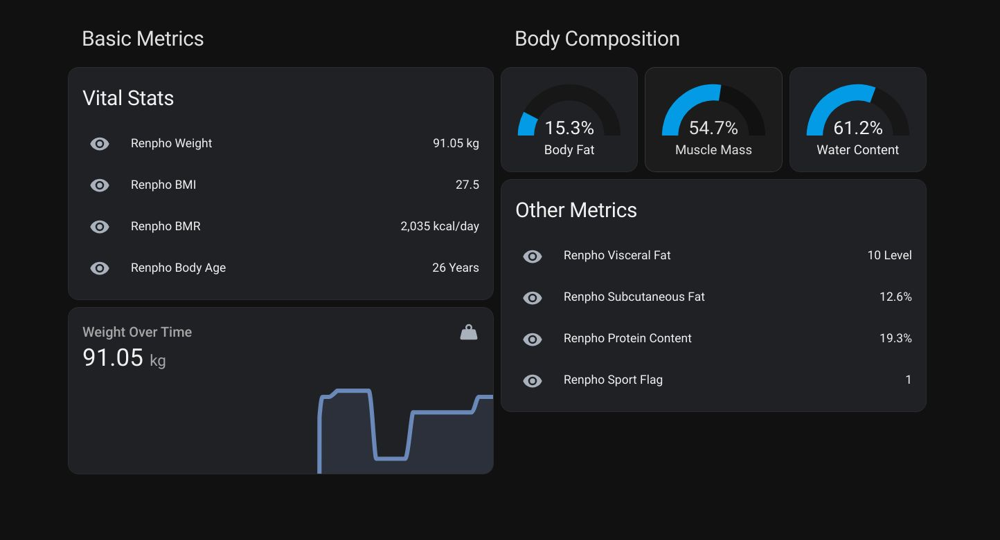

## Inspiration : le « Blueprint Protocol » de Bryan Johnson

Pour moi, le suivi de santé personnel a commencé avec le **Blueprint Protocol** de Bryan Johnson — une poussée vers l’auto-quantification qui collait à ma façon de voir la forme. Je voulais le même niveau de granularité ; une balance **Renpho** avec bio-impédance s’est avérée un moyen pratique d’obtenir plus que le simple poids.


## Fork de hass-renpho et écosystème Home Assistant

J’ai trouvé **hass-renpho**, une intégration communautaire qui ramène les données Renpho dans Home Assistant. Le projet était à l’arrêt ; avec le mainteneur d’origine indisponible, j’ai forké pour étendre la prise en charge des métriques exposées par le matériel.

Ce fork m’a fait suivre le parcours classique des composants personnalisés : installation via **HACS**, configuration des identifiants, itération sur les entités. J’ai aussi échangé avec le mainteneur d’origine quand c’était pertinent — correctifs, retours sur l’API, garder l’intégration utile pour d’autres utilisateurs de balance Renpho.


## Rétro-ingénierie et APKLeaks

L’app mobile ne publie pas de doc API officielle ; il fallait voir ce que le client Android appelle réellement. **APKLeaks** parcourt l’APK empaqueté à la recherche de chaînes — URL, clés, indices — plutôt que de tout décompiler en source lisible. En l’exécutant sur l’APK Renpho, j’ai obtenu les points HTTP et assez de contexte pour aligner ces appels sur les charges JSON utiles (poids, IMC, métabolisme de base, âge corporel, estimations graisse et muscle, eau, protéines, graisse viscérale, etc.). Dans Home Assistant, tout cela devient des entités et alimente des cartes Lovelace — jauges pour la composition, graphes d’historique pour le poids, lignes simples pour les métriques « bonus ».

```shell
# Installation PyPI simple
pip3 install apkleaks
# Explorer les sources
git clone https://github.com/dwisiswant0/apkleaks
cd apkleaks/
pip3 install -r requirements.txt
```

Pour aller plus loin :

- [APKLeaks sur GitHub](https://github.com/dwisiswant0/apkleaks)
- [Analyse approfondie d’APKLeaks](https://www.whiteoaksecurity.com/blog/apkleaks-discover-leaks-within-apk-files/)

## Tableau de bord, contexte et habitudes de mesure

Les données Renpho ne font qu’une partie du tableau. J’utilise aussi Google Health, MyFitnessPal, etc., pour l’activité et l’alimentation, afin que les pesées côtoient régime et mouvement, pas isolées.



Les variations jour après jour m’ont appris à traiter les chiffres comme des **tendances**, pas des jugements. Les vêtements seuls peuvent faire bouger la balance d’environ un kilo « mauvais jour » ; hydratation et digestion comptent aussi. Mesurer à un **moment stable** (pour moi, le matin, conditions comparables) garde la série exploitable sur la carte d’historique HA.

Le projet technique est devenu une habitude : un seul endroit pour la trajectoire du poids, les estimations de composition et les stats exposées par l’intégration — assez pour voir si entraînement ou sommeil réagissent comme prévu.

## Communauté et ce qui vous convient

Rien de tout cela ne serait aussi pratique sans l’écosystème Home Assistant et les intégrations open source — forks, tickets et petits correctifs s’additionnent. Si vous quantifiez votre santé, qu’est-ce qui a vraiment tenu chez vous : matériel dédié, apps téléphone, ou solution auto-hébergée comme celle-ci ? Partager ce qu’on utilise et ce qu’on ignore aide souvent plus que le gadget seul : l’essentiel est que les données s’intègrent **régulièrement** à la routine.
