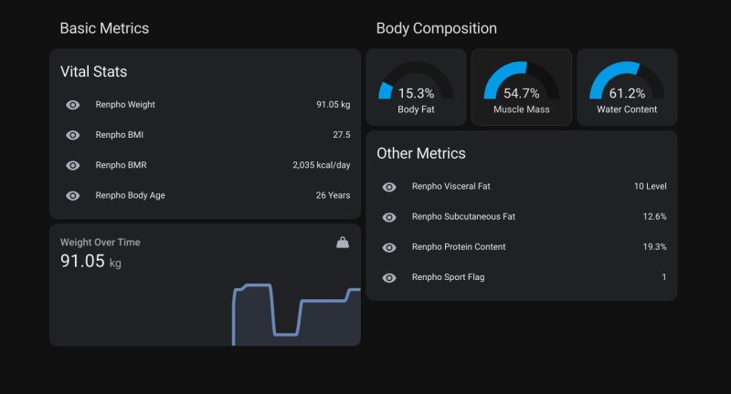
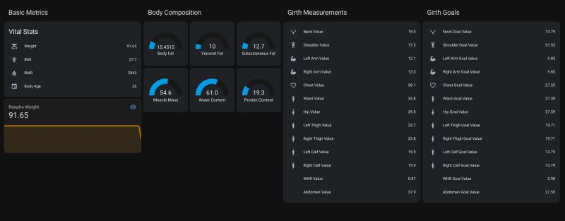

Je voulais les pesées dans **Home Assistant** avec le reste des automations — pas une app santé de plus. Ça a mené à **[hass_renpho](https://github.com/antoinebou12/hass_renpho)** (fork d’une intégration communautaire devenue silencieuse), **APKLeaks** sur le client Android, et un tableau Lovelace que j’ouvre encore quand l’entraînement ou le sommeil bougent. **[English version]()**.

<!--more-->

## Pourquoi pas seulement l’app Renpho

Une balance **Renpho** bio-impédance sort plus que le poids — IMC, BMR, âge corporel, graisse/muscle, eau, protéines, graisse viscérale, résistances par membre si vous tirez tout le JSON. Utile seulement si les chiffres vivent là où vous regardez déjà : historiques, automations, même esprit **[lab maison]()** que le reste auto-hébergé.

## Inspiration (sans la mode)

Le suivi perso, pour moi, a commencé quand beaucoup parlaient du **« Blueprint »** de Bryan Johnson — auto-quantification poussée. Je ne vends aucun protocole : l’idée était **des tendances**, mêmes conditions, pas de panique sur une pesée. La photo ci-dessous, c’est l’ambiance, pas un conseil médical.


## D’où vient hass_renpho

Les articles de Neil Allen — [rétro-ingénierie de l’app Renpho](https://neilgaryallen.dev/blog/reverse-engineering-the-renpho-app) et [Renpho → Home Assistant](https://neilgaryallen.dev/blog/renpho-to-home-assistant) — ont posé le travail difficile. Le dépôt **[neilzilla/hass-renpho](https://github.com/neilzilla/hass-renpho)** a encapsulé ça en composant Home Assistant.

Quand l’activité a ralenti et qu’il me fallait plus d’entités, j’ai forké vers **[antoinebou12/hass_renpho](https://github.com/antoinebou12/hass_renpho)**. Le README est clair :

> Intégration pour l’**ancienne app** Renpho et son API cloud. Les versions récentes peuvent ne pas fonctionner — hobby, pas produit supporté.

Explorateur API : [hass-renpho.vercel.app/docs](https://hass-renpho.vercel.app/docs).

### Ce que fait le fork

- Connexion cloud Renpho (`renpho.qnclouds.com`) avec email/mot de passe.
- Sondes selon l’intervalle **`refresh`** (YAML ou UI).
- **Capteurs** poids, composition, métabolisme, appareil, tours / objectifs si le compte les a.
- **`proxy`** optionnel si l’IP maison est bloquée mais l’app marche en LTE.

Échanges avec le mainteneur d’origine quand possible — formes de payloads, éviter les doublons de correctifs.

## Installation que j’ai suivie

1. **[HACS](https://hacs.xyz/)** (ou copier `custom_components/renpho` depuis le repo).
2. Identifiants dans **`configuration.yaml`** :

```yaml
renpho:
  email: vous@exemple.com
  password: !secret renpho_password
  refresh: 600
  # proxy: http://127.0.0.1:8080

sensor:
  - platform: renpho
```

3. Redémarrer HA, vérifier les entités, construire Lovelace.

**Attention :** le polling se connecte à l’API ; Renpho peut déconnecter la session téléphone. J’ai visé **600 s** pour ne pas spammer les logins.

## Métriques exposées

Le fork documente des dizaines de champs. En pratique je n’affiche qu’un sous-ensemble ; le reste sert aux automations et au debug.

| Groupe | Exemples | Unités |
|--------|----------|--------|
| **Base** | poids, IMC, graisse, eau, muscle, os | kg, % |
| **Mensurations** | taille, hanches | cm |
| **Métabolisme** | BMR, protéines | kcal/j, % |
| **Âge** | âge corporel | ans |
| **Viscéral / sous-cutané** | visfat, subfat | niveau, % |
| **Appareil** | nom balance, MAC, modèle | texte |
| **Bio-impédance** | résistances par membre | ohms |

Table complète : **[README du repo](https://github.com/antoinebou12/hass_renpho#supported-metrics)**.

## Quand l’API cloud refuse le réseau

Parfois l’IP résidentielle ou datacenter échoue alors que l’app officielle marche en 4G.

Pistes du README :

1. **VPN sur l’hôte HA**
2. **`proxy` dans la config** — trafic Renpho seulement (credentials visibles du proxy — à vous de juger)

J’écris ça parce qu’une soirée « intégration cassée » était en fait **réputation d’IP**.

## Rétro-ingénierie avec APKLeaks

Pas de PDF API public — lire ce que l’**APK Android** appelle.

```bash
pip install apkleaks
apkleaks -f /chemin/vers/renpho.apk -o renpho-leaks.txt
```

Aligner URLs et clés JSON avec les capteurs HA ; combler les trous quand Lovelace affiche `unknown` après une mise à jour app.

- [APKLeaks GitHub](https://github.com/dwisiswant0/apkleaks)
- [White Oak Security](https://www.whiteoaksecurity.com/blog/apkleaks-discover-leaks-within-apk-files/)

Contrat **instable** — taxe hobby à chaque update Renpho.

## Tableaux Lovelace





## Contexte hors HA

Renpho = une entrée ; activité et repas ailleurs (**Google Health**, **MyFitnessPal**).

| Habitude | Pourquoi |
|----------|----------|
| **Même heure** | Matin, hydratation stable |
| **Vêtements constants** | ~1 kg de bruit |
| **Tendances** | La composition estimée lag |
| **Masquer l’inutile** | Pas de jauge obsessionnelle |

Projet technique devenu habitude : assez de signal pour voir entraînement/sommeil, pas pour la clinique.

## Quand s’abstenir

- Besoin **clinique** — estimation grand public.
- Pas l’**ancienne app/API** attendue par l’intégration.
- Pas de maintenance de fork — casse prévisible.
- % graisse quotidien toxique — épurer Lovelace.

## Liens repo

| Ressource | URL |
|-----------|-----|
| Mon fork | [github.com/antoinebou12/hass_renpho](https://github.com/antoinebou12/hass_renpho) |
| Amont | [github.com/neilzilla/hass-renpho](https://github.com/neilzilla/hass-renpho) |
| Docs API | [hass-renpho.vercel.app/docs](https://hass-renpho.vercel.app/docs) |
| Blog RE | [neilgaryallen.dev](https://neilgaryallen.dev/blog/reverse-engineering-the-renpho-app) |

## Articles liés

- [Évolution réseau maison]()
- [Notes homelab MediaBox]()
- [Économie LEGO data science]()

Vous self-hostez quoi côté santé ? Le gadget compte moins que la routine.
