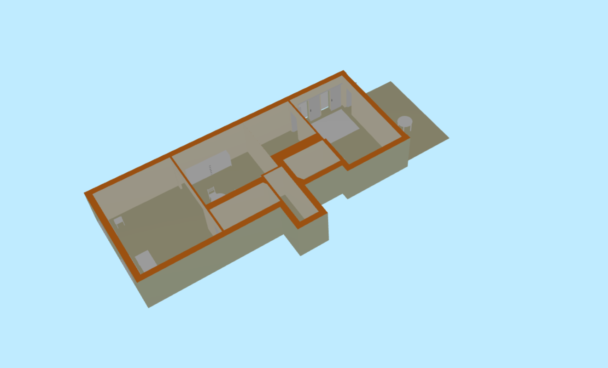
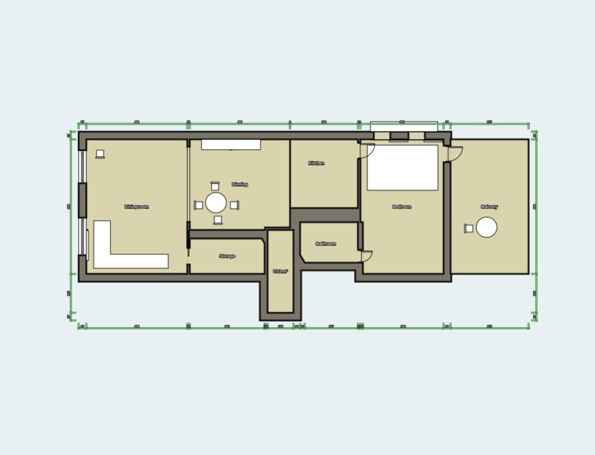
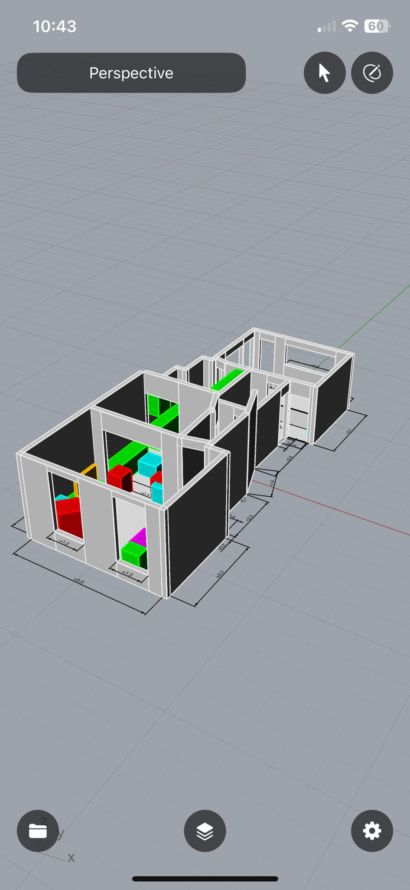
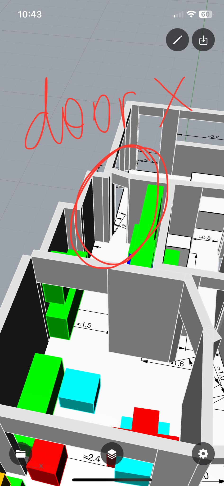

## Introduction

We used the Rhino app on an iPhone with LiDAR to scan our apartment and make clearer decisions about layout and furniture.

### LiDAR and Rhino

LiDAR captures depth quickly; Rhino on iPhone turns those scans into workable 3D geometry for review on device.

### Process

We walked room by room while the phone mapped space; Rhino updated the model as we moved.

### Screenshots

### Still frames from the scan

### Conclusion

Handheld LiDAR plus a focused modeling app is enough for early layout exploration before committing to bigger CAD or renovation steps.
