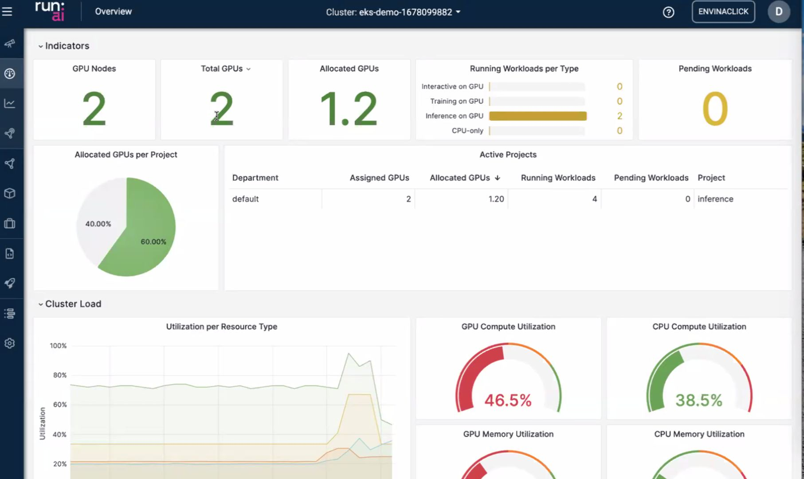
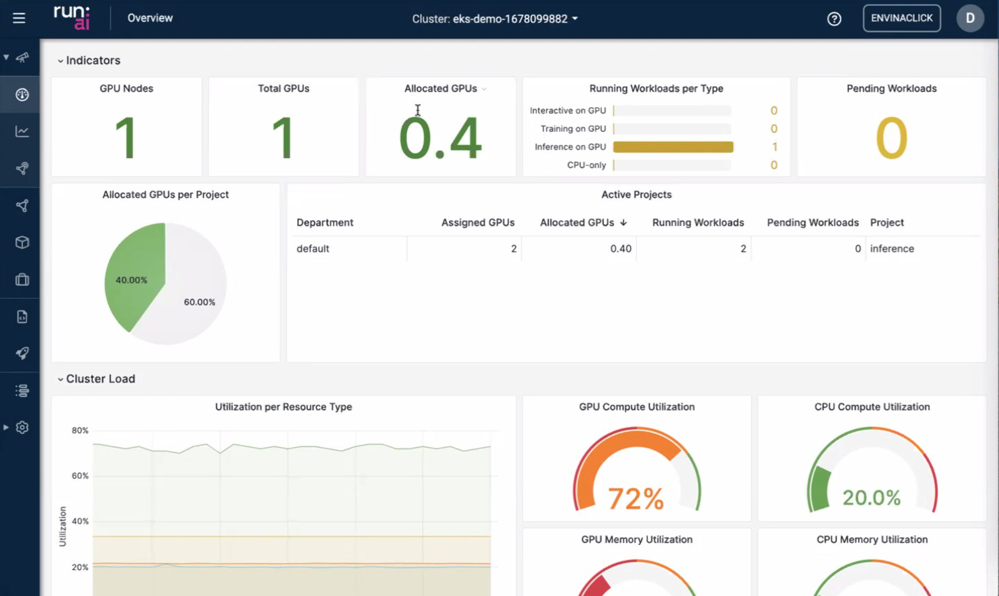
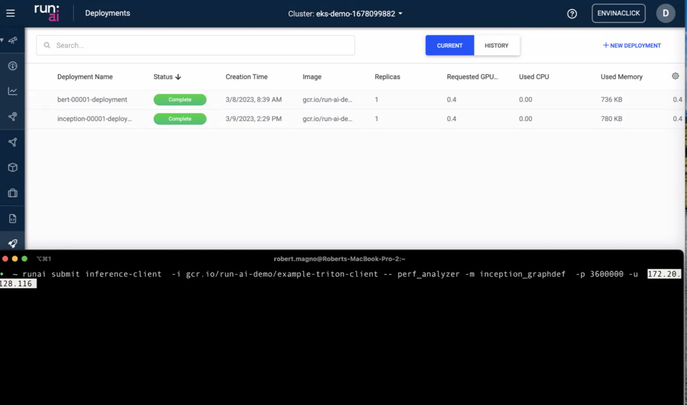
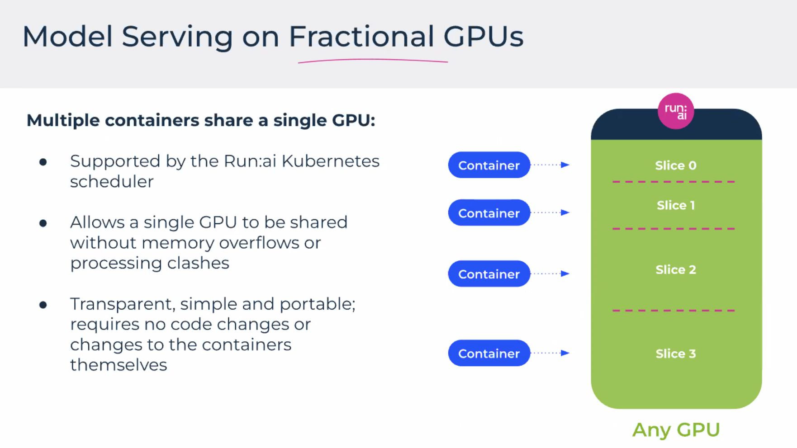
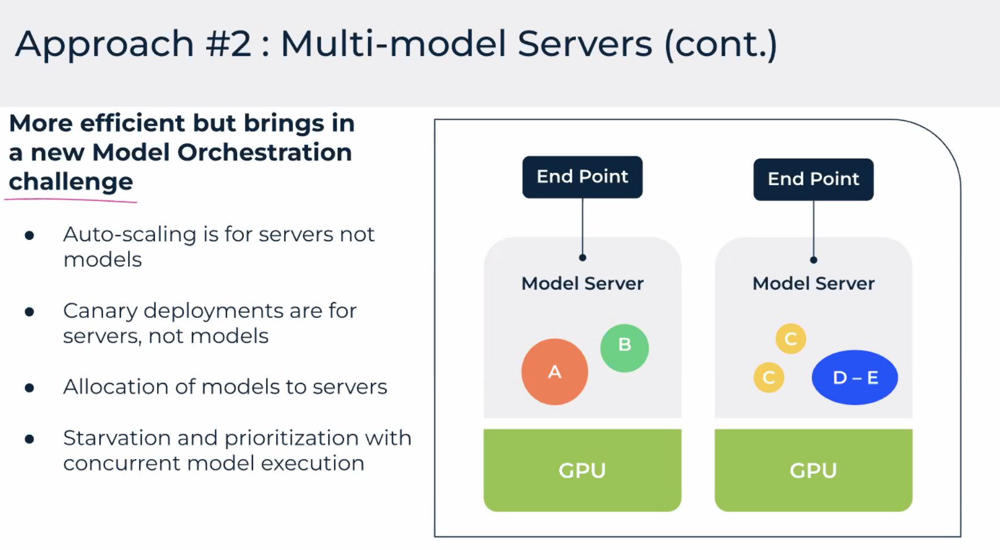
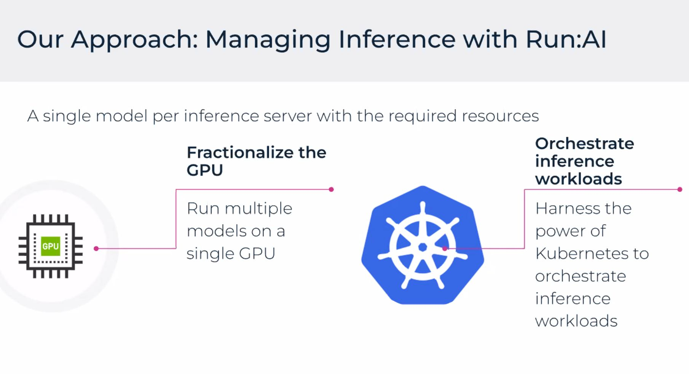
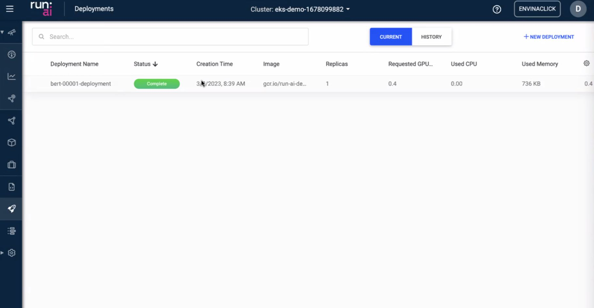
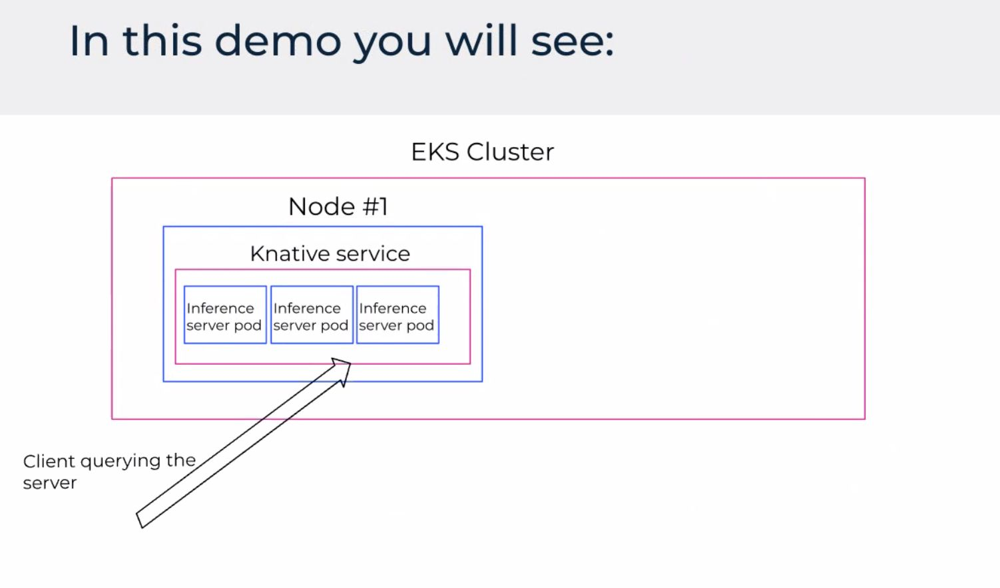
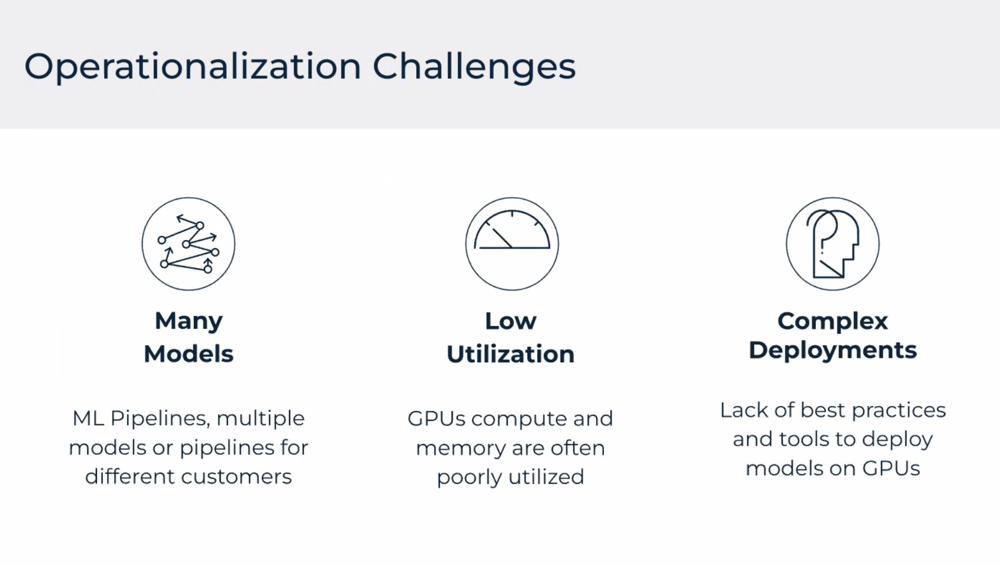

Notes du webinaire **Run:ai** sur l’exécution et la montée en charge des charges d’**inférence** sur **AWS** (Amériques). Run:ai met l’accent sur l’ordonnancement, la visibilité et l’efficacité pour les modèles sur GPU dans des environnements partagés.

## Tableau de bord

Vue d’ensemble des jobs et de l’usage des ressources.

## CLI

Opérations et automatisation en ligne de commande.

## Modèles et charge

## Gestion des charges

## Vue infrastructure

## Démo

## Défis

---

Pour le détail produit, voir la documentation officielle **Run:ai** et les offres **AWS** marketplace ou partenaires.
