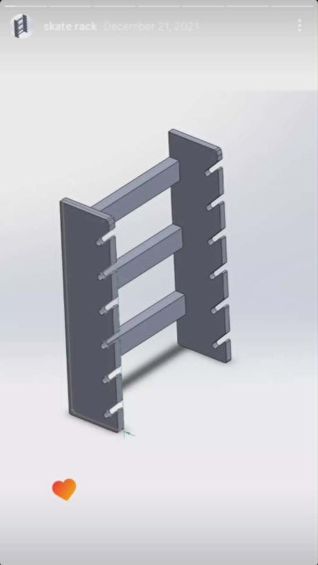
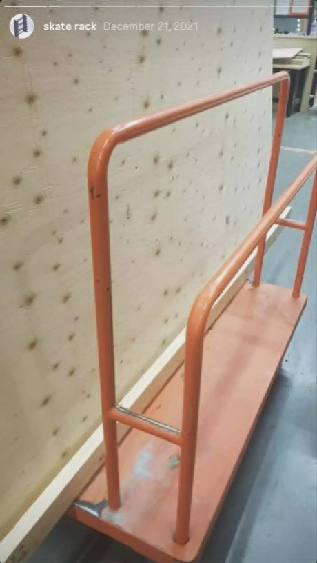
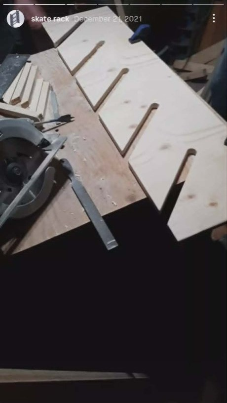
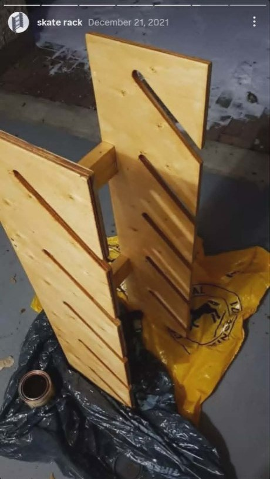
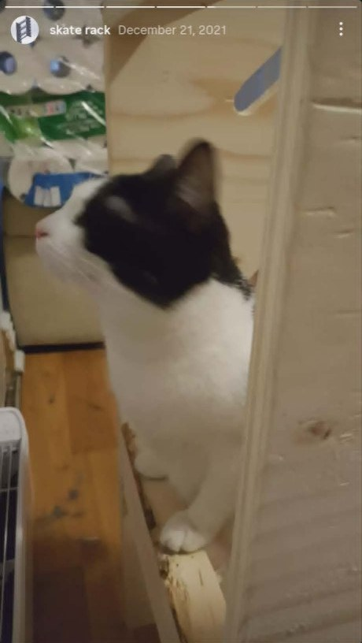
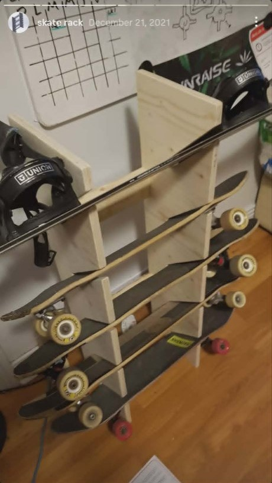

Les planches s’accumulaient dans les coins — j’ai dessiné un **rack vertical** en CAO, découpé des **entailles inclinées** dans du contreplaqué, et monté un meuble qui tient **skateboards et snowboard** sans percer les murs du logement. Projet de **décembre 2021** ; photos recadrées des stories d’époque. **[English version]()**.

<!--more-->

## Conception CAO

Deux montants, trois traverses, **six entailles inclinées vers le bas** par côté pour que les decks glissent et restent en place. Modéliser d’abord a évité de acheter les panneaux au mauvais pas.

Le rendu CAO, c’est la version optimiste — pas de sciure, pas de chat.

## Dérive métal (atelier scolaire)

Avant le contreplaqué final, j’ai soudé un **cadre tubulaire orange** en cours — bon pour l’équerrage, excessif pour un appart. Ce n’est pas devenu la solution chambre, mais ça validait l’idée montants + traverses.

## Découpe des entailles

Chaque entaille : **trou de fin**, coupe droite à la circulaire, lime. Serre-joints, chutes, répéter.

## Montage et inspection

Essai à sec, teinture sur bâche au garage (décembre = doigts froids), et **inspecteur qualité** (chat bicolore) qui valide en s’asseyant sur la dernière étagère alignée.

## Rack fini

Six emplacements par colonne, **snowboard en haut** (fixations Union visibles), skates en dessous, une planche au sol. Faible encombrement, tout hors du passage.

## La prochaine fois

- **Angle des entailles** un peu plus prononcé pour les longboards.
- **Chants** sur les bords des entailles — le contreplaqué accroche le grip au fil du temps.
- **Fixation murale** — locataire à l’époque ; aujourd’hui j’ancrerais proprement.

Même fil « maker » : [lab réseau maison]() et [figurines IA / impression 3D]().
