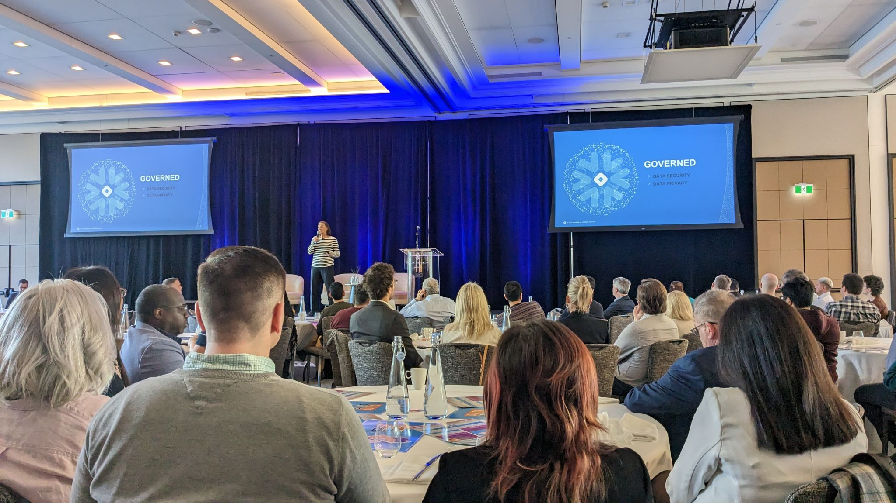
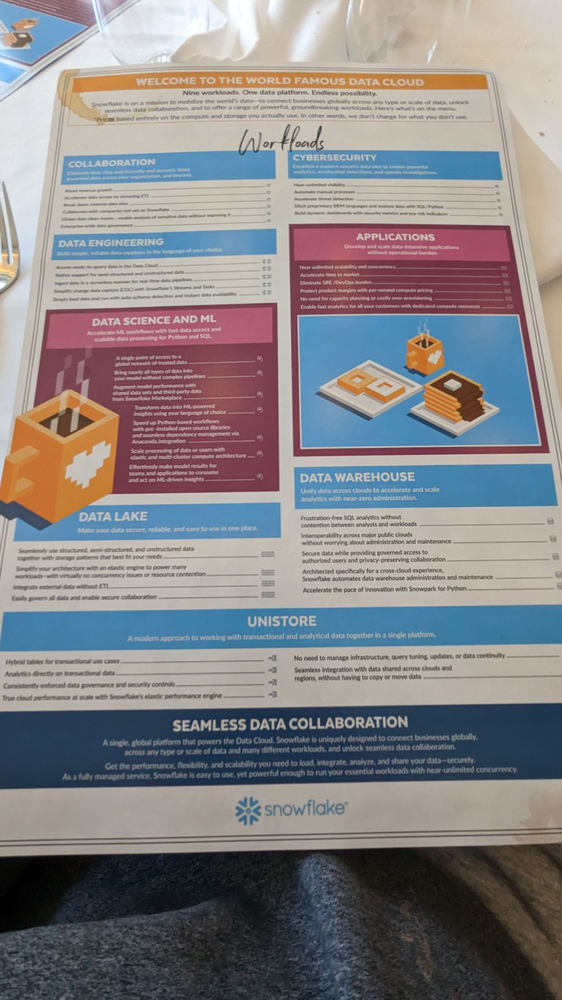
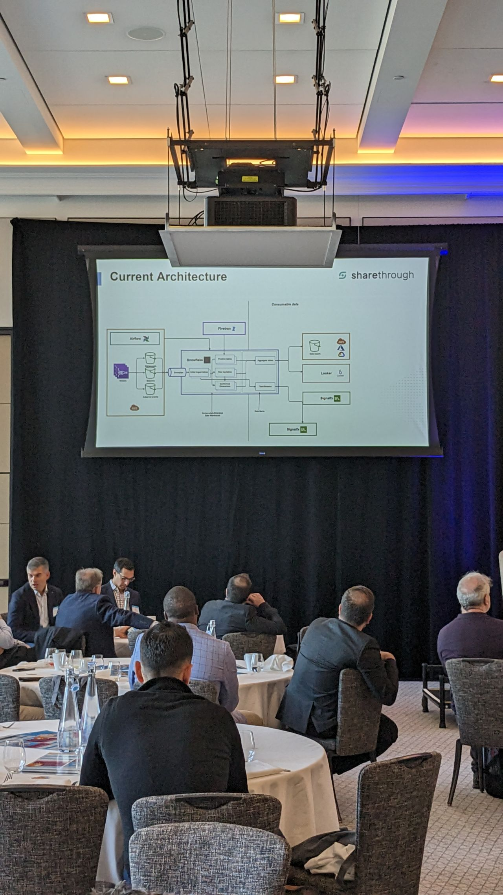
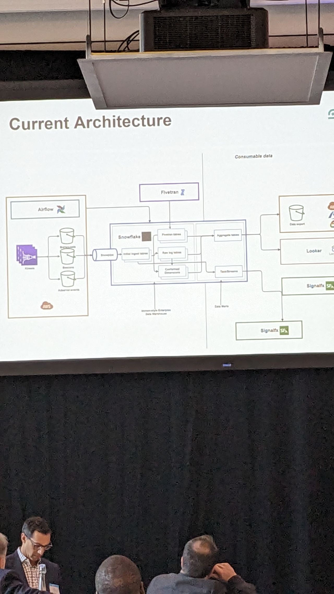
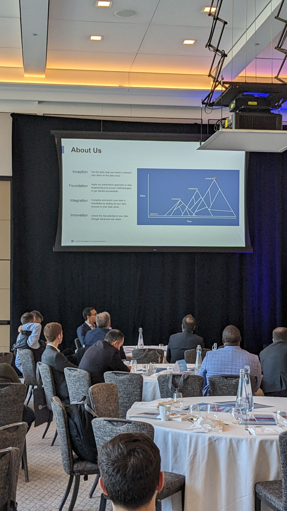
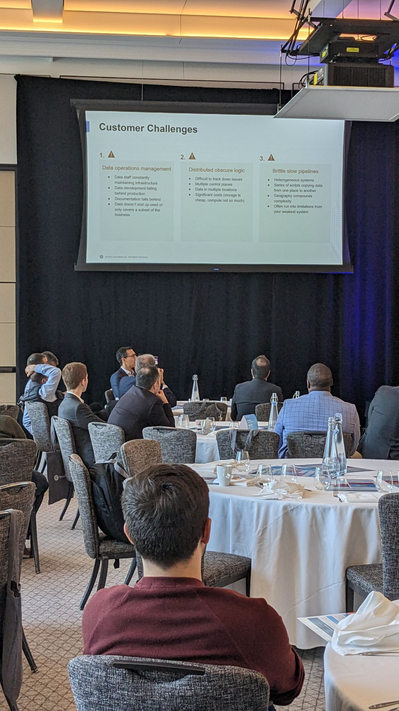
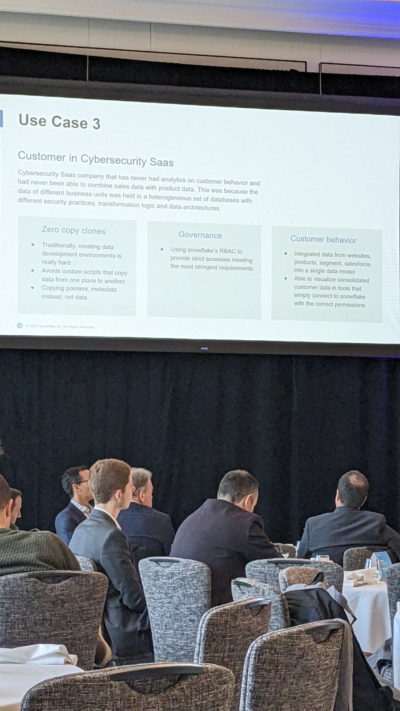

Notes from the Snowflake Data-for-Breakfast conference on the Snowflake Cloud Data Platform, data warehousing, integration, and analytics—including a strong keynote from Infostrux.

## Overview

## Key takeaways

### Global data operations

A healthcare customer case study showed Snowflake managing secure data operations across three continents, simplifying partner data sharing while keeping high availability and strong SLAs.

Cloud data platforms remain a practical backbone for consolidation and analytics; this event was a useful snapshot of where Snowflake is heading.

### Tax sector analytics

Another customer needed to store very large datasets and analyze them without knowing every question in advance. Snowflake gave them a single place to consolidate and transform data, which sped up troubleshooting and improved visibility into lineage.

### Data clean rooms

The clean-room model—collaborating on shared data while preserving privacy—came up as relevant when two companies need to compare datasets during due diligence without exposing everything.

## Closing thoughts

Snowflake Data-for-Breakfast was a worthwhile look at cloud data platforms, operations at scale, and newer patterns like clean rooms. Worth attending if you work in data management or analytics.
