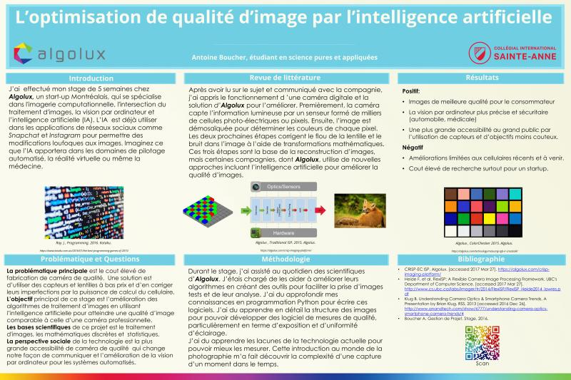
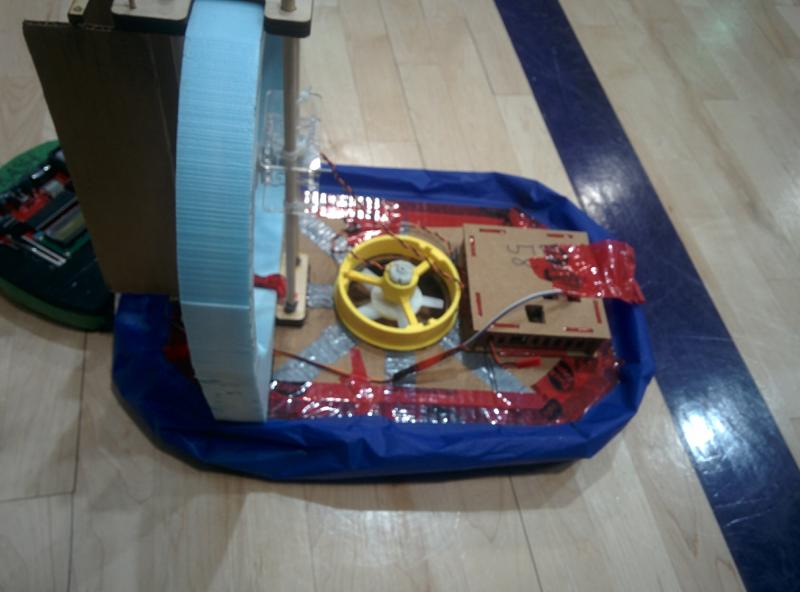
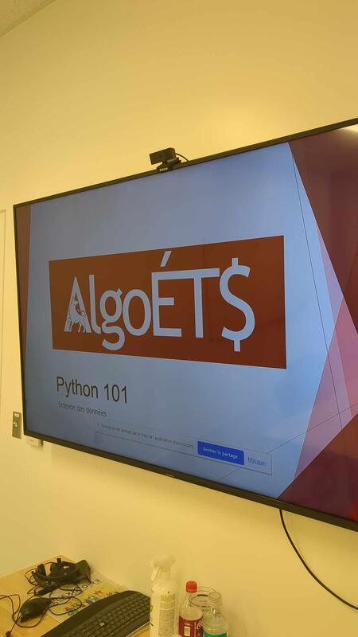

I did not start in Kubernetes. I started in browser tabs, game loops, and a makerspace that smelled like hot PLA. This post is the longer version of that path—**backend**, **platform**, and **DevSecOps** are where I landed, but the steps in between matter. **[Version française]()**.

<!--more-->

## The arc (one glance)

Career flow ([`career-journey-flow.mmd`](./images/career-journey-flow.mmd), rendered with [uml-mcp](https://github.com/antoinebou12/uml-mcp)):

*Figure: milestones from browser games and makerspace demos through ÉTS capstones, co-ops, and today’s platform/backend focus. Rendered from [`career-journey-flow.mmd`](./images/career-journey-flow.mmd).*

*Color key:* green personal · blue school · purple club · gray co-op · slate full-time job · orange contract · pink teaching · amber today.

The diagram is the map; the sections below are the stories I tell in interviews when someone asks “how did you end up doing platform work?”

## ~2010 — Game developer energy, Flash and the web

In high school I was already building small **browser games in Flash** and picking up **HTML and JavaScript**. Progress meant something you could click: a loop that runs, a score that updates, a page that loads without embarrassing you in front of friends.

That habit—ship something playable, then fix what feels wrong—never really left. Years later I packaged some of that nostalgia as [FlashGames](https://antoinebou12.github.io/FlashGames/) (Ruffle in the browser) and a  Docker setup for classic consoles.

## ~2015 — A game portfolio, then bigger engines

By college I was curating a **portfolio of game projects** and redoing favorites in **Unity**, **CryEngine**, and **Unreal**. Same motivation, heavier tools: lighting, physics, assets that take a week to look “fine.”

It taught me scope. A jam game and a semester demo do not owe each other the same bar—but both owe you honest playtesting.

That scope sense shows up later when I refuse to boil the ocean on a single microservice migration — I want a playable milestone every week.

## ~2017 — Makerspace, WiFi RC, web as a serious path

At **Collégial International Sainte-Anne** I managed the **makerspace**: 3D printers, VR gear, students stuck on wiring at 4 p.m. on a Friday. I also built a **WiFi-controlled RC car**—the kind of project where firmware, mechanical slack, and “why does it only steer left?” share the same afternoon.

That year I leaned into **web development** for real: less “scene in a game engine,” more “product someone uses every week.”

## 2018 — Algolux internship (computational imaging)

My **Algolux** internship was five weeks inside computational photography: Python tools, RAW color analysis, capture workflows, Ansible stacks for ISP validation. I still have the research poster from that period—it is the bridge between “I like code” and “I like systems that touch the physical world.”

Concrete leftovers on this site:  (RAW clipping and calibration helpers, Algolux-era lineage). Lab work was spreadsheets, cameras, and scripts—not shiny product pages—but it trained the same loop I use today: **measure, automate, document**.

## ÉTS — Hydroglisseur, AlgoÉTS, and the web stack

**École de technologie supérieure (ÉTS)** is where school projects stacked into something like a career.

**Technological path (2017–2018)** — capstone **hydroglisseur** (hovercraft): blue skirt, lift fan, 3D-printed parts, wood and foam and stubborn debugging. The kind of build that teaches integration before microservices.

**Bachelor (2018–2023)** — coursework plus clubs. I helped run **[AlgoÉTS](https://algoets.etsmtl.ca/)** (algorithmic trading); we ran workshops like **Python 101 for data science** for members who wanted to move from “I use Python” to “I trust my pandas.”

That club work connects to open source I still maintain: the  Python library for the stock-market game. Same itch—**automate the boring path so humans can focus on decisions**.

**Co-ops (2019–2022)** — [Wandrian](https://wandrian.com/), [Power Go](https://www.powergo.ca/), [Intact](https://www.intact.ca/): parsers, APIs, ELK dashboards, and backend work where the titles finally matched the daily grind.

**Full-time (2023)** — [IONODES](https://ionodes.com/): cloud developer on an IoT platform—Auth0 tiers, Sentry, ONVIF/WebRTC, Azure DevOps.

**Master (2023–2026)** — ÉTS: **real-time rendering**, **interactive physics**, and **surface wear in real time**, with dynamic friction and textures—the thread that ties graphics back to the path.

## 2020s — Platform, security, teaching

After graduation the problems moved up a layer:

- **GitLab CI/CD**, **GCP**, Java microservices, **Playwright** tests (IMC2 research).
- **DevSecOps labs** at Polytechnique Montréal—GitLab templates for ~20 teams, Docker/Kubernetes, OWASP-minded reviews.
- **Teaching** at ÉTS: distributed databases, mobile UX labs, integrator projects—courseware is also software delivery.
-  conference web ([graphquon.github.io](https://graphquon.github.io/)) and **[uml-mcp](https://github.com/antoinebou12/uml-mcp)** for diagrams from chat—because explaining systems still beats guessing them.

## What stayed constant (the “human” part)

Early on I measured progress in **features shipped**. Now I care whether the system stays understandable when you are not in the room:

- **Backend** — boundaries, failure modes, APIs that do not surprise the next team.
- **Platform** — CI, logging, local dev that works without a heroic README.
- **DevSecOps** — secrets, dependencies, and deploy paths that are boring on purpose.

Reliability is trust. Security is not a final gate—it is habits in the pipeline. I still write posts and draw flows because explaining something badly is how I notice what I do not understand.

## What I optimize for next

Sharper platforms, safer delivery, legible systems as they grow. If you are early in the path: follow problems where you see the **whole loop**—code, deploy, operate, improve. I happened to start that loop with Flash and a hovercraft; you might start somewhere else. The loop is the job.

More concrete write-ups live under [posts]() and [projects]() on this site.

## Related posts

- [GraphQuon 2024 — ÉTS]() and [GraphQuon 2025 — Toronto]() — graphics research community
- [CodePen demos]() — early web experiments
- [Professional résumé + JSON Resume]() — how this timeline becomes a CV
