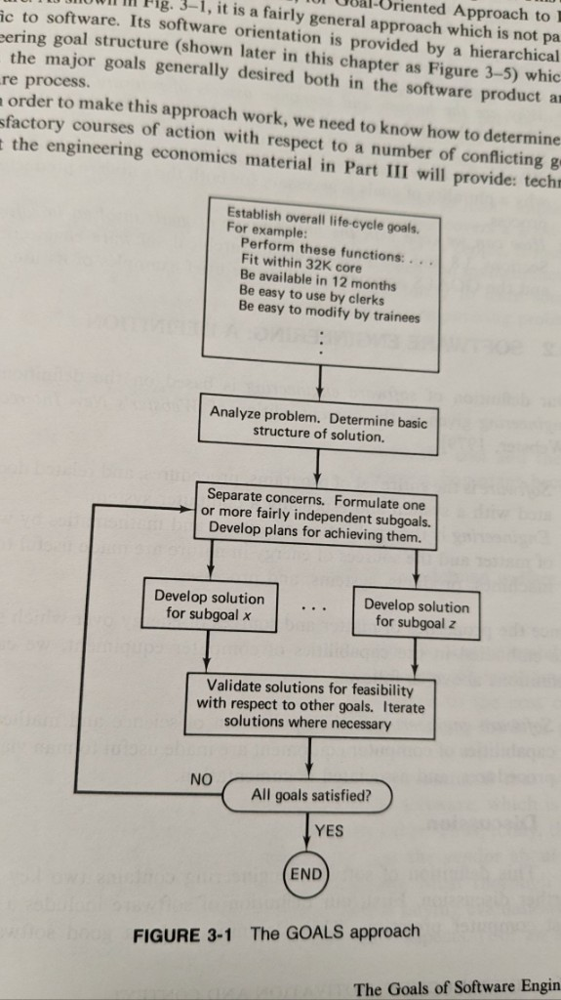
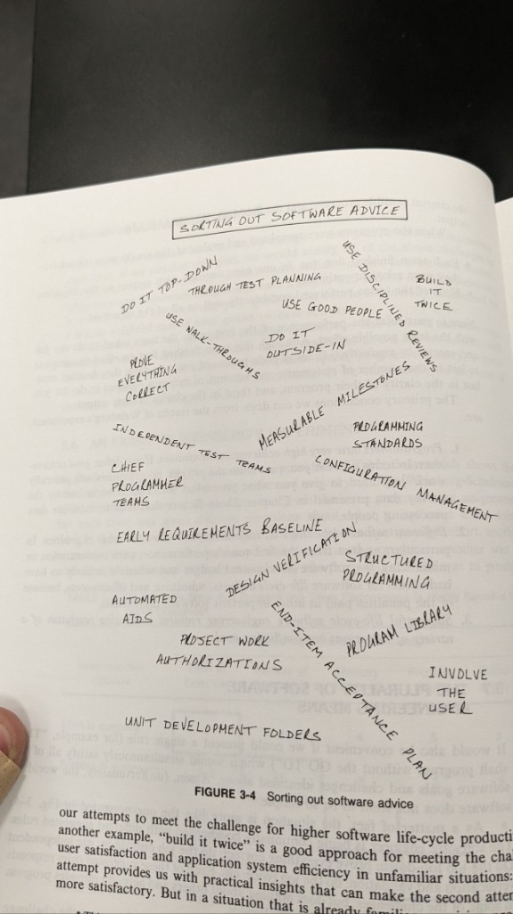
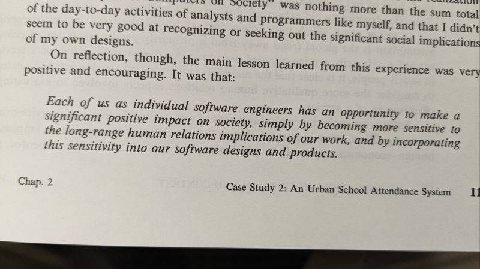
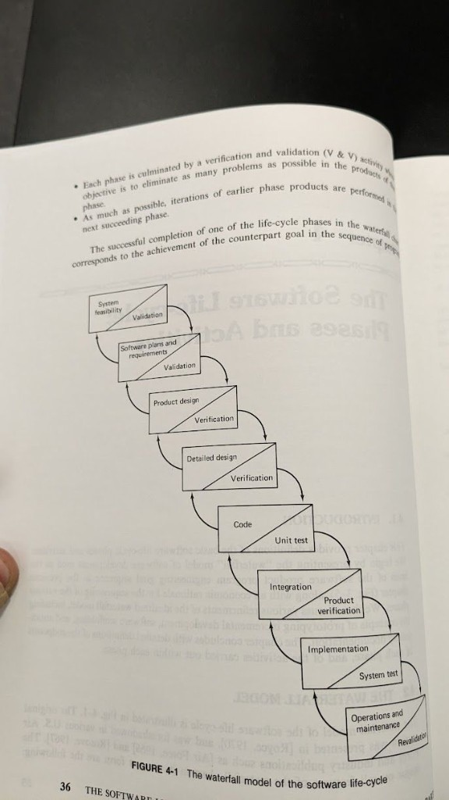
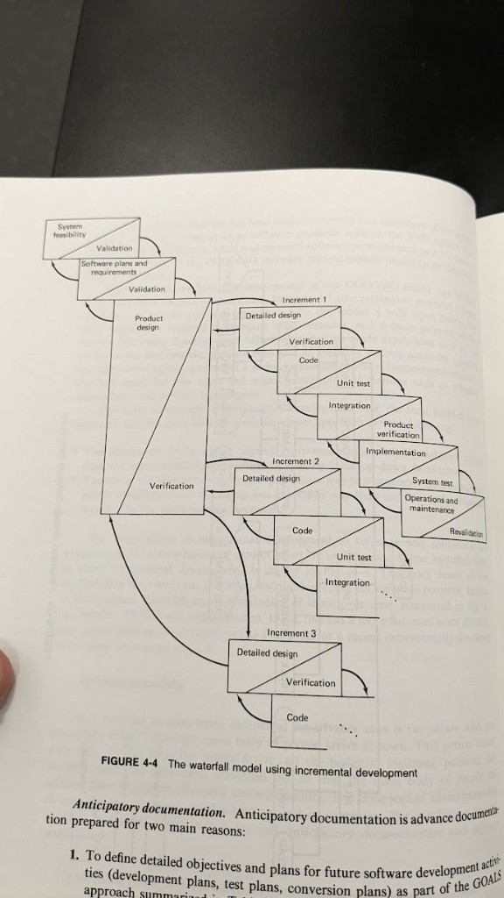
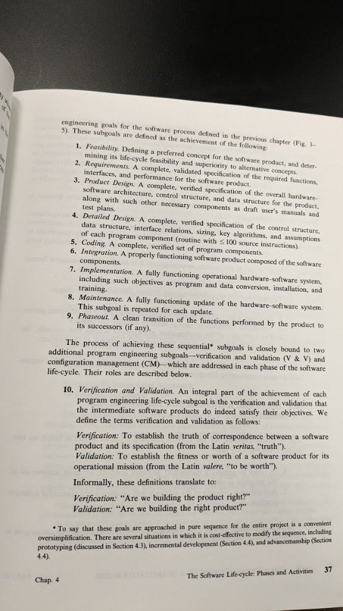

Ces pages viennent d’un **manuel de génie logiciel** utilisé en cours. J’y ai regroupé les figures sur une seule page de référence : **planification orientée objectifs**, comment le modèle **waterfall** enchaîne les activités (avec **vérification et validation** appariées à chaque phase), une variante **incrémentale**, la liste des **sous-objectifs du cycle de vie** du manuel, le rappel que **les conseils méthodo dépendent du contexte**, et un court passage **d’éthique** sur l’impact sur les personnes.

## Approche GOALS (figure 3-1)

L’organigramme **GOALS** est un schéma descendant : fixer les **objectifs globaux du cycle de vie** (fonctions, contraintes, délais, utilisabilité, maintenabilité), **analyser** le problème et esquisser la structure de solution, **séparer les préoccupations** en sous-objectifs, **développer** des solutions pour chaque sous-objectif en parallèle quand c’est possible, puis **valider** ces solutions par rapport aux autres objectifs et **itérer** jusqu’à ce que la décision « tous les objectifs sont satisfaits ? » soit oui.

On y reconnaît ce que les méthodes ultérieures font encore : décomposer, vérifier la cohérence entre préoccupations, boucler plutôt que supposer qu’un seul passage suffit.

## Trier les conseils logiciels (figure 3-4)

La figure « **sorting out software advice** » est un nuage de pratiques — top-down vs outside-in, revues de code, équipes de test indépendantes, équipes « chief programmer », jalons mesurables, gestion de configuration, programmation structurée, « build it twice », impliquer l’utilisateur, et bien d’autres. Le texte insiste : **le même slogan peut être juste dans un contexte et superflu dans un autre** (par ex. construire une première version jetable quand le domaine est flou vs quand il est déjà bien connu).

Utile comme liste d’idées à considérer, pas comme une recette unique à appliquer partout.

## Éthique : système de présence scolaire en milieu urbain (étude de cas chapitre 2)

La citation en italique sur cette page est celle que j’ai soulignée en marge : les ingénieur·e·s peuvent **améliorer les résultats pour la société** en prêtant attention aux **implications humaines et sociales à long terme** des conceptions, pas seulement à la justesse technique.

Ça va de pair avec exigences et validation — « le bon produit » inclut à qui il sert et comment il affecte les personnes.

## Cycle de vie waterfall (figure 4-1)

Le diagramme **waterfall** classique enchaîne les phases dans l’ordre. Chaque boîte est coupée en diagonale : **travail de développement** d’un côté et activité de **V&V** assortie de l’autre — de la **faisabilité système** aux **exigences**, **conception produit**, **conception détaillée**, **code**, **intégration**, **mise en œuvre**, jusqu’à **exploitation et maintenance**. Les **flèches de retour** matérialisent les retouches quand une revue de phase révèle des problèmes.

Même quand une équipe ne livre pas un « pur waterfall », le diagramme nomme encore les types d’artefacts et de contrôles qui réapparaissent sous d’autres noms.

## Waterfall incrémental (figure 4-4)

La variante **incrémentale** ancre une **conception produit** commune, puis enchaîne des **incréments** parallèles ou décalés à travers conception détaillée, codage, intégration, etc. — chaque incrément gardant la même paire **construction / vérification** et le **retour** vers les étapes amont (y compris la conception produit).

C’est une façon structurée de montrer une **livraison par tranches** sans prétendre que les décisions en amont ne changent jamais.

## Sous-objectifs, vérification et validation (chapitre 4)

Cette page liste **neuf sous-objectifs d’ingénierie** dans l’ordre : **faisabilité**, **exigences**, **conception produit**, **conception détaillée**, **codage**, **intégration**, **mise en œuvre**, **maintenance** (répétée à chaque mise à jour), et **retrait de service**. Elle définit ensuite la **vérification** comme adéquation à la spécification — « **Construit-on le produit correctement ?** » — et la **validation** comme adéquation à la mission — « **Construit-on le bon produit ?** » La **gestion de configuration** apparaît aux côtés de la V&V comme autre obligation transversale. Une note admet que la séquence stricte est une **simplification pédagogique** ; **prototype**, **développement incrémental** et chevauchement sont cités comme ajustements courants.

---

Ces scans servent à ma révision ; **figures et formulations appartiennent au livre et à l’éditeur d’origine**. Pour des notes liées sur **compilateurs et grammaires** dans un autre manuel, voir l’article compagnon sur le [pipeline de compilation, la généalogie des langages et les arbres d’analyse]().
