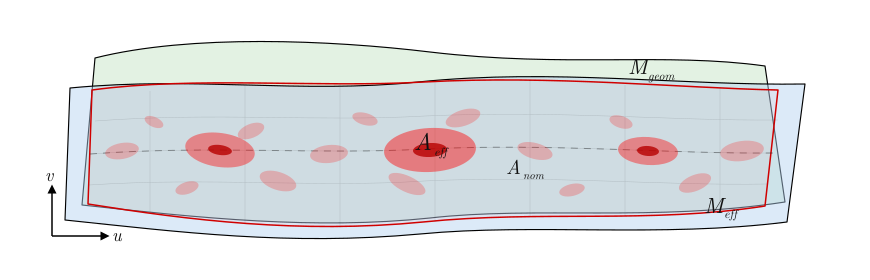
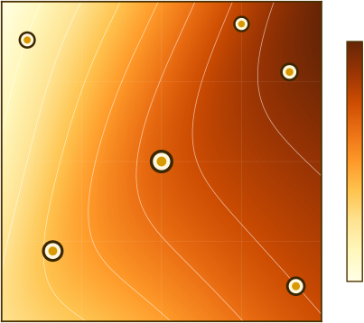

**Couplage contact-apparence pour l'usure de surfaces microstructurées en simulation interactive** — mon mémoire de maîtrise à l'ÉTS (titre anglais du résumé : *Visual Appearance Evolution from Wear on Microstructured Surfaces in Texture Space*). Direction : **Sheldon Andrews**. Soutenance le **14 août 2026**. L'idée centrale : donner aux cartes de matériau une **mémoire locale persistante** du contact. La distance parcourue par le corps ne suffit pas à prédire où l'usure apparaît. **[English version]()**.

<!--more-->

## Le décalage

Une surface réelle garde la trace du frottement et du glissement. En simulation interactive, cette information disparaît souvent à la fin du pas de calcul. Le solveur de contact calcule déjà impulsions, vitesse relative, traction tangentielle et dissipation — puis met à jour le mouvement des corps rigides et s'arrête. Les cartes matériau (albédo, rugosité, normales) restent fixes sauf si un artiste peint l'usure à la main.

Le mémoire boucle ce circuit : la résolution mécanique du contact alimente l'évolution d'apparence en **espace texture**, là où le contact a réellement eu lieu.

## Pipeline (vue d'ensemble)

Les contacts épars sont regroupés en patchs locaux, projetés vers des atlas matériau, et reconstruits en vitesse tangentielle, traction effective et dissipation frictionnelle sur une grille GPU. Ces champs pilotent l'accumulation du glissement, de la direction dominante et de l'usure — puis la mise à jour progressive des cartes **sans remaillage global**.

Source : [`wear-pipeline-flow.mmd`](./images/wear-pipeline-flow.mmd) (même chaîne que [GraphQuon 2025]()). L'implémentation interactive **TextureFriction** impose un ordre d'exécution plus strict : passes FBO pré-résolution → solveur PGS ou AVBD → vitesse/traction post-résolution → dépôt glissement/usure/direction → rendu.

## Trois contributions

1. **Accumulation locale fondée sur la dissipation** — relie glissement, traction reconstruite et évolution visuelle de la surface en espace texture.
2. **Architecture de projection contact → atlas** — regroupement en patchs, tampons GPU, mémoire matériau persistante sur maillage fixe ; glissement, direction et usure écrits là où le recouvrement indique un contact.
3. **Acquisition et comparaison GelSight** — captures sur banc d'usure contrôlé pour le jeu **Wear Surface Texture Datasets** et la calibration des motifs simulés face à la microgéométrie mesurée.

## Deux bases de code

| Dépôt | Rôle |
|-------|------|
| [**WearPaper**](https://github.com/ETSim/WearPaper) | Mémoire LaTeX (`Thesis/main.tex` → `Thesis/build/main.pdf`), article ACM, diapositives Beamer de soutenance ; manuscrit et bibliographie de référence. |
| **TextureFriction** (local, `E:\master\TextureFriction`) | Simulateur Qt6 + OpenGL 4.3+ : contact PGS/AVBD, passes FBO par cluster, dépôt GPU dans les atlas glissement/usure/direction. Build : `just build`, exécution : `just run-build`. |

WearPaper est la **trace écrite** ; TextureFriction est la boucle interactive.

## Validation

Des acquisitions sur un banc d'abrasion réciproque ([`banc-abrasion-reciproque`](./images/banc-abrasion-reciproque.pdf)) alimentent cartes normales mesurées et progression d'usure par stades. Jeu public : [ETSim/WearSurfacesDatasets](https://github.com/ETSim/WearSurfacesDatasets). La métrologie de surface rejoint mon travail CV sur [**TrueMapData**](https://github.com/ETSim/TrueMapData) et l'intégration **surfalize**.

## Résultats (aperçu)

Dans les scénarios testés, les **texels écrits** suivent mieux l'usure cumulée que la trajectoire du corps seul ; la topologie du contact modifie le dépôt. Un cube ou un tore sur plan reste dans un **budget interactif** ; le coût augmente fortement quand plusieurs regroupements de contact sont traités en parallèle. La méthode est un **modèle d'apparence** physiquement motivé, pas une simulation tribologique complète — limites autour de la reconstruction de champs effectifs, de la calibration et de la paramétrisation UV.

## PDF du mémoire

Le manuscrit, l'article et les diapositives de soutenance sont dans [**ETSim/WearPaper**](https://github.com/ETSim/WearPaper). La CI produit le mémoire complet en `Thesis/build/main.pdf` à partir de `Thesis/main.tex`.

## Voir aussi

- [GraphQuon 2025 — Where to Wear?]() — présentation conférence sur la même ligne de recherche
- [Parcours ingénierie logicielle]() — fil maîtrise ÉTS (rendu, physique, usure)
- Ligne mémoire sur le CV : *Usure de surface en temps réel dans des simulations physiques interactives, avec frottement et textures dynamiques*
