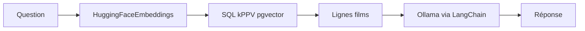

J’ai enseigné un fil « films similaires » qui a grossi : **pgvector** en SQL, puis **Qdrant** avec vecteurs **denses** et **creux** sur MovieLens, puis une boucle **RAG** **LangChain + Ollama** sur le même catalogue. Cette page est la version fusionnée ; les notebooks animés sont dans [AlgoETS/SimilityVectorEmbedding](https://github.com/AlgoETS/SimilityVectorEmbedding). **[English version]()**.

<!--more-->

**En bref**

- **Partie 1 —** Constituer un catalogue **PostgreSQL + pgvector** à partir de données structurées sur les films ; exécuter du **kPPV en SQL** avec la distance cosinus (et d’autres métriques).
- **Partie 2 —** Réutiliser « vecteur = similarité » avec **Qdrant + MovieLens** : embeddings **denses** pour « des films dans cet esprit », vecteurs **creux** de notes pour « des utilisateurs au profil proche ».
- **Partie 3 —** Réemployer les mêmes lignes pgvector comme **couche de récupération** pour un petit flux **RAG** (**LangChain** + **Ollama**) : question → meilleures lignes → réponse ancrée.

## Visualisations

*Partie 1 — pgvector / SQL : films proches à partir des embeddings et des métriques de distance.*

*Partie 2 — Qdrant + MovieLens : recherche dense de films ou voisinage creux utilisateur–notes.*

*Partie 3 — Q&R ancrée : question → lignes récupérées → réponse du LLM liée au catalogue.*

## Ressources

- **GitHub (cours / notebooks) :** [AlgoETS/SimilityVectorEmbedding](https://github.com/AlgoETS/SimilityVectorEmbedding) — dont `postgres/3.LLMS.ipynb` pour la partie 3
- **Medium (article pgvector d’origine) :** [Using vector databases to find similar movies (Part 1)](https://medium.com/@antoine.boucher012/using-vector-databases-to-find-similar-movies-algorithm-part-1-f14a244bb23d)
- **Jeu de données :** [`movies.json`](https://github.com/AlgoETS/SimilityVectorEmbedding/blob/main/movies.json) dans le dépôt du cours
- **Discord :** [discord.gg/Mgf6STuvzZ](https://discord.gg/Mgf6STuvzZ)

---

## Partie 1 — PostgreSQL, pgvector et films similaires

### Ce que l’on construit

On part d’un catalogue du type [`movies.json`](https://github.com/AlgoETS/SimilityVectorEmbedding/blob/main/movies.json) : titres, années, genres, distribution, résumés, etc. Un modèle NLP transforme le **texte concaténé** de chaque film en **vecteur dense**. Ces vecteurs sont stockés dans PostgreSQL avec l’extension **pgvector** dans des colonnes typées (par exemple `VECTOR(384)` pour MiniLM, et des largeurs plus grandes pour les gros modèles). Le matériel pédagogique compare **plusieurs encodeurs** (BART, GTE, MiniLM, RoBERTa, e5-large) pour montrer comment le choix du modèle déplace les voisinages.

### Pourquoi pgvector

Pgvector garde les vecteurs **à côté des données relationnelles** et expose des **opérateurs de distance en SQL**. Les opérateurs courants incluent **`<=>`** (distance cosinus), **`<->`** (L2), **`<+>`** (L1) et **`<#>`** (produit scalaire négatif). Avec des embeddings **normalisés en L2**, la distance cosinus colle à l’intuition classique de similarité cosinus ; on peut afficher un score de type similarité comme `1 - (colonne <=> référence)`.

### kPPV en SQL (cosinus)

Les plus proches voisins se traduisent par un `ORDER BY` sur la distance et un `LIMIT` :

```sql
SELECT title,
       embedding_minilm <=> (
         SELECT embedding_minilm FROM movies WHERE title = $1
       ) AS distance
FROM movies
WHERE title IS DISTINCT FROM $1
ORDER BY distance
LIMIT 10;
```

Pour trier par similarité plutôt que par distance brute :

```sql
SELECT title,
       1 - (embedding_minilm <=> (SELECT embedding_minilm FROM movies WHERE title = $1)) AS cosine_similarity
FROM movies
WHERE title IS DISTINCT FROM $1
ORDER BY cosine_similarity DESC
LIMIT 10;
```

(Ajuster le nom de colonne selon le schéma ; le cours utilise plusieurs colonnes `embedding_*` dans une même table.)

### Forme du pipeline (encoder → charger → interroger)

En Python : charger le JSON → construire une chaîne par film (titre, année, genres, acteurs, réalisateur, résumé, …) → **encoder** avec Sentence Transformers ou un modèle Hugging Face (moyenne des états cachés le cas échéant) → éventuellement **normaliser L2** ligne à ligne pour le cosinus → **insérer** dans `movies` avec cast vers `vector`. La **partie 3** réemploie la même colonne (par exemple `embedding_MiniLM`) mais en passant un vecteur issu de **questions en texte libre**, et non d’une ligne existante.

```python
# Esquisse : même modèle d’embedding que la table, puis liaison en paramètre SQL kPPV.
# Parsing complet, grille multi-modèles et inserts : voir les notebooks du cours.
from sentence_transformers import SentenceTransformer

model = SentenceTransformer("all-MiniLM-L12-v2")
q = model.encode("animated superhero family comedy", normalize_embeddings=True)
# Utiliser q.tolist() comme paramètre vectoriel dans psycopg2 / SQLAlchemy.
```

### Environnement

Le cours s’appuie sur Docker autour d’une **image PostgreSQL avec pgvector** et sur des tirages **Ollama** pour les parties suivantes. Épingler les versions comme dans les notebooks plutôt que recopier d’anciennes recettes figées.

```bash
git clone --branch v0.7.0 https://github.com/pgvector/pgvector.git
cd pgvector
docker build --build-arg PG_MAJOR=16 -t builder/pgvector .
cd ..
docker compose up -d
```

```yaml
# Schéma minimal : Postgres + image pgvector et volume de données
services:
  postgres:
    image: builder/pgvector
    environment:
      POSTGRES_USER: admin
      POSTGRES_PASSWORD: admin
      POSTGRES_DB: admin
    ports:
      - "5432:5432"
    volumes:
      - ./data:/var/lib/postgresql/data
```

### Notebooks et code pas à pas

Le contenu **long** — grilles de modèles, tableaux pandas comparant les voisins, graphiques matplotlib — reste sur **Medium** et dans les notebooks **AlgoETS** pour garder cet article lisible.

> **Approfondir :** [Using vector databases to find similar movies (Part 1) sur Medium](https://medium.com/@antoine.boucher012/using-vector-databases-to-find-similar-movies-algorithm-part-1-f14a244bb23d) · Notebooks dans [AlgoETS/SimilityVectorEmbedding](https://github.com/AlgoETS/SimilityVectorEmbedding), dossier `postgres/`.

---

## Partie 2 — Qdrant, MovieLens et vecteurs denses + creux

En partie 1, les embeddings **denses** des films vivaient dans PostgreSQL et le plus proche voisin passait par le SQL. Ici, la même idée — **similarité dans l’espace vectoriel** — s’appuie sur **Qdrant** et **MovieLens**, avec un second mode qui ne porte pas sur la sémantique du texte : des **vecteurs creux** construits à partir des **notes utilisateur**, pour des recommandations de type **filtrage collaboratif**.

Le code évoqué provient d’un petit projet pédagogique **FastAPI** (`movie_recommendation`) : scripts de seed sous `app/seed/` (par exemple `load_movielens_100k_to_qdrant.py` et `load_movielens_1m_to_qdrant.py`) chargent MovieLens dans des collections Qdrant ; l’API s’appuie sur `app/services/recommend.py`, `app/utils/embedding.py` et `app/services/qdrant.py`.

### Trois collections (exemple MovieLens 100K)

Le chargeur 100K crée :

- **`movielens_100k_movies`** — vecteurs denses (384 dimensions, cosinus) pour la recherche sémantique sur le texte des films.
- **`movielens_100k_users`** — profils utilisateur denses (même espace d’embedding que dans le pipeline de seed).
- **`movielens_100k_ratings`** — vecteurs **creux** nommés `ratings` : chaque dimension est un **identifiant de film**, chaque valeur une **note**, donc un utilisateur est un vecteur creux sur les films qu’il a notés.

Cette découpe est la leçon de conception principale : un moteur (Qdrant), **deux sens différents** pour le mot « vecteur ».

### Voie dense : « quelque chose comme ce titre »

`create_embedding` dans `app/utils/embedding.py` utilise `sentence-transformers/all-MiniLM-L6-v2` : tokenisation, moyenne du dernier état caché, retour d’un seul embedding. Pour une requête texte, le service **prétraite** le texte, l’encode, puis appelle `client.search` sur la collection **films** avec `query_vector` comme vecteur dense simple.

Conceptuellement, c’est la partie 1 : **encoder du texte → films les plus proches en cosinus** — seuls le stockage et l’API changent (Qdrant au lieu de pgvector).

### Voie creuse : des utilisateurs comme vous

`recommend_movies` construit un **`NamedSparseVector`** : les indices sont des identifiants de films, les valeurs les notes de l’utilisateur. Qdrant interroge la collection **`{prefix}_ratings`** (le script de seed enregistre le vecteur creux sous le nom `ratings`). Les voisins sont des **utilisateurs proches** dans l’espace des notes. L’application **agrège** ensuite les notes de ces voisins pour les films que l’utilisateur courant n’a pas notés et renvoie les titres les mieux classés (résolution des identifiants via un parcours de la collection films).

Le second mode est donc du **filtrage collaboratif** exprimé comme recherche vectorielle — pas de récupération à partir des résumés, mais à partir du **chevauchement des goûts**.

### Surface FastAPI

`app/main.py` monte des routeurs qui exposent ces flux dans une petite interface HTML. Pour un lecteur de cet article, l’intérêt est surtout dans la couche service : recherche dense **versus** agrégation sur le voisinage creux.

### Par où commencer dans le dépôt SimilityVectorEmbedding

Si vous suivez **[AlgoETS/SimilityVectorEmbedding](https://github.com/AlgoETS/SimilityVectorEmbedding)** en parallèle, le notebook **`qdrant/0.simple.ipynb`** est l’exercice minimal Qdrant + `movies.json` ; il complète la piste PostgreSQL et correspond au modèle mental « encoder des documents, upsert, requête » avant la montée en charge MovieLens et les motifs denses + creux.

### Synthèse Qdrant

- **Films proches par le texte :** embeddings denses et recherche cosinus sur une collection films.
- **Goûts proches :** vecteurs creux de notes, plus proches voisins utilisateurs, puis agrégation des notes sur les films non vus.

Qdrant permet de mélanger **vecteurs denses et creux** dans un même système, en complément du flux pgvector de la partie 1.

---

## Partie 3 — Q&R sur les films ancrée avec LangChain, Ollama et pgvector

Les mêmes lignes **`movies`** que dans la partie 1 peuvent alimenter un petit flux **récupérer puis générer** : encoder la question de l’utilisateur, récupérer les films les plus proches en SQL, puis laisser un **LLM local** commenter les résultats avec **LangChain** et **Ollama**. Le notebook de référence est **`postgres/3.LLMS.ipynb`** dans [AlgoETS/SimilityVectorEmbedding](https://github.com/AlgoETS/SimilityVectorEmbedding).

### Pourquoi ne pas s’arrêter à un modèle conversationnel généraliste ?

Une consigne du type « des films proches des *Indestructibles* » sur le web ouvert ne garantit pas des réponses tirées **de votre catalogue**. Le notebook oppose cela à des réponses contraintes aux lignes de votre table `movies` — la même idée que le RAG : **ancrer le modèle sur des preuves que vous contrôlez**.

### Pipeline en un coup d’œil



### Récupération : question vers SQL + vecteurs

1. **Encoder la question** — `HuggingFaceEmbeddings` avec `sentence-transformers/all-MiniLM-L12-v2` (`embed_query`).
2. **Similarité en SQL** — Le notebook construit une requête qui trie par distance de type cosinus sur `embedding_MiniLM`, par exemple avec l’opérateur pgvector `<=>` et `1 - (embedding_MiniLM <=> ARRAY[...]::vector) AS cosine_similarity`, avec `ORDER BY cosine_similarity DESC` et `LIMIT 5`.

Cela reprend la partie 1 : mêmes vecteurs et même idée `<=>`, mais le **vecteur de requête** vient d’un texte libre plutôt que d’une ligne existante.

### Génération : prompt décrivant le schéma + Ollama

Le notebook branche **LangChain** : un `ChatPromptTemplate` décrit la table `movies` (y compris les colonnes d’embedding), demande un comportement compatible PostgreSQL et demande au modèle de renvoyer la question, le SQL, les résultats formatés et une courte réponse en langage naturel. La chaîne exécutable utilise **`Ollama(model="llama2:13b-chat")`** et `StrOutputParser()`.

Un `ConversationBufferMemory` est créé dans le notebook ; la démonstration reste surtout des invocations **ponctuelles** par question.

### Ce qui coince en pratique (et pourquoi c’est instructif)

La sortie enregistrée du notebook est utile parce qu’elle est **bruyante** :

- **SQLAlchemy / LangChain** avertit qu’il ne reconnaît pas le type `vector` sur les colonnes d’embedding lors de la réflexion du schéma.
- Le LLM produit parfois du **SQL incompatible avec pgvector** (par exemple en traitant les embeddings comme des scalaires avec `@>` ou `ANY(...)` de façon invalide pour votre schéma).
- **Ollama** peut **expirer** sous charge (`llama2:13b-chat` est lourd) ; une des questions de test en parallèle échoue par timeout.

Ce sont des enseignements normaux : le RAG n’est pas qu’« embed et search » — il faut validation, repli, modèles plus légers ou récupération hybride lorsque le générateur dérive du SQL exécutable.

### Faire tourner la partie 3 chez vous

Il faut PostgreSQL avec pgvector, des lignes `movies` chargées via le **pipeline de la partie 1** (voir les notebooks liés plus haut), **Ollama** avec le modèle choisi tiré (`pull`), et la pile Python du notebook (`langchain`, `langchain-community`, `langchain-huggingface`, `psycopg2`, etc.). Adapter chaînes de connexion et noms de modèle à votre environnement.

## Bilan

Même modèle mental trois fois : **embed → stocker → plus proches voisins**, puis décider si « similaire » veut dire texte d’intrigue, chevauchement de notes, ou preuve pour un LLM. La partie 3, c’est la théorie qui rencontre le désordre — SQL foireux, warnings sur le type `vector`, timeouts Ollama — d’où les sorties notebook conservées dans le dépôt du cours.

---

*Les sections PostgreSQL / pgvector ont été [publiées à l’origine sur Medium](https://medium.com/@antoine.boucher012/using-vector-databases-to-find-similar-movies-algorithm-part-1-f14a244bb23d) ; cette page regroupe aussi le volet Qdrant + MovieLens et le notebook RAG LangChain + Ollama.*
