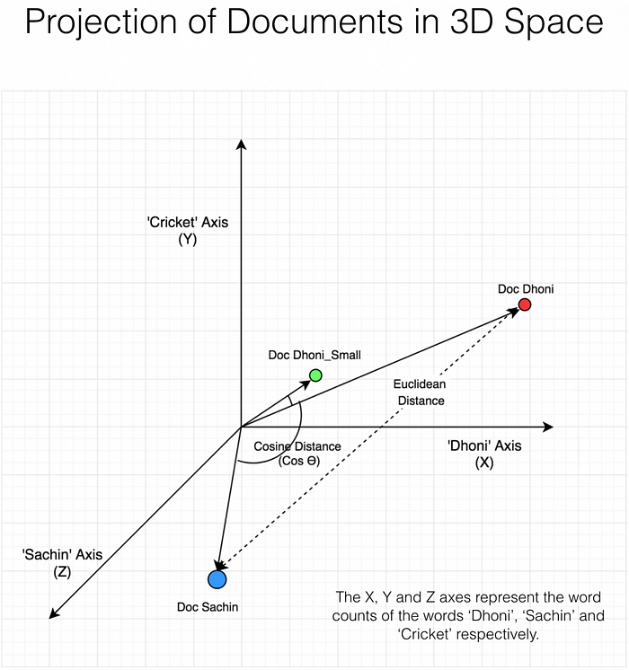
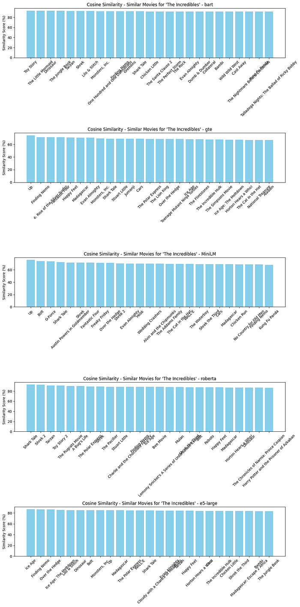
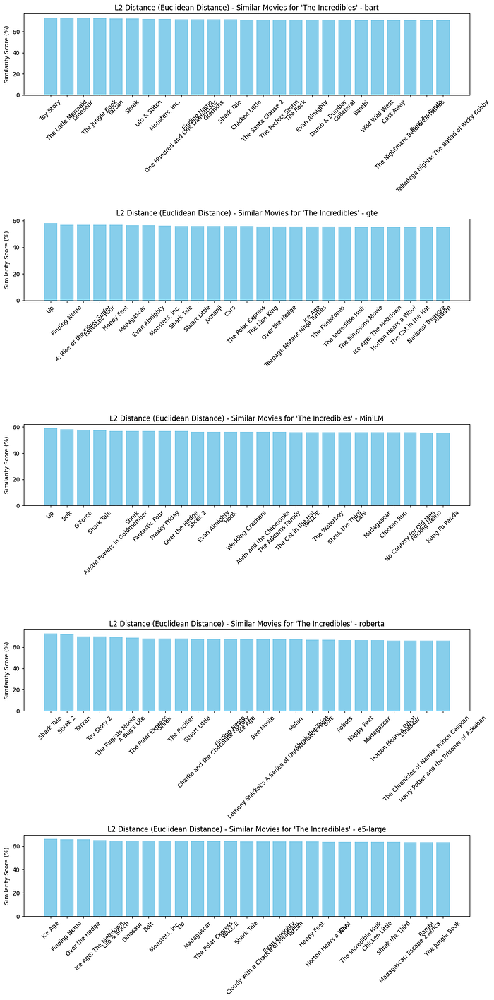
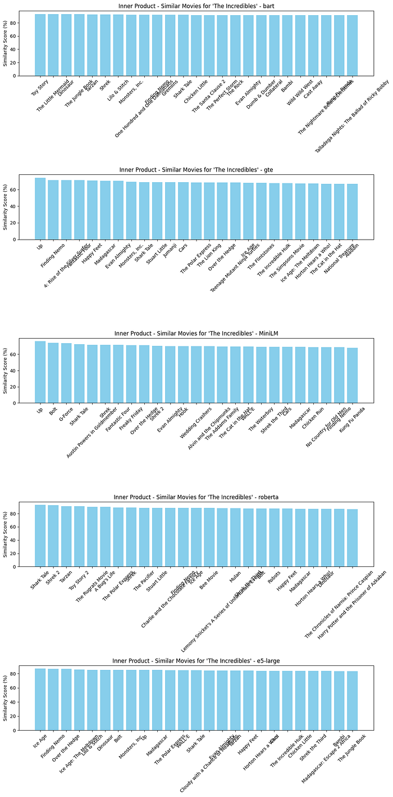
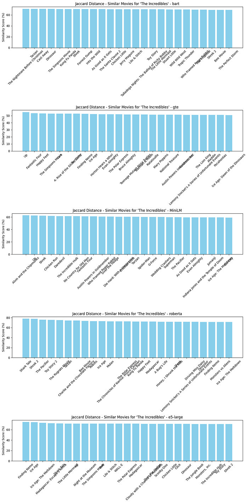
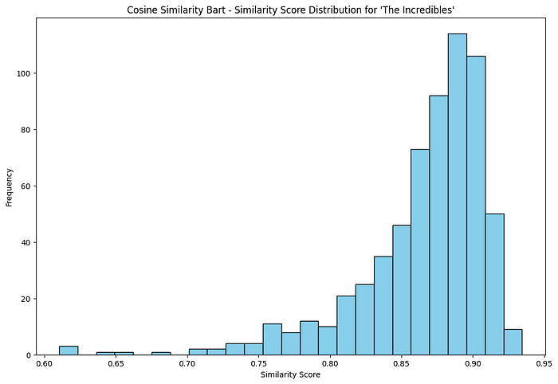
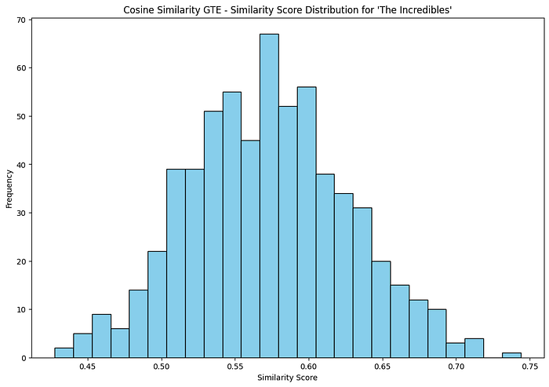
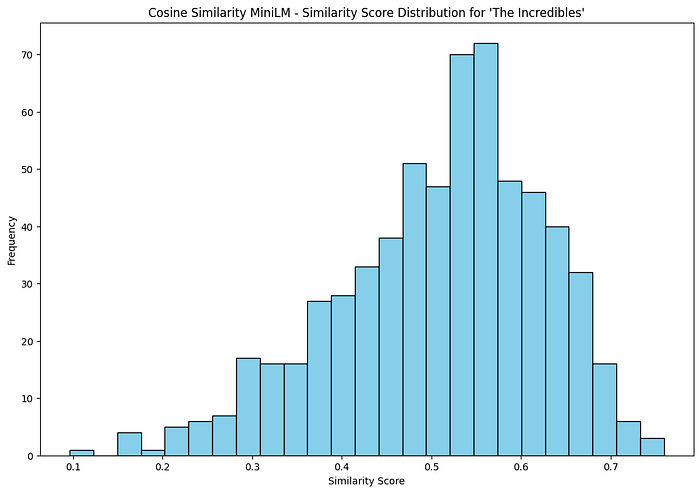
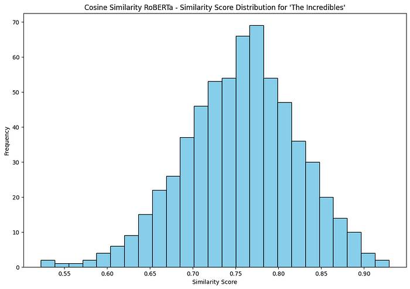
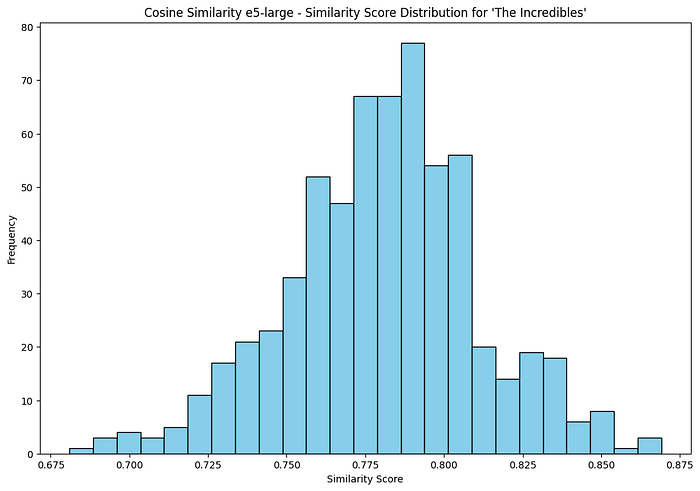

Fil conducteur en **trois parties** sur la **similarité entre films** : **partie 1** — embeddings dans **PostgreSQL + pgvector** et recherche du plus proche voisin en SQL ; **partie 2** — **Qdrant** et **MovieLens** (vecteurs denses pour la recherche sémantique, vecteurs creux pour un voisinage façon filtrage collaboratif) ; **partie 3** — le même catalogue pgvector comme couche de **récupération** pour un petit pipeline **RAG** avec **LangChain** et **Ollama**. Ci-dessous, des extraits animés du travail (`movie-similarities-1.gif` … `3.gif`).

## Visualisations

*Partie 1 — pgvector / SQL : films proches à partir des embeddings et des métriques de distance.*

*Partie 2 — Qdrant + MovieLens : recherche dense de films ou voisinage creux utilisateur–notes.*

*Partie 3 — Q&R ancrée : question → lignes récupérées → réponse du LLM liée au catalogue.*

## Ressources

- **GitHub (cours / notebooks) :** [AlgoETS/SimilityVectorEmbedding](https://github.com/AlgoETS/SimilityVectorEmbedding) — dont `postgres/3.LLMS.ipynb` pour la partie 3
- **Medium (article pgvector d’origine) :** [Using vector databases to find similar movies (Part 1)](https://medium.com/@antoine.boucher012/using-vector-databases-to-find-similar-movies-algorithm-part-1-f14a244bb23d)
- **Discord :** [discord.gg/Mgf6STuvzZ](https://discord.gg/Mgf6STuvzZ)

---

## Partie 1 — PostgreSQL, pgvector et films similaires

Le projet montre comment des **embeddings** et une **base vectorielle** (PostgreSQL + pgvector) permettent la recherche de similarité sur descriptions et métadonnées de films, en encodant le texte avec des modèles NLP et en comparant les titres dans l’espace vectoriel.

## Requêtes vectorielles et similarité cosinus

### Requêtes avec pgvector

**Pgvector** est une extension PostgreSQL pour stocker et interroger efficacement des vecteurs de grande dimension. Ici, les embeddings représentent le contenu sémantique des descriptions et métadonnées, ce qui permet des requêtes avancées (plus proches voisins).

Plusieurs métriques sont disponibles, dont la distance cosinus (`<=>` en SQL). Exemple de recherche de films similaires par cosinus :

SELECT title, embedding  
FROM movies  
ORDER BY embedding <=> (SELECT embedding FROM movies WHERE title \= %s) ASC  
LIMIT 10;

### Similarité cosinus

Le cosinus de l’angle entre deux vecteurs ; très utilisé en NLP pour comparer des documents (ici des fiches films) quelle que soit leur longueur.

Cosine Similarity \= (A · B) / (|A| |B|)

### Autres distances dans pgvector

Pgvector propose aussi L2 (euclidienne), L1 (Manhattan), produit scalaire, etc., selon la requête et la nature des données.

*   **L2** : écarts absolus entre vecteurs.
*   **L1** : utile en grande dimension.

## Installation

Bibliothèques Python nécessaires :

pip install transformers psycopg2 numpy boto3 torch scikit-learn matplotlib nltk sentence-transformers

## Configuration de la base

#!/bin/bash  
  
\# Install pgvector  
git clone --branch v0.7.0 https://github.com/pgvector/pgvector.git  
cd pgvector  
docker build --build-arg PG\_MAJOR=16 -t builder/pgvector .  
cd ..  
docker-compose up -d  
  
\# ollama  
curl -fsSL https://ollama.com/install.sh | sh  
  
ollama pull bakllava  
ollama pull llama2:13b-chat

version: '3.8'  
  
services:  
  postgres:  
    image: builder/pgvector  
    environment:  
      POSTGRES\_USER: admin  
      POSTGRES\_PASSWORD: admin  
      POSTGRES\_DB: admin  
    ports:  
      \- "5432:5432"  
    volumes:  
      \- ./data:/var/lib/postgresql/data

## Exemple d’entrée film

Exemple de représentation dans `movies.json` :

{  
  "titre": "George of the Jungle",  
  "annee": "1997",  
  "pays": "USA",  
  "langue": "English",  
  "duree": "92",  
  "resume": "George grows up in the jungle raised by apes. Based on the Cartoon series.",  
  "genre": \["Action", "Adventure", "Comedy", "Family", "Romance"\],  
  "realisateur": {"\_id": "918873", "\_\_text": "Sam Weisman"},  
  "scenariste": \["Jay Ward", "Dana Olsen"\],  
  "role": \[  
    {"acteur": {"\_id": "409", "\_\_text": "Brendan Fraser"}, "personnage": "George of the Jungle"},  
    {"acteur": {"\_id": "5182", "\_\_text": "Leslie Mann"}, "personnage": "Ursula Stanhope"}  
  \],  
  "poster": "https://m.media-amazon.com/images/M/MV5BNTdiM2VjYjYtZjEwNS00ZWU5LWFkZGYtZGYxMDcwMzY1OTEzL2ltYWdlL2ltYWdlXkEyXkFqcGdeQXVyMTczNjQwOTY@.\_V1\_SY150\_CR0,0,101,150\_.jpg",  
  "\_id": "119190"  
}

## Travailler avec les embeddings

Les embeddings sont produits avec BERT, Sentence Transformers, etc., puis utilisés dans pgvector pour des recherches de similarité cosinus rapides.

## Générer les embeddings

Modèles et génération pour le catalogue films :

models = {  
    "bart": {  
        "model\_name": "facebook/bart-large",  
        "tokenizer": AutoTokenizer.from\_pretrained("facebook/bart-large", trust\_remote\_code=True),  
        "model": AutoModel.from\_pretrained("facebook/bart-large", trust\_remote\_code=True)  
    },  
    "gte": {  
        "model\_name": "Alibaba-NLP/gte-large-en-v1.5",  
        "tokenizer": AutoTokenizer.from\_pretrained("Alibaba-NLP/gte-large-en-v1.5", trust\_remote\_code=True),  
        "model": AutoModel.from\_pretrained("Alibaba-NLP/gte-large-en-v1.5", trust\_remote\_code=True)  
    },  
    "MiniLM": {  
        "model\_name": 'all-MiniLM-L12-v2',  
        "model": SentenceTransformer('all-MiniLM-L12-v2')  
    },  
    "roberta": {  
        "model\_name": 'sentence-transformers/nli-roberta-large',  
        "model": SentenceTransformer('sentence-transformers/nli-roberta-large')  
    },  
    "e5-large":{  
        "model\_name": 'intfloat/e5-large',  
        "tokenizer": AutoTokenizer.from\_pretrained('intfloat/e5-large', trust\_remote\_code=True),  
        "model": AutoModel.from\_pretrained('intfloat/e5-large', trust\_remote\_code=True)  
    }  
}

## Test Cosine Similarity with Embeddings

\# Example sentences  
sentences\_test = \["This is a fox.", "This is a dog.", "This is a cat.", "This is a fox."\]  
  
\# Generate embeddings  
embeddings\_test = models\["MiniLM"\]\["model"\].encode(sentences\_test)  
  
\# Calculate cosine similarity  
cosine\_similarity = np.dot(embeddings\_test\[0\], embeddings\_test\[1\]) / (np.linalg.norm(embeddings\_test\[0\]) \* np.linalg.norm(embeddings\_test\[1\]))  
print("Cosine Similarity:", cosine\_similarity)  
cosine\_similarity = np.dot(embeddings\_test\[0\], embeddings\_test\[3\]) / (np.linalg.norm(embeddings\_test\[0\]) \* np.linalg.norm(embeddings\_test\[3\]))  
print("Cosine Similarity Same:", cosine\_similarity)

Cosine Similarity: 0.46493083  
Cosine Similarity Same: 1.0

## Remove stopwords to reduce noise

import nltk  
from nltk.corpus import stopwords  
nltk.download(‘stopwords’)

## Define a list of movie titles

current\_directory = os.getcwd()  
with open(os.path.join(current\_directory, "movies.json"), "r") as f:  
    movies = json.load(f)  
  
movies\_data = \[\]  
for movie in movies\["films"\]\["film"\]:  
  
    roles = movie.get("role", \[\])  
    if isinstance(roles, dict):  # If 'roles' is a dictionary, make it a single-item list  
        roles = \[roles\]  
  
    \# Extract actor information  
    actors = \[\]  
    for role in roles:  
        actor\_info = role.get("acteur", {})  
        if "\_\_text" in actor\_info:  
            actors.append(actor\_info\["\_\_text"\])  
  
    movies\_data.append({  
        "title": movie.get("titre", ""),  
        "year": movie.get("annee", ""),  
        "country": movie.get("pays", ""),  
        "language": movie.get("langue", ""),  
        "duration": movie.get("duree", ""),  
        "summary": movie.get("synopsis", ""),  
        "genre": movie.get("genre", ""),  
        "director": movie.get("realisateur", {"\_\_text": ""}).get("\_\_text", ""),  
        "writers": movie.get("scenariste", \[\]),  
        "actors": actors,  
        "poster": movie.get("affiche", ""),  
        "id": movie.get("id", "")  
    })

## Generate embeddings for movies

def preprocess(text):  
    \# Example preprocessing step simplified for demonstration  
    tokens = text.split()  
    \# Assuming stopwords are already loaded to avoid loading them in each process  
    stopwords\_set = set(stopwords.words('english'))  
    tokens = \[word for word in tokens if word.lower() not in stopwords\_set\]  
    return ' '.join(tokens)

def normalize\_embeddings(embeddings):  
    """ Normalize the embeddings to unit vectors. """  
    norms = np.linalg.norm(embeddings, axis=1, keepdims=True)  
    normalized\_embeddings = embeddings / norms  
    return normalized\_embeddings

def generate\_embedding(movies\_data, model\_key, normalize=True):  
    model\_config = models\[model\_key\]  
    if 'tokenizer' in model\_config:  
        \# Handle HuggingFace transformer models  
        movie\_texts = \[  
            f"{preprocess(movie\['title'\])} {movie\['year'\]} {' '.join(movie\['genre'\])} "  
            f"{' '.join(movie\['actors'\])} {movie\['director'\]} "  
            f"{preprocess(movie\['summary'\])} {movie\['country'\]}"  
            for movie in movies\_data  
        \]  
        inputs = model\_config\['tokenizer'\](movie\_texts, padding=True, truncation=True, return\_tensors="pt")  
        with torch.no\_grad():  
            outputs = model\_config\['model'\](\*\*inputs)  
        embeddings = outputs.last\_hidden\_state.mean(dim=1).numpy()  
    else:  
        \# Handle Sentence Transformers  
        movie\_texts = \[  
            f"{preprocess(movie\['title'\])} {movie\['year'\]} {' '.join(movie\['genre'\])} "  
            f"{' '.join(movie\['actors'\])} {movie\['director'\]} "  
            f"{preprocess(movie\['summary'\])} {movie\['country'\]}"  
            for movie in movies\_data  
        \]  
        embeddings = model\_config\['model'\].encode(movie\_texts)  
  
    if normalize:  
        embeddings = normalize\_embeddings(embeddings)  
  
    return embeddings

embeddings\_MiniLM = generate\_embedding(movies\_data, 'MiniLM')  
embeddings\_MiniLM = np.array(embeddings\_MiniLM)  
print("MiniLM embeddings shape:", embeddings\_MiniLM.shape)  
print("MiniLM embeddings:", embeddings\_MiniLM\[0\])

## Create connection to the database

conn = psycopg2.connect(database=”admin”, host=”localhost”, user=”admin”, password=”admin”, port=”5432")  
cur = conn.cursor()

cur.execute("CREATE EXTENSION IF NOT EXISTS vector;")  
conn.commit()  
cur.execute("CREATE EXTENSION IF NOT EXISTS cube;")  
conn.commit()

## Inserting Data into the Database

Insert movie titles and their embeddings into the `movies` table:

def setup\_database():  
    cur.execute('DROP TABLE IF EXISTS movies')  
    cur.execute('''  
        CREATE TABLE movies (  
            id SERIAL PRIMARY KEY,  
            title TEXT NOT NULL,  
            actors TEXT,  
            year INTEGER,  
            country TEXT,  
            language TEXT,  
            duration INTEGER,  
            summary TEXT,  
            genre TEXT\[\],  
            director TEXT,  
            scenarists TEXT\[\],  
            poster TEXT,  
            embedding\_bart VECTOR(1024),  
            embedding\_gte VECTOR(1024),  
            embedding\_MiniLM VECTOR(384),  
            embedding\_roberta VECTOR(1024),  
            embedding\_e5\_large VECTOR(1024)  
        );  
    ''')  
    conn.commit()  
  
setup\_database()

## Insert movie titles and their embeddings into the ‘movies’ table

def insert\_movies(movie\_data, embeddings\_bart, embeddings\_gte, embeddings\_MiniLM, embeddings\_roberta, embeddings\_e5\_large):  
    for movie, emb\_bart, emb\_gte, emb\_MiniLM , emb\_roberta, emb\_e5\_large in zip(movie\_data, embeddings\_bart, embeddings\_gte, embeddings\_MiniLM, embeddings\_roberta, embeddings\_e5\_large):  
        \# Joining actors into a single string separated by commas  
        actor\_names = ', '.join(movie\['actors'\])  
        \# Convert list of genres into a PostgreSQL array format  
        genre\_array = '{' + ', '.join(\[f'"{g}"' for g in movie\['genre'\]\]) + '}'  
        \# Convert list of scenarists into a PostgreSQL array format  
        scenarist\_array = '{' + ', '.join(\[f'"{s}"' for s in movie\['writers'\]\]) + '}'  
        \# Convert embeddings to a string properly formatted as a list  
        embedding\_bart\_str = '\[' + ', '.join(map(str, emb\_bart)) + '\]'  
        embedding\_gte\_str = '\[' + ', '.join(map(str, emb\_gte)) + '\]'  
        embedding\_MiniLM\_str = '\[' + ', '.join(map(str, emb\_MiniLM)) + '\]'  
        embedding\_roberta\_str = '\[' + ', '.join(map(str, emb\_roberta)) + '\]'  
        embedding\_e5\_large\_str = '\[' + ', '.join(map(str, emb\_e5\_large)) + '\]'  
  
        cur.execute('''  
            INSERT INTO movies (title, actors, year, country, language, duration, summary, genre, director, scenarists, poster, embedding\_bart, embedding\_gte, embedding\_MiniLM, embedding\_roberta, embedding\_e5\_large)  
            VALUES (%s, %s, %s, %s, %s, %s, %s, %s, %s, %s, %s, %s, %s, %s, %s, %s)  
        ''', (  
            movie\['title'\], actor\_names, movie\['year'\], movie\['country'\], movie\['language'\],  
            movie\['duration'\], movie\['summary'\], genre\_array, movie\['director'\],  
            scenarist\_array, movie\['poster'\], embedding\_bart\_str, embedding\_gte\_str, embedding\_MiniLM\_str, embedding\_roberta\_str, embedding\_e5\_large\_str  
        ))  
    conn.commit()

insert\_movies(movies\_data, embeddings\_bart, embeddings\_gte, embeddings\_MiniLM, embeddings\_roberta, embeddings\_e5\_large)

## Finding Similar Movies with Python

Define functions to get query embeddings and find similar movies based on different distance functions:

def get\_query\_embedding(title, embedding\_type='bart'):  
    cur.execute(f"SELECT embedding\_{embedding\_type} FROM movies WHERE title = %s", (title,))  
    result = cur.fetchone()  
    if result:  
        embedding\_str = result\[0\]  
        embedding = \[float(x) for x in embedding\_str.strip('\[\]').split(',')\]  
        return np.array(embedding, dtype=float).reshape(1, -1)  
    else:  
        return None

def find\_similar\_movies(title, threshold=0.5, return\_n=25, distance\_function='cosine\_similarity', embedding\_type='bart'):  
    query\_embedding = get\_query\_embedding(title, embedding\_type)  
    if query\_embedding is None:  
        print(f"No embedding found for the movie titled '{title}'.")  
        return \[\]  
  
    cur.execute(f'SELECT title, embedding\_{embedding\_type} FROM movies')  
    rows = cur.fetchall()  
  
    embeddings = \[\]  
    movie\_titles = \[\]  
    for other\_title, embedding\_str in rows:  
        if other\_title != title:  
            embedding = np.array(\[float(x) for x in embedding\_str.strip('\[\]').split(',')\])  
            embeddings.append(embedding)  
            movie\_titles.append(other\_title)  
  
    if distance\_function == 'cosine\_similarity':  
        distances = pairwise\_distances(query\_embedding, embeddings, metric='cosine')  
        similarities = 1 - distances  
    elif distance\_function == 'euclidean\_distance':  
        distances = pairwise\_distances(query\_embedding, embeddings, metric='euclidean')  
        similarities = 1 / (1 + distances)  
    elif distance\_function == 'inner\_product':  
        inner\_products = np.dot(query\_embedding, np.array(embeddings).T)  
        similarities = inner\_products / (np.linalg.norm(query\_embedding) \* np.linalg.norm(embeddings, axis=1))  
    elif distance\_function == 'hamming\_distance':  
        \# convert embeddings to binary  
        query\_binary = np.where(query\_embedding > 0, 1, 0)  
        embeddings\_binary = np.where(np.array(embeddings) > 0, 1, 0)  
        distances = pairwise\_distances(query\_binary, embeddings\_binary, metric='hamming')  
        similarities = 1 - distances  
    elif distance\_function == 'jaccard\_distance':  
        \# convert embeddings to binary  
        query\_binary = np.where(query\_embedding > 0, 1, 0)  
        embeddings\_binary = np.where(np.array(embeddings) > 0, 1, 0)  
        distances = pairwise\_distances(query\_binary, embeddings\_binary, metric='jaccard')  
        similarities = 1 - distances  
    else:  
        print("Unsupported distance function.")  
        return \[\]  
  
    similar\_movies = \[(movie\_titles\[i\], similarities\[0\]\[i\]) for i in range(len(movie\_titles)) if similarities\[0\]\[i\] > threshold\]  
    \# sort to get the most similar movies first  
    similar\_movies.sort(key=lambda x: x\[1\], reverse=True)  
    return similar\_movies\[:return\_n\]

## SQL Query to Find Similar Movies

Use SQL queries to find movies similar to a given movie based on embeddings similarity:

def find\_similar\_movies\_sql(title, threshold=0.1, return\_n=10, distance\_function='<->', embedding\_type='bart'):  
    allowed\_functions = \['<->', '<#>', '<=>', '<+>'\]  \# L2, negative inner product, cosine, L1  
    if distance\_function not in allowed\_functions:  
        print("Unsupported distance function.")  
        return \[\]  
  
    try:  
        cur.execute(f"""  
            SELECT title, embedding\_{embedding\_type}, embedding\_{embedding\_type} {distance\_function} (SELECT embedding\_{embedding\_type} FROM movies WHERE title = %s) AS distance  
            FROM movies  
            WHERE title != %s  
            ORDER BY distance  
            LIMIT %s;  
        """, (title, title, return\_n))  
  
        results = cur.fetchall()  
        if distance\_function == '<=>':  \# Adjust for cosine similarity  
            similar\_movies = \[(row\[0\], 1 - row\[2\]) for row in results if (1 - row\[2\]) > threshold\]  
        else:  
            similar\_movies = \[(row\[0\], row\[2\]) for row in results if row\[2\] < threshold\]  
  
        return similar\_movies  
    except Exception as e:  
        print(f"An error occurred: {e}")  
        return \[\]

## Define a Query Movie Title

query\_movie\_title = 'The Incredibles'

## Plot Similar Movies

Create functions to visualize the similar movies:

def plot\_similar\_movies(similar\_movies, title):  
    \# Prepare data  
    titles, similarities = zip(\*similar\_movies)  
    similarities = \[round(sim \* 100, 3) for sim in similarities\]  \# Convert to percentage and round off  
  
    \# Create a vertical bar chart  
    plt.figure(figsize=(12, 8))  
    bars = plt.bar(titles, similarities, color='skyblue')  
    plt.ylabel('Similarity Score (%)')  
    plt.title(f"{title} - Similar Movies for '{query\_movie\_title}'")  
    plt.xticks(rotation=45, ha='right')  
  
    plt.tight\_layout()  
    plt.show()

def plot\_compare\_similar\_movies\_embedding(similar\_movies\_array, title):  
    \# Prepare data multiple plot for different embeddings  
    fig, ax = plt.subplots(5, 1, figsize=(12, 24))  
    for i, similar\_movies in enumerate(similar\_movies\_array):  
        titles, similarities = zip(\*similar\_movies)  
        similarities = \[round(sim \* 100, 3) for sim in similarities\]  \# Convert to percentage and round off  
  
        \# Create a vertical bar chart  
        bars = ax\[i\].bar(titles, similarities, color='skyblue')  
        ax\[i\].set\_ylabel('Similarity Score (%)')  
        ax\[i\].set\_title(f"{title} - Similar Movies for '{query\_movie\_title}' - {list(models.keys())\[i\]}")  
        ax\[i\].tick\_params(axis='x', rotation=45, labelsize=10)  
    plt.tight\_layout()  
    plt.show()

## Perform a similarity search

### SQL Approach

\# For cosine similarity  
similar\_movies\_bart = find\_similar\_movies\_sql(query\_movie\_title, threshold=0, return\_n=25, distance\_function='<=>', embedding\_type='bart')  
similar\_movies\_gte = find\_similar\_movies\_sql(query\_movie\_title, threshold=0, return\_n=25, distance\_function='<=>', embedding\_type='gte')  
similar\_movies\_MiniLM = find\_similar\_movies\_sql(query\_movie\_title, threshold=0, return\_n=25, distance\_function='<=>', embedding\_type='MiniLM')  
similar\_movies\_roberta = find\_similar\_movies\_sql(query\_movie\_title, threshold=0, return\_n=25, distance\_function='<=>', embedding\_type='roberta')  
similar\_movies\_e5\_large = find\_similar\_movies\_sql(query\_movie\_title, threshold=0, return\_n=25, distance\_function='<=>', embedding\_type='e5\_large')  
plot\_compare\_similar\_movies\_embedding(\[similar\_movies\_bart, similar\_movies\_gte, similar\_movies\_MiniLM, similar\_movies\_roberta, similar\_movies\_e5\_large\], "Cosine Similarity")

## Python

\# For cosine similarity  
similar\_movies\_cosine\_bart = find\_similar\_movies(query\_movie\_title, threshold=0, distance\_function='cosine\_similarity', embedding\_type='bart')  
similar\_movies\_cosine\_gte = find\_similar\_movies(query\_movie\_title, threshold=0, distance\_function='cosine\_similarity', embedding\_type='gte')  
similar\_movies\_cosine\_MiniLM = find\_similar\_movies(query\_movie\_title, threshold=0, distance\_function='cosine\_similarity', embedding\_type='MiniLM')  
similar\_movies\_cosine\_roberta = find\_similar\_movies(query\_movie\_title, threshold=0, distance\_function='cosine\_similarity', embedding\_type='roberta')  
similar\_movies\_cosine\_e5\_large = find\_similar\_movies(query\_movie\_title, threshold=0, distance\_function='cosine\_similarity', embedding\_type='e5\_large')  
plot\_compare\_similar\_movies\_embedding(\[similar\_movies\_cosine\_bart, similar\_movies\_cosine\_gte, similar\_movies\_cosine\_MiniLM, similar\_movies\_cosine\_roberta, similar\_movies\_cosine\_e5\_large\], "Cosine Similarity")

\# For L2 Distance (Euclidean Distance)  
similar\_movies\_l2\_bart = find\_similar\_movies(query\_movie\_title, threshold=0, distance\_function='euclidean\_distance', embedding\_type='bart')  
similar\_movies\_l2\_gte = find\_similar\_movies(query\_movie\_title, threshold=0, distance\_function='euclidean\_distance', embedding\_type='gte')  
similar\_movies\_l2\_MiniLM = find\_similar\_movies(query\_movie\_title, threshold=0, distance\_function='euclidean\_distance', embedding\_type='MiniLM')  
similar\_movies\_l2\_roberta = find\_similar\_movies(query\_movie\_title, threshold=0, distance\_function='euclidean\_distance', embedding\_type='roberta')  
similar\_movies\_l2\_e5\_large = find\_similar\_movies(query\_movie\_title, threshold=0, distance\_function='euclidean\_distance', embedding\_type='e5\_large')  
plot\_compare\_similar\_movies\_embedding(\[similar\_movies\_l2\_bart, similar\_movies\_l2\_gte, similar\_movies\_l2\_MiniLM, similar\_movies\_l2\_roberta, similar\_movies\_l2\_e5\_large\], "L2 Distance (Euclidean Distance)")

\# For Inner Product  
similar\_movies\_inner\_bart = find\_similar\_movies(query\_movie\_title, threshold=0, distance\_function='inner\_product', embedding\_type='bart')  
similar\_movies\_inner\_gte = find\_similar\_movies(query\_movie\_title, threshold=0, distance\_function='inner\_product', embedding\_type='gte')  
similar\_movies\_inner\_MiniLM = find\_similar\_movies(query\_movie\_title, threshold=0, distance\_function='inner\_product', embedding\_type='MiniLM')  
similar\_movies\_inner\_roberta = find\_similar\_movies(query\_movie\_title, threshold=0, distance\_function='inner\_product', embedding\_type='roberta')  
similar\_movies\_inner\_e5\_large = find\_similar\_movies(query\_movie\_title, threshold=0, distance\_function='inner\_product', embedding\_type='e5\_large')  
plot\_compare\_similar\_movies\_embedding(\[similar\_movies\_inner\_bart, similar\_movies\_inner\_gte, similar\_movies\_inner\_MiniLM, similar\_movies\_inner\_roberta, similar\_movies\_inner\_e5\_large\], "Inner Product")

\# For Jaccard Distance  
similar\_movies\_jaccard\_bart = find\_similar\_movies(query\_movie\_title, threshold=0, distance\_function='jaccard\_distance', embedding\_type='bart')  
similar\_movies\_jaccard\_gte = find\_similar\_movies(query\_movie\_title, threshold=0, distance\_function='jaccard\_distance', embedding\_type='gte')  
similar\_movies\_jaccard\_MiniLM = find\_similar\_movies(query\_movie\_title, threshold=0, distance\_function='jaccard\_distance', embedding\_type='MiniLM')  
similar\_movies\_jaccard\_roberta = find\_similar\_movies(query\_movie\_title, threshold=0, distance\_function='jaccard\_distance', embedding\_type='roberta')  
similar\_movies\_jaccard\_e5\_large = find\_similar\_movies(query\_movie\_title, threshold=0, distance\_function='jaccard\_distance', embedding\_type='e5\_large')  
plot\_compare\_similar\_movies\_embedding(\[similar\_movies\_jaccard\_bart, similar\_movies\_jaccard\_gte, similar\_movies\_jaccard\_MiniLM, similar\_movies\_jaccard\_roberta, similar\_movies\_jaccard\_e5\_large\], "Jaccard Distance")

## Comparing Different Embeddings

## Using Pandas for Comparison for most similar movies

import pandas as pd  
most\_similar\_movie\_bart = find\_similar\_movies\_sql(query\_movie\_title, threshold=0, return\_n=1, distance\_function='<=>', embedding\_type='bart')\[0\]  
most\_similar\_movie\_gte = find\_similar\_movies\_sql(query\_movie\_title, threshold=0, return\_n=1, distance\_function='<=>', embedding\_type='gte')\[0\]  
most\_similar\_movie\_MiniLM = find\_similar\_movies\_sql(query\_movie\_title, threshold=0, return\_n=1, distance\_function='<=>', embedding\_type='MiniLM')\[0\]  
most\_similar\_movie\_roberta = find\_similar\_movies\_sql(query\_movie\_title, threshold=0, return\_n=1, distance\_function='<=>', embedding\_type='roberta')\[0\]  
most\_similar\_movie\_e5\_large = find\_similar\_movies\_sql(query\_movie\_title, threshold=0, return\_n=1, distance\_function='<=>', embedding\_type='e5\_large')\[0\]  
most\_similar\_movie\_df = pd.DataFrame({  
    'Title': \[most\_similar\_movie\_bart\[0\], most\_similar\_movie\_gte\[0\], most\_similar\_movie\_MiniLM\[0\], most\_similar\_movie\_roberta\[0\], most\_similar\_movie\_e5\_large\[0\]\],  
    'Similarity Score (%)': \[round(most\_similar\_movie\_bart\[1\] \* 100, 3), round(most\_similar\_movie\_gte\[1\] \* 100, 3), round(most\_similar\_movie\_MiniLM\[1\] \* 100, 3), round(most\_similar\_movie\_roberta\[1\] \* 100, 3), round(most\_similar\_movie\_e5\_large\[1\] \* 100, 3)\]  
}, index=list(models.keys()))  
print(most\_similar\_movie\_df)  

Title  Similarity Score (%)  
bart       Toy Story                93.451  
gte               Up                74.388  
MiniLM            Up                75.960  
roberta   Shark Tale                92.904  
e5-large     Ice Age                86.908

## Finding the Median Similar Movie

\# find the most similar movie median  
def find\_most\_similar\_movie\_median(title, threshold=0, distance\_function='<->', embedding\_type='bart', n=631):  
    similar\_movies = find\_similar\_movies\_sql(title, threshold, n, distance\_function, embedding\_type)  
    if similar\_movies:  
        similarities = \[sim for \_, sim in similar\_movies\]  
        \# find median and return index  
        median\_index = np.argsort(similarities)\[len(similarities) // 2\]  
        return similar\_movies\[median\_index\]  
    else:  
        return None  
  
most\_similar\_movie\_median\_bart = find\_most\_similar\_movie\_median(query\_movie\_title, threshold=0, distance\_function='<=>', embedding\_type='bart')  
most\_similar\_movie\_median\_gte = find\_most\_similar\_movie\_median(query\_movie\_title, threshold=0, distance\_function='<=>', embedding\_type='gte')  
most\_similar\_movie\_median\_MiniLM = find\_most\_similar\_movie\_median(query\_movie\_title, threshold=0, distance\_function='<=>', embedding\_type='MiniLM')  
most\_similar\_movie\_median\_roberta = find\_most\_similar\_movie\_median(query\_movie\_title, threshold=0, distance\_function='<=>', embedding\_type='roberta')  
most\_similar\_movie\_median\_e5\_large = find\_most\_similar\_movie\_median(query\_movie\_title, threshold=0, distance\_function='<=>', embedding\_type='e5\_large')  
  
most\_similar\_movie\_median\_df =  pd.DataFrame({  
    'Title': \[most\_similar\_movie\_median\_bart\[0\], most\_similar\_movie\_median\_gte\[0\], most\_similar\_movie\_median\_MiniLM\[0\], most\_similar\_movie\_median\_roberta\[0\], most\_similar\_movie\_median\_e5\_large\[0\]\],  
    'Similarity Score (%)': \[round(most\_similar\_movie\_median\_bart\[1\] \* 100, 3), round(most\_similar\_movie\_median\_gte\[1\] \* 100, 3), round(most\_similar\_movie\_median\_MiniLM\[1\] \* 100, 3), round(most\_similar\_movie\_median\_roberta\[1\] \* 100, 3), round(most\_similar\_movie\_median\_e5\_large\[1\] \* 100, 3)\]  
}, index=list(models.keys()))  
print(most\_similar\_movie\_median\_df)

Title  Similarity Score (%)  
bart            101 Dalmatians                87.738  
gte            Blades of Glory                57.274  
MiniLM    The Bourne Ultimatum                52.563  
roberta                  Speed                75.812  
e5-large               Titanic                78.170

## Find the least similar movie

\# find the least similar movie  
def find\_least\_similar\_movie(title, threshold=0.1, distance\_function='<->', embedding\_type='bart', return\_n=631):  
    similar\_movies = find\_similar\_movies\_sql(title, threshold, return\_n, distance\_function, embedding\_type)  
    if similar\_movies:  
        return similar\_movies\[-1\]  
    else:  
        return None  
  
least\_similar\_movie\_bart = find\_least\_similar\_movie(query\_movie\_title, threshold=0, distance\_function='<=>', embedding\_type='bart')  
least\_similar\_movie\_gte = find\_least\_similar\_movie(query\_movie\_title, threshold=0, distance\_function='<=>', embedding\_type='gte')  
least\_similar\_movie\_MiniLM = find\_least\_similar\_movie(query\_movie\_title, threshold=0, distance\_function='<=>', embedding\_type='MiniLM')  
least\_similar\_movie\_roberta = find\_least\_similar\_movie(query\_movie\_title, threshold=0, distance\_function='<=>', embedding\_type='roberta')  
least\_similar\_movie\_e5\_large = find\_least\_similar\_movie(query\_movie\_title, threshold=0, distance\_function='<=>', embedding\_type='e5\_large')  
least\_similar\_movie\_df = pd.DataFrame({  
    'Title': \[least\_similar\_movie\_bart\[0\], least\_similar\_movie\_gte\[0\], least\_similar\_movie\_MiniLM\[0\], least\_similar\_movie\_roberta\[0\], least\_similar\_movie\_e5\_large\[0\]\],  
    'Similarity Score (%)': \[round(least\_similar\_movie\_bart\[1\] \* 100, 3), round(least\_similar\_movie\_gte\[1\] \* 100, 3), round(least\_similar\_movie\_MiniLM\[1\] \* 100, 3), round(least\_similar\_movie\_roberta\[1\] \* 100, 3), round(least\_similar\_movie\_e5\_large\[1\] \* 100, 3)\]  
}, index=list(models.keys()))  
print(least\_similar\_movie\_df)

Title  Similarity Score (%)  
bart      Il buono, il brutto, il cattivo.                61.033  
gte                      The Lady Vanishes                42.767  
MiniLM                 Le notti di Cabiria                 9.650  
roberta                    Smultronstället                52.263  
e5-large               Ladri di biciclette                68.094

## Show Distribution of Similarity Scores

  
def plot\_similarity\_distribution(similar\_movies, title):  
    similarities = \[sim\[1\] for sim in similar\_movies\]  
    plt.figure(figsize=(12, 8))  
    plt.hist(similarities, bins=25, color='skyblue', edgecolor='black')  
    plt.xlabel('Similarity Score')  
    plt.ylabel('Frequency')  
    plt.title(f"{title} - Similarity Score Distribution for '{query\_movie\_title}'")  
    plt.show()  
  
similar\_movies\_bart = find\_similar\_movies\_sql(query\_movie\_title, threshold=0, return\_n=631, distance\_function='<=>', embedding\_type='bart')  
similar\_movies\_gte = find\_similar\_movies\_sql(query\_movie\_title, threshold=0, return\_n=631, distance\_function='<=>', embedding\_type='gte')  
similar\_movies\_MiniLM = find\_similar\_movies\_sql(query\_movie\_title, threshold=0, return\_n=631, distance\_function='<=>', embedding\_type='MiniLM')  
similar\_movies\_roberta = find\_similar\_movies\_sql(query\_movie\_title, threshold=0, return\_n=631, distance\_function='<=>', embedding\_type='roberta')  
similar\_movies\_e5\_large = find\_similar\_movies\_sql(query\_movie\_title, threshold=0, return\_n=631, distance\_function='<=>', embedding\_type='e5\_large')  
  
plot\_similarity\_distribution(similar\_movies\_bart, 'Cosine Similarity Bart')  
plot\_similarity\_distribution(similar\_movies\_gte, 'Cosine Similarity GTE')  
plot\_similarity\_distribution(similar\_movies\_MiniLM, 'Cosine Similarity MiniLM')  
plot\_similarity\_distribution(similar\_movies\_roberta, 'Cosine Similarity RoBERTa')  
plot\_similarity\_distribution(similar\_movies\_e5\_large, 'Cosine Similarity e5-large')

## Partie 2 — Qdrant, MovieLens et vecteurs denses + creux

Above we stored **dense** movie embeddings in PostgreSQL and ran nearest-neighbor search in SQL. Here we use the same core idea—**similarity in vector space**—with **Qdrant** and **MovieLens**, and add a second mode that is not about text semantics: **sparse vectors** built from user ratings for collaborative-style recommendations.

The code described here comes from a small **FastAPI** teaching project (`movie_recommendation`): seed scripts under `app/seed/` (for example `load_movielens_100k_to_qdrant.py` and `load_movielens_1m_to_qdrant.py`) load MovieLens into Qdrant collections; the API uses `app/services/recommend.py`, `app/utils/embedding.py`, and `app/services/qdrant.py`.

### Three collections (MovieLens 100K example)

The 100K loader creates:

- **`movielens_100k_movies`** — dense vectors (384 dimensions, cosine) for semantic search over movie text.
- **`movielens_100k_users`** — dense user profiles (same embedding space as used in the seed pipeline).
- **`movielens_100k_ratings`** — **sparse** vectors named `ratings`: each dimension is a **movie id**, each value is a **rating**, so a user is a sparse vector over items they rated.

That split is the main design lesson: one engine (Qdrant), two different vector “meanings.”

### Dense path: “something like this title”

`create_embedding` in `app/utils/embedding.py` uses `sentence-transformers/all-MiniLM-L6-v2`: tokenize, mean-pool the last hidden state, return a single embedding. For a query string, the service **preprocesses** text, embeds it, and calls `client.search` on the **movies** collection with `query_vector` as a plain dense vector.

Conceptually this matches Part 1: **encode text → nearest movies by cosine similarity**—only the storage and API are Qdrant instead of pgvector.

### Sparse path: users like you

`recommend_movies` builds a **`NamedSparseVector`**: indices are movie ids, values are the user’s ratings. Qdrant searches the **`{prefix}_ratings`** collection (the seed script registers the sparse vector under the name `ratings`). Neighbors are **similar users** in rating space. The app then **aggregates** those neighbors’ ratings for movies the current user has not rated and returns top-scoring titles (resolving ids via a scroll over the movies collection).

So the second mode is **collaborative filtering** expressed as vector search—not retrieval from plot summaries, but from overlapping taste.

### FastAPI surface

`app/main.py` mounts routers that expose these flows to a simple HTML UI. The interesting logic for readers of this post is in the service layer: dense search vs sparse neighbor aggregation.

### Where to start in the SimilityVectorEmbedding course repo

If you are working through **[AlgoETS/SimilityVectorEmbedding](https://github.com/AlgoETS/SimilityVectorEmbedding)** in parallel, the **`qdrant/0.simple.ipynb`** notebook is the minimal Qdrant + `movies.json` exercise; it sits alongside the PostgreSQL track and matches the mental model “embed documents, upsert, query” before you add MovieLens scale and hybrid sparse+dense patterns.

### Qdrant summary

- **Similar movies by text:** dense embeddings and cosine search on a movies collection.
- **Similar taste:** sparse rating vectors, nearest users in rating space, then aggregate their ratings for unseen items.

Qdrant adds a convenient way to mix **dense and sparse** vectors in one system alongside the pgvector workflow in Part 1.

## Partie 3 — Q&R films ancrée avec LangChain, Ollama et pgvector

The same rows you load in Part 1 can back a small **retrieve-then-generate** flow: embed the user’s question, pull the nearest movies in SQL, then let a **local LLM** explain the hits with **LangChain** and **Ollama**. The reference notebook is **`postgres/3.LLMS.ipynb`** in [AlgoETS/SimilityVectorEmbedding](https://github.com/AlgoETS/SimilityVectorEmbedding).

### Why not only a general-purpose chat model?

A prompt like “movies similar to *The Incredibles*” against the open web does not guarantee answers from *your* catalog. The notebook contrasts that with answers constrained to rows in your `movies` table—the same idea as RAG: **ground the model in evidence you control**.

### Pipeline at a glance

### Retrieval: question to SQL + vectors

1. **Embedding the question** — `HuggingFaceEmbeddings` with `sentence-transformers/all-MiniLM-L12-v2` (`embed_query`).
2. **Similarity in SQL** — The notebook builds a query that orders by cosine-style distance on `embedding_MiniLM`, e.g. using the pgvector `<=>` operator and `1 - (embedding_MiniLM <=> ARRAY[...]::vector) AS cosine_similarity`, with `ORDER BY cosine_similarity DESC` and `LIMIT 5`.

This mirrors Part 1: same vectors and `<=>` idea, but the **query vector** comes from free text instead of an existing movie row.

### Generation: schema-aware prompting + Ollama

The notebook wires **LangChain**: a `ChatPromptTemplate` describes the `movies` table (including embedding columns), asks for PostgreSQL-friendly behavior, and instructs the model to return question, SQL, formatted results, and a short natural-language answer. The runnable chain uses **`Ollama(model="llama2:13b-chat")`** and `StrOutputParser()`.

`ConversationBufferMemory` is created in the notebook; the demonstrated flow is still essentially **one-shot** invocations per question.

### What goes wrong in practice (and why it matters)

The saved notebook output is useful because it is messy:

- **SQLAlchemy / LangChain** warns that it does not recognize the `vector` type on embedding columns when reflecting the schema.
- The LLM sometimes emits **SQL that does not match pgvector semantics** (for example treating embeddings like scalars with `@>` or `ANY(...)` in ways that are not valid for your schema).
- **Ollama** can **time out** under load (`llama2:13b-chat` is heavy); one of the parallel test questions fails with a runner timeout.

Those issues are normal teaching points: RAG is not only “embed and search”—you need validation, fallbacks, smaller models, or hybrid retrieval when the generator drifts from executable SQL.

### Running Part 3 yourself

You need PostgreSQL with pgvector, movie rows populated as in **Part 1** above, **Ollama** with the chosen model pulled, and the Python stack from the notebook (`langchain`, `langchain-community`, `langchain-huggingface`, `psycopg2`, etc.). Adjust connection strings and model names to match your environment.

## Conclusion

**pgvector** (partie 1) offre du SQL explicite et des métriques sur les embeddings ; **Qdrant** + MovieLens (partie 2) combine recherche sémantique dense et signaux creux façon recommandation ; **LangChain + Ollama** (partie 3) montre comment le même catalogue sert de couche de récupération pour des réponses en langage naturel ancrées. L’ensemble couvre recherche vectorielle, signaux « recommandeur » et une pile RAG minimale reproductible depuis le dépôt du cours.

Jeu de données : [movies.json dans SimilityVectorEmbedding](https://github.com/AlgoETS/SimilityVectorEmbedding/blob/main/movies.json).

---

*Les sections PostgreSQL / pgvector ont été [publiées à l’origine sur Medium](https://medium.com/@antoine.boucher012/using-vector-databases-to-find-similar-movies-algorithm-part-1-f14a244bb23d) ; cette page regroupe aussi le matériel Qdrant + MovieLens et le notebook RAG LangChain + Ollama.*
