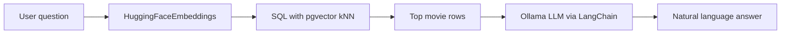

I taught a thread on “find movies like this” that kept growing: **pgvector** in SQL, then **Qdrant** with dense *and* sparse vectors on MovieLens, then a small **RAG** loop with **LangChain + Ollama** grounded on the same catalog. This page is the merged write-up; animated notebooks stay in [AlgoETS/SimilityVectorEmbedding](https://github.com/AlgoETS/SimilityVectorEmbedding). **[Version française]()**.

<!--more-->

**At a glance**

- **Part 1 —** Build a **PostgreSQL + pgvector** catalog from structured movie data; run **kNN in SQL** with cosine (and other) distances.
- **Part 2 —** Reuse “vectors = similarity” with **Qdrant + MovieLens**: **dense** text embeddings for “movies like this phrasing,” **sparse** rating vectors for “users like you.”
- **Part 3 —** Use the same pgvector-backed rows as the **retrieval layer** for a small **RAG** flow (**LangChain** + **Ollama**): question → top rows → grounded answer.

## Visualizations

*Part 1 — pgvector / SQL: exploring similar movies from embeddings and distance metrics.*

*Part 2 — Qdrant + MovieLens: dense movie search or sparse user–rating neighborhoods (depending on your recording).*

*Part 3 — Grounded Q&A: question → retrieve rows → LLM answer tied to your catalog.*

## Resources

- **GitHub (course / notebooks):** [AlgoETS/SimilityVectorEmbedding](https://github.com/AlgoETS/SimilityVectorEmbedding) — includes `postgres/3.LLMS.ipynb` for Part 3
- **Medium (original pgvector article):** [Using vector databases to find similar movies (Part 1)](https://medium.com/@antoine.boucher012/using-vector-databases-to-find-similar-movies-algorithm-part-1-f14a244bb23d)
- **Dataset:** [movies.json](https://github.com/AlgoETS/SimilityVectorEmbedding/blob/main/movies.json) in the course repo
- **Discord:** [discord.gg/Mgf6STuvzZ](https://discord.gg/Mgf6STuvzZ)

---

## Part 1 — PostgreSQL, pgvector, and similar movies

### What you are building

You start from a catalog such as [`movies.json`](https://github.com/AlgoETS/SimilityVectorEmbedding/blob/main/movies.json): titles, years, genres, cast, summaries, and so on. An NLP model turns each film’s **concatenated text fields** into a **dense vector**. Those vectors are stored in PostgreSQL using the **pgvector** extension as typed columns (for example `VECTOR(384)` for MiniLM and wider columns for larger models). The teaching stack compares **several encoders** side by side (BART, GTE, MiniLM, RoBERTa, e5-large) so you can see how the choice of model shifts neighborhoods.

### Why pgvector

Pgvector keeps vectors **next to relational data** and exposes **distance operators in SQL**. Common operators include **`<=>`** (cosine distance), **`<->`** (L2), **`<+>`** (L1), and **`<#>`** (negative inner product). For **unit-normalized** embeddings, cosine distance lines up with the usual cosine-similarity story; you can report a similarity-like score as `1 - (column <=> reference)`.

### kNN in SQL (cosine)

Nearest neighbors are an `ORDER BY` on distance, with a `LIMIT`:

```sql
SELECT title,
       embedding_minilm <=> (
         SELECT embedding_minilm FROM movies WHERE title = $1
       ) AS distance
FROM movies
WHERE title IS DISTINCT FROM $1
ORDER BY distance
LIMIT 10;
```

To rank by similarity instead of raw distance:

```sql
SELECT title,
       1 - (embedding_minilm <=> (SELECT embedding_minilm FROM movies WHERE title = $1)) AS cosine_similarity
FROM movies
WHERE title IS DISTINCT FROM $1
ORDER BY cosine_similarity DESC
LIMIT 10;
```

(Adjust the column name to match your schema; the course uses several `embedding_*` columns in one table.)

### Pipeline shape (encode → load → query)

In Python, the pattern is: load JSON → build one string per movie (title, year, genres, actors, director, summary, …) → **encode** with Sentence Transformers or a Hugging Face model (mean pooling where applicable) → optionally **L2-normalize** rows for cosine → **insert** into `movies` with casts to `vector`. **Part 3** reuses the same column (for example `embedding_MiniLM`) but passes a vector built from **free-text questions**, not from an existing row.

```python
# Sketch: same embedding model as the table, then bind into SQL kNN.
# Full parsing, multi-model grid, and inserts are in the course notebooks.
from sentence_transformers import SentenceTransformer

model = SentenceTransformer("all-MiniLM-L12-v2")
q = model.encode("animated superhero family comedy", normalize_embeddings=True)
# Use q.tolist() as a vector parameter in psycopg2 / SQLAlchemy.
```

### Environment

The course uses Docker around a **PostgreSQL image with pgvector** and optional **Ollama** pulls for later parts. Pin versions to match the notebooks rather than copying stale literals from an old export.

```bash
git clone --branch v0.7.0 https://github.com/pgvector/pgvector.git
cd pgvector
docker build --build-arg PG_MAJOR=16 -t builder/pgvector .
cd ..
docker compose up -d
```

```yaml
# Minimal pattern: Postgres + pgvector image and a data volume
services:
  postgres:
    image: builder/pgvector
    environment:
      POSTGRES_USER: admin
      POSTGRES_PASSWORD: admin
      POSTGRES_DB: admin
    ports:
      - "5432:5432"
    volumes:
      - ./data:/var/lib/postgresql/data
```

### Full notebooks and step-by-step code

The **long-form** material—multi-model configs, pandas tables comparing top neighbors, matplotlib charts, and distribution plots—is meant to live in **Medium** and the **AlgoETS** notebooks so this article stays readable.

> **Go deeper:** [Using vector databases to find similar movies (Part 1) on Medium](https://medium.com/@antoine.boucher012/using-vector-databases-to-find-similar-movies-algorithm-part-1-f14a244bb23d) · Notebooks in [AlgoETS/SimilityVectorEmbedding](https://github.com/AlgoETS/SimilityVectorEmbedding) under the `postgres/` track.

---

## Part 2 — Qdrant, MovieLens, and dense + sparse vectors

In Part 1, **dense** movie embeddings lived in PostgreSQL and nearest neighbors ran in SQL. Here the same idea—**similarity in vector space**—uses **Qdrant** and **MovieLens**, plus a second mode that is not about text semantics: **sparse vectors** built from user ratings for collaborative-style recommendations.

The code described here comes from a small **FastAPI** teaching project (`movie_recommendation`): seed scripts under `app/seed/` (for example `load_movielens_100k_to_qdrant.py` and `load_movielens_1m_to_qdrant.py`) load MovieLens into Qdrant collections; the API uses `app/services/recommend.py`, `app/utils/embedding.py`, and `app/services/qdrant.py`.

### Three collections (MovieLens 100K example)

The 100K loader creates:

- **`movielens_100k_movies`** — dense vectors (384 dimensions, cosine) for semantic search over movie text.
- **`movielens_100k_users`** — dense user profiles (same embedding space as used in the seed pipeline).
- **`movielens_100k_ratings`** — **sparse** vectors named `ratings`: each dimension is a **movie id**, each value is a **rating**, so a user is a sparse vector over items they rated.

That split is the main design lesson: one engine (Qdrant), two different vector “meanings.”

### Dense path: “something like this title”

`create_embedding` in `app/utils/embedding.py` uses `sentence-transformers/all-MiniLM-L6-v2`: tokenize, mean-pool the last hidden state, return a single embedding. For a query string, the service **preprocesses** text, embeds it, and calls `client.search` on the **movies** collection with `query_vector` as a plain dense vector.

Conceptually this matches Part 1: **encode text → nearest movies by cosine similarity**—only the storage and API are Qdrant instead of pgvector.

### Sparse path: users like you

`recommend_movies` builds a **`NamedSparseVector`**: indices are movie ids, values are the user’s ratings. Qdrant searches the **`{prefix}_ratings`** collection (the seed script registers the sparse vector under the name `ratings`). Neighbors are **similar users** in rating space. The app then **aggregates** those neighbors’ ratings for movies the current user has not rated and returns top-scoring titles (resolving ids via a scroll over the movies collection).

So the second mode is **collaborative filtering** expressed as vector search—not retrieval from plot summaries, but from overlapping taste.

### FastAPI surface

`app/main.py` mounts routers that expose these flows to a simple HTML UI. The interesting logic for readers of this post is in the service layer: dense search vs sparse neighbor aggregation.

### Where to start in the SimilityVectorEmbedding course repo

If you are working through **[AlgoETS/SimilityVectorEmbedding](https://github.com/AlgoETS/SimilityVectorEmbedding)** in parallel, the **`qdrant/0.simple.ipynb`** notebook is the minimal Qdrant + `movies.json` exercise; it sits alongside the PostgreSQL track and matches the mental model “embed documents, upsert, query” before you add MovieLens scale and hybrid sparse+dense patterns.

### Qdrant summary

- **Similar movies by text:** dense embeddings and cosine search on a movies collection.
- **Similar taste:** sparse rating vectors, nearest users in rating space, then aggregate their ratings for unseen items.

Qdrant adds a convenient way to mix **dense and sparse** vectors in one system alongside the pgvector workflow in Part 1.

---

## Part 3 — Grounding movie Q&A with LangChain, Ollama, and pgvector

The same **`movies`** rows from Part 1 can back a small **retrieve-then-generate** flow: embed the user’s question, pull the nearest movies in SQL, then let a **local LLM** explain the hits with **LangChain** and **Ollama**. The reference notebook is **`postgres/3.LLMS.ipynb`** in [AlgoETS/SimilityVectorEmbedding](https://github.com/AlgoETS/SimilityVectorEmbedding).

### Why not only a general-purpose chat model?

A prompt like “movies similar to *The Incredibles*” against the open web does not guarantee answers from *your* catalog. The notebook contrasts that with answers constrained to rows in your `movies` table—the same idea as RAG: **ground the model in evidence you control**.

### Pipeline at a glance



### Retrieval: question to SQL + vectors

1. **Embedding the question** — `HuggingFaceEmbeddings` with `sentence-transformers/all-MiniLM-L12-v2` (`embed_query`).
2. **Similarity in SQL** — The notebook builds a query that orders by cosine-style distance on `embedding_MiniLM`, e.g. using the pgvector `<=>` operator and `1 - (embedding_MiniLM <=> ARRAY[...]::vector) AS cosine_similarity`, with `ORDER BY cosine_similarity DESC` and `LIMIT 5`.

This mirrors Part 1: same vectors and `<=>` idea, but the **query vector** comes from free text instead of an existing movie row.

### Generation: schema-aware prompting + Ollama

The notebook wires **LangChain**: a `ChatPromptTemplate` describes the `movies` table (including embedding columns), asks for PostgreSQL-friendly behavior, and instructs the model to return question, SQL, formatted results, and a short natural-language answer. The runnable chain uses **`Ollama(model="llama2:13b-chat")`** and `StrOutputParser()`.

`ConversationBufferMemory` is created in the notebook; the demonstrated flow is still essentially **one-shot** invocations per question.

### What goes wrong in practice (and why it matters)

The saved notebook output is useful because it is messy:

- **SQLAlchemy / LangChain** warns that it does not recognize the `vector` type on embedding columns when reflecting the schema.
- The LLM sometimes emits **SQL that does not match pgvector semantics** (for example treating embeddings like scalars with `@>` or `ANY(...)` in ways that are not valid for your schema).
- **Ollama** can **time out** under load (`llama2:13b-chat` is heavy); one of the parallel test questions fails with a runner timeout.

Those issues are normal teaching points: RAG is not only “embed and search”—you need validation, fallbacks, smaller models, or hybrid retrieval when the generator drifts from executable SQL.

### Running Part 3 yourself

You need PostgreSQL with pgvector, movie rows populated through the **Part 1** pipeline (see notebooks linked above), **Ollama** with the chosen model pulled, and the Python stack from the notebook (`langchain`, `langchain-community`, `langchain-huggingface`, `psycopg2`, etc.). Adjust connection strings and model names to match your environment.

## Takeaway

Same mental model three times: **embed → store → nearest neighbors**, then decide whether “similar” means plot text, rating overlap, or evidence for an LLM answer. Part 3 is where theory meets mess — bad SQL from the model, `vector` type warnings, Ollama timeouts — which is why I kept the notebook outputs in the course repo.

---

*The PostgreSQL / pgvector sections were [originally published on Medium](https://medium.com/@antoine.boucher012/using-vector-databases-to-find-similar-movies-algorithm-part-1-f14a244bb23d); this page also includes the Qdrant + MovieLens material and the LangChain + Ollama RAG notebook in one place.*
