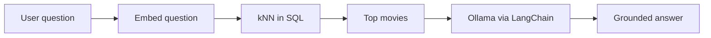

I taught a thread on “find movies like this” that kept growing: **embeddings in PostgreSQL**, the same idea in **Qdrant** with two different vector meanings, then **retrieval + a local LLM** grounded on the same rows. This page is the story; notebooks and animations live in [AlgoETS/SimilityVectorEmbedding](https://github.com/AlgoETS/SimilityVectorEmbedding). **[Version française]()**.

<!--more-->

## The question behind all three parts

Recommendation systems usually hide three different questions:

1. **Plot language** — “films that feel like this description.”
2. **Taste overlap** — “users who rated like you.”
3. **Explainability** — “why these titles?” with text the user asked.

Parts 1–3 map to those questions. Mixing them without labeling the vector type is how demos lie.

## Part 1 — PostgreSQL, pgvector, and honest SQL

### Build the catalog

Start from structured movie JSON ([`movies.json`](https://github.com/AlgoETS/SimilityVectorEmbedding/blob/main/movies.json) in the course repo). Concatenate title, year, genres, cast, summary; encode with Sentence Transformers (MiniLM, GTE, etc.); store typed `vector` columns beside relational fields.

Why **pgvector**? Vectors stay next to SQL you already trust. Distance operators (`<=>` cosine, `<->` L2) turn kNN into `ORDER BY … LIMIT`.

```sql
SELECT title,
       1 - (embedding_minilm <=> (
         SELECT embedding_minilm FROM movies WHERE title = $1
       )) AS similarity
FROM movies
WHERE title IS DISTINCT FROM $1
ORDER BY similarity DESC
LIMIT 10;
```

Swap column names per model — the course keeps several `embedding_*` columns to compare neighborhoods side by side.

### What students learn here

- Normalizing embeddings for cosine.
- How choice of encoder shifts “similar” (BART vs MiniLM vs e5-large).
- That SQL transparency beats a black-box API when you are debugging wrong neighbors.

Full plots and distribution charts: [Medium Part 1](https://medium.com/@antoine.boucher012/using-vector-databases-to-find-similar-movies-algorithm-part-1-f14a244bb23d) and `postgres/` notebooks in the repo.

## Part 2 — Qdrant, MovieLens, dense vs sparse

Same “similarity in vector space,” different **semantics**:

| Collection | Vector type | Question it answers |
|------------|-------------|---------------------|
| Movies | Dense text embedding | “Like this wording / vibe” |
| Users (profile) | Dense | User representation in same space (seed pipeline) |
| Ratings | **Sparse** movieId → rating | “Users with overlapping taste” |

Dense path: encode query text with MiniLM, `search` movies collection — mirrors Part 1 but in Qdrant’s API.

Sparse path: build `NamedSparseVector` from a user’s ratings, find similar users, aggregate their high scores on unseen movies — collaborative filtering without training a neural net in the notebook.

FastAPI teaching project (`movie_recommendation` in the course repo) exposes both flows to a simple HTML UI.

Starter notebook: `qdrant/0.simple.ipynb` before MovieLens scale.

## Part 3 — RAG with LangChain + Ollama

Reuse pgvector rows as **evidence**:



Pipeline: `HuggingFaceEmbeddings` → SQL ordering by `<=>` on `embedding_MiniLM` → prompt that includes schema + retrieved rows → `Ollama(model="llama2:13b-chat")`.

The saved notebook output is instructive because it fails politely:

- LangChain warns on unknown `vector` column types.
- The LLM sometimes emits SQL that is not valid pgvector.
- Heavy models **timeout** under load.

RAG is not “embed and forget” — you need validation, smaller models, or hybrid retrieval.

Notebook: `postgres/3.LLMS.ipynb`.

## When not to use this stack

| Situation | Better path |
|-----------|-------------|
| Cold-start users with no ratings | Dense metadata only |
| Billion-scale sparse CF | Specialized CF stack, not demo Qdrant |
| Sub-10 ms latency at huge QPS | Managed vector DB + tuning |
| Legal need for exact quotes | RAG + citation checks, not raw LLM |

## Takeaway

**Embed → store → nearest neighbors** three times, with three meanings of “neighbor.” Part 3 teaches humility: generators drift from executable SQL unless you constrain them.

## Related posts

- [Snowflake Data-for-Breakfast]() — warehouse storytelling
- [Experimentation with technical indicators]() — another AlgoETS thread

## References

- [AlgoETS/SimilityVectorEmbedding](https://github.com/AlgoETS/SimilityVectorEmbedding)
- [Medium — Part 1](https://medium.com/@antoine.boucher012/using-vector-databases-to-find-similar-movies-algorithm-part-1-f14a244bb23d)
- [pgvector](https://github.com/pgvector/pgvector) · [Qdrant docs](https://qdrant.tech/documentation/)

---

*Originally published on [Medium](https://medium.com/@antoine.boucher012/using-vector-databases-to-find-similar-movies-algorithm-part-1-f14a244bb23d); this page merges Parts 1–3.*
