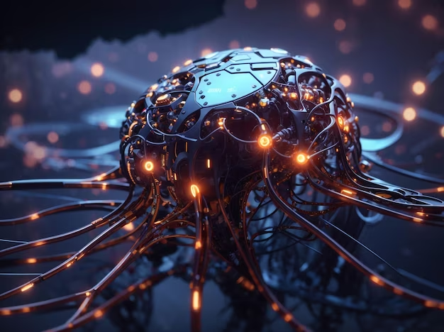
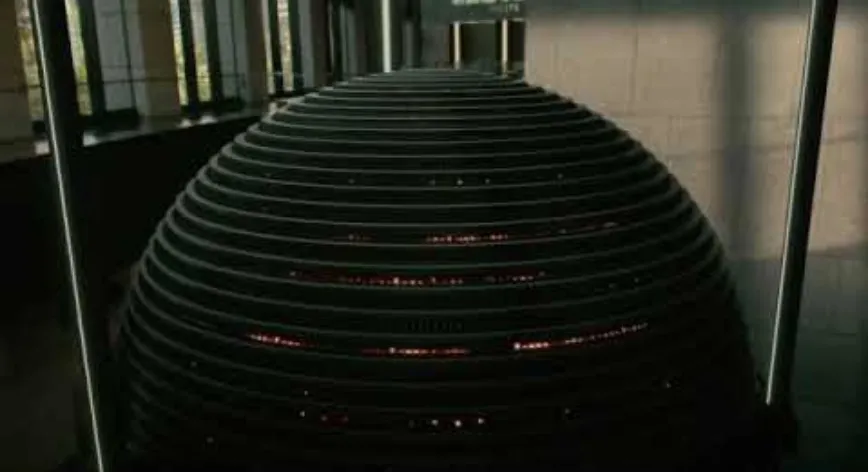

# Genesis Cerveau IA avec Câbles : Proposition de Projet de Rendu

## Thème
**Les grandes avancées technologiques**

### Motivation
Inspirés par le monde gouverné par l'IA de Westworld, nous visons à rendre une scène 3D qui imite un système IA complexe. La scène comportera une sphère avec plusieurs câbles qui y entrent, représentant un cerveau IA à la manière de Westworld.

  
*Concept de Cerveau IA pour Glitch (Source : [Pixabay](https://www.pixabay.com))*

  
  
*(Source : Westworld, 2016)*

## Liste des Fonctionnalités

### Fonctionnalités Simples (1 point chacune)
- **Source de Lumière Ponctuelle** : Pour éclairer la scène de manière minimale.
- **Modèle de Matériau Simple** : Ombre Phong basique pour les objets spéculaires généraux.
- **Génération de textures** : Textures procédurales basiques.

### Fonctionnalités Intermédiaires (4 points chacune)
- **Cartographie d'Environnement (Skybox)** : Pour améliorer l'ambiance et l'éclairage global.
- **Profondeur de Champ** : Pour des effets de mise au point réalistes.

### Fonctionnalités Difficiles (8 points chacune)
- **Accélération GPU via CUDA** : Pour un rendu plus rapide.
- **Dispersion en Sous-surface ou Rendu Volumétrique** : Pour simuler des matériaux complexes comme la fumée ou l'eau bouillante.

#### Fonctionnalités de Secours
- **Flou de Mouvement** : Ajoute du réalisme pour les objets en mouvement comme l'électricité dans les câbles.
- **Instanciation** : Pour répliquer efficacement des objets si nécessaire dans des scènes futures (ex : voitures ou câbles).

#### Mention Spéciale
- **Optix pour BVH** : Comme recommandé par le professeur pour une accélération GPU efficace.

## Plan de Travail
- **Antoine Boucher** : Travaillera sur la Cartographie d'Environnement, la Dispersion en Sous-surface ou le Rendu Volumétrique, et la Fumée, Source de Lumière Ponctuelle et la Génération de Textures.
- **Vincent Ducros** : Se concentrera sur l'implémentation de la profondeur de champ, le rendu GPU via CUDA et OptiX, et l'implémentation du modèle de Blinn-Phong.
